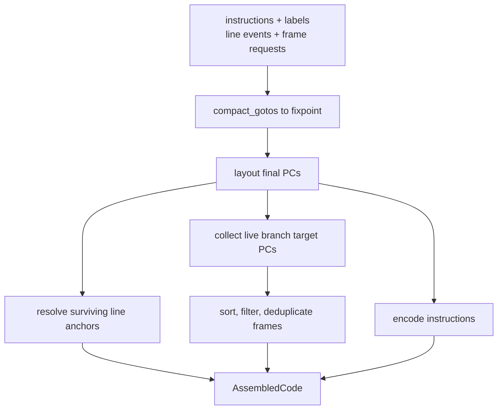

# Assembler and Metadata

`src/codegen/assembler.rs` owns symbolic per-method instruction recording and the
single final layout pass. `src/codegen/instruction.rs` defines the currently
reachable opcodes, exact physical instruction forms, and their stack-word
effects.

## Symbolic instruction model

`Instruction` records a form already selected by lowering:

| Variant family | Encoded role |
| --- | --- |
| `Simple` | Operand-free opcode |
| `U8`, `U16` | Opcode with a fixed one- or two-byte operand |
| `Iinc`, `WideIinc` | Narrow and `wide iinc` forms |
| `Field` | Constant-pool field operand plus explicit push words |
| `Invoke` | Constant-pool method operand plus explicit argument/return words |
| `Branch` | Narrow branch opcode with symbolic `Label` target |

There is no generic instruction-selection pass after recording. For example,
`ldc` versus `ldc_w` and a slot-0 short load versus an operand-bearing load have
already been decided.

The symbolic coordinate types are deliberately distinct:

- `InstructionAnchor` identifies one recorded instruction and remains stable if
  another instruction is tombstoned.
- `CodePosition` identifies a boundary between instructions, including method
  end.
- `Label` identifies a binding that eventually resolves to a `CodePosition`.

Line events attach to anchors. Labels and frame requests attach to boundaries.

## Emission chokepoint

`Emitter::emit` is the only path that appends an instruction. It performs four
jobs atomically:

- Creates a stable instruction anchor.
- Consumes the pending source line into a line event, suppressing consecutive
  duplicate line values.
- Clears the transient `at_control_entry` marker.
- Applies the instruction's pop/push word counts and updates `max_stack`.

Underflow and word-count overflow are internal panics. Lowering manually calls
`reset_stack` at statement and mutually exclusive control-flow boundaries. This
is not verifier dataflow analysis.

## Finalization

`Emitter::finish` owns one mutation and one layout:

### Goto compaction

`compact_gotos` computes reachability over the symbolic stream, threads branch
targets through unconditional gotos, and tombstones only unconditional gotos
that are unreachable or target the next live instruction. It repeats until no
additional goto can be deleted. Tombstones preserve all original anchor and
boundary indices.

This is a narrow javac-compatibility transform, not a general optimizer. Exact
preconditions and target-threading behavior live in the doc comments on
`compact_gotos`, `thread_from_position`, and `thread_target`.

### PC layout and encoding

`layout` assigns a `u32` PC to every original instruction index, adding length
only for live entries. It enforces the JVM `Code` length ceiling before metadata
is narrowed to `u16`. `encode` then walks the same live stream and asserts that
its output position and each encoded length agree with layout.

All current branches are encoded as an opcode plus signed 16-bit relative offset.
Targets are threaded before offset calculation. No equivalent branch form is
selected during this pass.

## Line numbers

Lowering calls `set_pending_line`; it does not immediately create a table row.
The next `emit` consumes that line. A later source mark can replace a line before
any instruction exists, which is required for code-free constructs.

During finalization, a line event attached to a tombstoned instruction is dropped.
Remaining anchors resolve through the final PC table. Consecutive duplicate line
values are suppressed both while recording and while resolving. The resulting
`Vec<(pc, line)>` becomes the method's `LineNumberTable`.

The boolean condition model carries additional code-free position provenance so
`gen_if` can decide whether to restore or preserve a pending line. That policy is
owned by [lowering](lowering.md#condition-lowering); the assembler only records
and resolves the resulting event.

## Stack-map requests

A frame request contains a symbolic `CodePosition`, a full verifier-local vector,
and a full verifier operand-stack vector. Current lowering supplies locals by
projecting sema's selected `FrameLocal` snapshot. It supplies the stack vector
manually, normally empty and once containing `Integer` at a boolean diamond merge.

Finalization keeps a requested frame only if its final PC is a live branch target.
Requests are sorted by PC. Duplicate requests at one PC must carry identical
states; conflicting states trigger a debug assertion. The assembler returns full
`StackFrame` snapshots, while the class-file writer chooses their compact encoded
forms.

## Current stack model

The emitter's running stack is `cur: u16`, a depth in JVM words. Category-2 values
push or pop two words. The effect table is centralized in
`Instruction::stack_effect`, with descriptor-dependent field and invocation
effects stored explicitly in instruction variants.

The model does not know whether a one-word value is an integer, float, or
reference; it does not retain value order; and it does not merge stack states at
control-flow joins. A correct word count can therefore coexist with an invalid
typed stack. Frame stacks are a parallel manual input rather than snapshots of
emitter state.

This is the main infrastructure boundary blocking general non-empty-stack boolean
materialization and future object/control-flow forms.

## Current encoding limits

Two absent forms are reachable from otherwise supported syntax:

- **Wide local loads and stores:** `Gen::emit_load` and `Gen::emit_store` use
  short forms for slots 0 through 3 and otherwise cast the `u16` slot to a
  one-byte operand. Slots above 255 are truncated. Only `wide iinc` exists.
- **Long branches:** `Instruction::Branch` has only the three-byte narrow form.
  `encode` panics when the final relative offset does not fit `i16`; it cannot
  emit `goto_w` or expand a long conditional branch.

These are defects, not deliberate diagnostics. They are also why sema's `u16`
slot model and the assembler's representable instruction set do not yet have a
complete checked handoff.

Other current limits follow the supported language: there are no switches and
therefore no alignment-sensitive instructions, no exception ranges, no local
variable ranges, and no uninitialized-object verification values.

## Target direction

The target assembler tracks a typed symbolic operand stack, derives field and
invocation effects from modeled descriptors, snapshots its own stack at frame
sites, and performs javac-compatible branch-form selection during layout. Every
PC-bearing structure remains symbolic until the final instruction layout,
including future exception handlers, local ranges, type annotations, and
uninitialized-object offsets.

The current single emission chokepoint, stable anchors, and ordered finalization
are foundations for that target rather than temporary APIs to replace wholesale.
