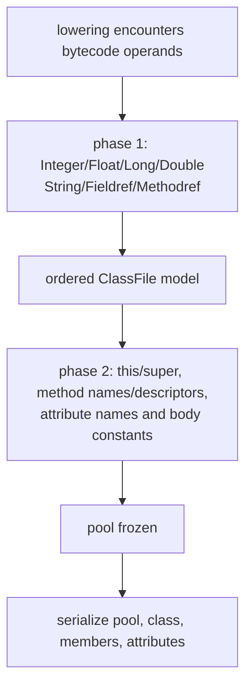

# Class File

The class-file backend owns the ordered model, constant pool, attribute encoding,
and final big-endian serialization. It receives already lowered method code and
must not make Java semantic decisions.

`src/classfile.rs` is the facade:

| Source | Responsibility |
| --- | --- |
| `src/classfile/model.rs` | `ClassFile`, `Method`, `CodeAttribute`, `Attribute`, and verifier snapshots |
| `src/classfile/pool.rs` | Encounter-ordered constant interning and serialization |
| `src/classfile/writer.rs` | Phase-2 interning, class layout, attributes, and frame encoding |
| `src/classfile/modified_utf8.rs` | JVM modified UTF-8 writer |
| `src/classfile/buffer.rs` | Big-endian output buffer and length backpatching |

## Current class model

`ClassFile` contains access flags, `this_class`, `super_class`, ordered methods,
and ordered class attributes. The current writer fixes the remaining shape:

- Minor version 0 and major version 69.
- Empty interfaces and fields tables.
- Methods in plan order.
- One class `SourceFile` attribute.

Each current `Method` has one ordered `Code` attribute. `CodeAttribute` carries
`max_stack`, `max_locals`, encoded code bytes, an empty exception table marker,
and ordered child attributes. Its constructor always adds `LineNumberTable` and
adds `StackMapTable` only when at least one frame survives assembly.

The closed `Attribute` enum currently supports exactly:

- `Code`
- `LineNumberTable`
- `StackMapTable`
- `SourceFile`

Vector order is byte order. Adding an attribute family requires extending both
the shared interning walk and body writer so they continue to traverse the same
plan.

## Two-phase constant-pool ordering

Constant-pool indices are append-only and byte-visible. The backend preserves two
encounter phases:

Phase 1 occurs while lowering chooses instructions, so an operand obtains its
final index before `ldc` versus `ldc_w` is selected. Phase 2 occurs at the start
of `ClassFile::to_bytes` in exact class/member/attribute write order. Writers
after that point use immutable lookup and cannot add entries.

`ConstantPool::intern` inserts one top-level entry and its missing children
breadth-first with a reusable FIFO. For a composite reference, the composite is
allocated first, then direct `Class` and `NameAndType` children, then their `Utf8`
children. Existing children are deduplicated without moving them.

`entries` is the sole serialization order. `FxHashMap` indexes never contribute
iteration order. Text is separately deduplicated into pool-local `TextId`s so
composite keys do not repeatedly hash strings; text-ID allocation itself has no
class-file meaning.

The current pool supports `Utf8`, `Integer`, `Float`, `Long`, `Double`, `Class`,
`String`, `NameAndType`, `Fieldref`, and `Methodref`. `Long` and `Double` advance
the next index by two, leaving the required unusable phantom slot.

Float and double keys use canonical NaN bit patterns before deduplication while
preserving signed zero. This is a pool rule rather than a source-level folding
rule.

## Modified UTF-8 writer

`modified_utf8::write` iterates Rust text as UTF-16 code units. It emits NUL as
the two-byte modified form and encodes each surrogate code unit independently, so
a supplementary scalar occupies six payload bytes. The encoded payload length is
checked against the class-file `u16` limit.

This writer is correct for Rust strings reaching the backend. The frontend cannot
currently preserve an unpaired surrogate escape in a string; that separate limit
is documented in [frontend source-text limits](frontend.md#source-text-limits).

## Attribute serialization

`intern_attributes` and `write_attributes` recursively walk the same ordered
vectors. Each attribute name is encountered before constants in its body or
children. `write_attributes` writes the count, reserves the body's `u32` length,
writes directly into the final buffer, and backpatches the measured length.

There is no separate size calculator or temporary attribute-body buffer to drift
from actual output. Counts come from vector lengths. The current `Code` body
writes an empty exception table and then its child vector.

## StackMapTable encoding

The assembler supplies full `StackFrame` snapshots at absolute bytecode offsets.
`write_stack_map_body` derives each relative offset and classifies the transition
against the previous local state. It chooses the smallest supported frame shape,
including extended forms where required, and writes only verification types
present in that chosen shape.

`frame_object_classes` uses the same classifier during phase-2 interning. This
ensures an `Object` verification type contributes a pool `Class` at exactly the
point where its serialized frame will reference it, rather than because it
appeared in an unencoded full snapshot.

The exact frame classification conditions belong to `writer::classify_frame` and
its doc comment. This page intentionally does not duplicate the decision table.

Current `VerificationType` supports `Top`, `Integer`, `Float`, `Long`, `Double`,
and `Object`. `Null`, `UninitializedThis`, and `Uninitialized` are not modeled by
the writer because current lowering cannot produce them.

## Independent class reader

`src/classdump.rs` is operationally separate from the writer. The correctness
harness and `classdiff` binary use it to locate the first structural divergence
and retain the first raw differing byte as ground truth.

`classdump::reader::dump` parses the class header, all current standard
constant-pool tag layouts, member tables, and attribute envelopes. Structural
attribute decoding is partial:

- `Code`, `LineNumberTable`, `StackMapTable`, and `SourceFile` are decoded into
  fields.
- The `Code` byte array remains one raw field rather than decoded instructions.
- Other attributes remain raw payload fields, with declared-length resynchronization.
- A parse failure causes `diff_report` to fall back to a raw byte window.

Its `CONSTANT_Utf8` reader uses `String::from_utf8_lossy`, not a JVM modified
UTF-8 decoder. Modified encodings such as NUL and surrogate sequences therefore
do not round-trip to the logical Java text in structural hints. Raw bytes are
still compared, so exact divergence detection remains valid, but rendered names
and attribute dispatch can be incomplete for such entries.

`classdump` is not a general class-file validation library. Its purpose is robust
localization for the repository's differential workflow.

## Target direction

The target backend receives complete ordered class and artifact plans. It grows
the constant pool, bootstrap registry, attributes, fields, interfaces, exception
tables, and verification types only as language rungs require them. Attribute
vectors remain the common interning/write authority, and the writer continues to
perform no semantic synthesis.

The independent reader should grow alongside new emitted structures, but it must
remain independent and retain raw fallback so a shared writer/reader assumption
cannot hide incorrect bytes.
