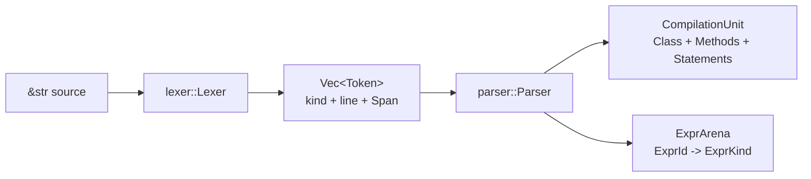

# Frontend

The current frontend is a byte-oriented lexer, a recursive-descent parser, and a
plain-enum AST with arena-owned expressions. Its accepted language is documented
by [language support](../reference/language-support.md); this page documents how
the frontend represents that language and where its responsibility stops.



## Lexer ownership

`src/lexer.rs::lex` creates a private `Lexer` over `source.as_bytes()`. The
facade owns traversal, trivia skipping, line tracking, and identifier dispatch.
Its children divide the remaining work:

| Source | Responsibility |
| --- | --- |
| `src/lexer/token.rs` | Public `Token` and `TokenKind` model |
| `src/lexer/literal.rs` | Numeric, character, and string scanning and decoding |
| `src/lexer/punctuator.rs` | Longest-match punctuation and operators |

Every token carries a half-open byte `Span` into the original Rust string and a
1-based `u16` line where the token starts. Trivia has no token representation.
The token stream always ends in a single zero-width `Eof` token.

Literal spelling is mostly discarded at this boundary. Integer radix and
underscores become an `i32` or `i64`; floating values become `f32` or `f64`;
characters become a `u16`; strings become decoded Rust `String` values. That is
appropriate for current code generation, but it means later stages cannot
recover raw literal spelling.

### Source-text limits

The lexer is not a complete Java lexical translation layer:

- Identifier recognition is ASCII-only: letters, digits after the first byte,
  `_`, and `$`.
- Java Unicode escapes are decoded only while scanning character and string
  literals. There is no pre-lexing Unicode-escape translation pass.
- Direct non-ASCII source is not modeled correctly outside the supported
  boundary because traversal and literal fallback operate one UTF-8 byte at a
  time.
- A string escape is converted through a Unicode scalar value. An unpaired UTF-16
  surrogate cannot be preserved faithfully in Rust `String`.
- Decimal floating literals are implemented; hexadecimal floating literals are
  not.
- Literal scanners normalize accepted text but are not a complete validator for
  every illegal underscore or suffix placement in Java.

The class-file writer itself can encode NUL and supplementary Rust scalar values
as modified UTF-8. That backend capability does not remove the frontend limits.

## Parser ownership

`src/parser.rs::parse` consumes ownership of the token vector and builds one
`CompilationUnit`. The facade handles declarations and the cursor. Children own
the two recursive grammars:

| Source | Responsibility |
| --- | --- |
| `src/parser/statement.rs` | Local declarations, assignments, compound forms, calls, and `if` arms |
| `src/parser/expression.rs` | Prefix/primary expressions and one precedence-climbing infix loop |

`parser::expression::infix_binding_power` is the single precedence table. All
current infix operators are left-associative. Primitive casts are recognized by
bounded lookahead after `(`; reference casts are outside the grammar.

The parser deliberately does not resolve `System.out.println`. A dotted target
becomes nested `ExprKind::Name` and `ExprKind::Select` nodes followed by a generic
`ExprKind::Call`. Semantic attribution decides whether that structure names a
supported library call.

Similarly, the parser can construct class and method shapes that semantic
analysis later refuses. Parsing answers whether text fits the current grammar;
it does not establish the supported compilation-unit contract.

## AST representation

`src/ast.rs` contains ordinary structs and enums rather than a visitor or trait
hierarchy. The important ownership split is:

- `CompilationUnit` owns one `Class` and one `ExprArena`.
- Classes own methods in source order.
- Methods and branch bodies own statement vectors.
- Statements carry recursive expression roots as `ExprId`.
- `ExprArena` owns every `ExprKind`; recursive children are also `ExprId`.

Expression allocation is append-only and child-before-parent. `ExprId` is a
dense parser-assigned identity suitable for sema side tables. `ExprArena` also
provides a private pointer-and-length identity used to prove that an `Analysis`
belongs to the same arena before code generation.

`ExprKind::Paren` is intentionally retained. Parentheses are semantically
transparent in most Java typing, but current boolean lowering has byte-visible
syntax-sensitive behavior. `BranchBody::braced` similarly preserves whether an
`if` arm had braces, because braces define semantic scopes even though
branch-local declarations are currently refused.

`Type` is the current shared Java type representation:

```text
Void | Primitive(eight primitive kinds) | Class(internal name) | Array(Type)
```

It owns descriptor writing, local width, and verifier reference naming. This is
not the target arena-based full Java type system, but it avoids separate drifting
type enums in parser and sema. Numeric JVM stack projection is isolated later in
`src/codegen/stack.rs`.

## Position model

Position coverage is intentionally uneven today:

| Node or fact | Position retained |
| --- | --- |
| Token | Full half-open byte span and starting line |
| Compilation unit, class, method, parameter | Full span |
| Class and method names | Dedicated identifier span |
| Statement and branch body | Full span; statements also retain starting line |
| Local/name occurrence | Dedicated `Name.span` |
| Expression | Stable `ExprId`, but no general span |
| Operator, parenthesis, cast type | No dedicated retained span |
| Closing braces | Line retained where needed for emitted line metadata |

This is enough for current local resolution and line-number generation, but not
for precise expression diagnostics. `sema::analyzer::attribution::validate_expr`
receives an enclosing span and passes it recursively, so type errors in most
compound expressions underline the statement rather than the exact operand or
operator. See [diagnostics](../reference/diagnostics.md#position-accuracy).

## Frontend-to-sema contract

The parser guarantees structure, order, and stable expression identity. Sema is
responsible for all of the following:

- Supported class and `main` shape.
- Declaration identity and local-name resolution.
- Definite assignment and slot allocation.
- Operand validation, result types, and assignment compatibility.
- Library-call target and overload resolution.
- The distinction between invalid Java and deliberately unsupported semantics.

The [semantics page](semantics.md) documents those side tables and current
limitations.

## Target direction

The target frontend retains the plain-enum design but adds compilation-wide
source identity, a source map, Java Unicode translation with mapping back to the
original text, and spans on every syntax node and byte-visible token. Unresolved
source type syntax will remain distinct from attributed semantic types. Parser
recovery and multiple diagnostics also belong to that future source/diagnostic
infrastructure.

None of those target modules exists today. Current code should continue to use
`Span`, `Token`, `CompilationUnit`, and `ExprId` rather than introducing empty
future abstractions ahead of a concrete language need.
