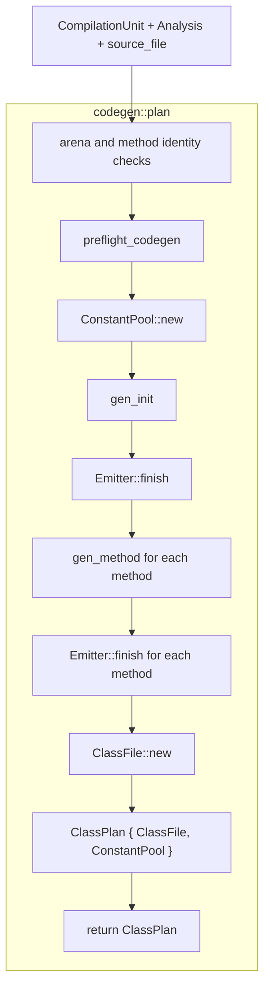
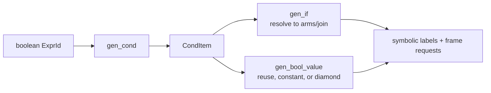

# Lowering

Lowering turns an attributed current-subset AST into exact physical JVM
instruction choices and an ordered class-file model. It is deliberately
driven by pinned black-box output rather than acting as a generic optimization
layer.

The facade `src/codegen.rs` owns class planning. The implementation is split
between reusable policy modules and `src/codegen/lowering/`:

| Source | Responsibility |
| --- | --- |
| `src/codegen/preflight.rs` | Reject attributed frontend shapes the backend cannot represent safely |
| `src/codegen/constant.rs` | Primitive folding queries and constant conversions reconstructed from pinned output |
| `src/codegen/condition.rs` | Pure `CondItem` state used by boolean lowering |
| `src/codegen/ops.rs` | Opcode-family and conversion selection helpers |
| `src/codegen/stack.rs` | Primitive Java type to JVM computational type projection |
| `src/codegen/lowering.rs` | Method context, implicit constructor, descriptors, frame-local projection |
| `src/codegen/lowering/body.rs` | Statements, values, calls, assignments, and compound forms |
| `src/codegen/lowering/condition.rs` | Conditions, short-circuit chains, `if`, and boolean materialization |
| `src/codegen/lowering/emit.rs` | Constant/load/store/conversion physical-form emission |

## Planning sequence

`codegen::plan` verifies that the `Analysis` belongs to the unit's expression
arena and method list. It then performs this sequence:

`ClassPlan::to_bytes` runs only after `codegen::plan` returns; it is not nested in
planning. Each constructor or source method is fully assembled by its own
`Emitter::finish` before `ClassFile::new` builds the ordered class model.

Preflight runs before constant interning or instruction recording. A returned
`NJC1001` therefore cannot leave a partially observable plan. The one current
preflight refusal is branch-valued boolean materialization while another operand
stack value is live. Examples and the public boundary are documented in
[language support](../reference/language-support.md#conditions-and-boolean-values).

## Class and method shape

Current planning always emits:

- A public class with `ACC_SUPER`, parsed `this_class`, and implicit
  `java/lang/Object` superclass.
- A generated public `<init>()V` first.
- The accepted public static `main` after the constructor.
- No fields or interfaces.
- One `SourceFile` class attribute using the library's `source_file` argument.

`gen_init` emits `aload_0`, invokes the modeled superclass constructor, and
returns. `gen_method` builds its descriptor from parsed parameter and return
`Type`s, lowers statements in order, and appends a `return` carrying the method
closing-brace line.

The plan is not yet a compilation-level artifact graph. `ClassPlan` is an opaque
pair of `ClassFile` and the phase-1 `ConstantPool`, sufficient for one class.

## Value lowering

`Gen` holds the phase-1 constant pool, one `MethodInfo`, the expression arena, an
`Emitter`, and the currently selected sema-owned verifier-local snapshot. Every
physical instruction goes through the emitter.

Value lowering distinguishes:

- Constants that can be loaded directly in the target or promoted type.
- Local and compound expressions emitted structurally.
- String literals, which are only values at resolved `println` call sites.
- Branch-valued booleans, which require condition lowering and possible 0/1
  materialization.

Assignments call `gen_coerced`, which folds a constant directly to the target
type or emits a runtime conversion. Binary operations emit the left operand and
its widening before the right operand, preserving the pinned output's instruction
and pool encounter order. Shift distance lowering is separate because the JVM
consumes an `int` distance even for a `long` left operand.

Compound assignment has a selected `iinc`, `wide iinc`, or general
load/operate/narrow/store form. The exact delta boundaries and int-family
normalization rules live in the doc comments on
`constant::int_additive_const_delta`, `constant::int_delta_magnitude`, and
`Gen::gen_compound`; this guide does not duplicate their truth tables.

## Constant folding

There are two related lowering queries in `src/codegen/constant.rs`:

- `fold` evaluates a maximal primitive constant subtree for value generation and
  short-circuit-aware decisions.
- `lowering_const` is stricter for condition-item construction and requires the
  complete logical subtree to be available as a lowering immediate.

Keeping these concepts separate preserves observable history for grouped,
negated, or cast logical expressions even when runtime semantics are statically
known. Folding uses wrapping integer behavior, IEEE-754 operations, primitive
casts, and Java shift masking. Pool insertion later canonicalizes NaN payloads;
folding itself keeps ordinary Rust floating values.

The precise exceptional and boolean cases are documented beside `fold_impl`.
They should be changed only with a complete black-box corpus, not summarized into
a second algorithm here.

## Condition lowering

`Gen::gen_cond` lowers a boolean expression to `CondItem` rather than immediately
materializing an integer. A condition item carries a deciding operation or static
verdict, pending true and false chains, whether an existing stack value can be
reused, origin/materialization state, and code-free source-position provenance.

Comparisons evaluate promoted operands and leave a pending true-polarity branch
test. `&&` and `||` resolve only the chain that must enter the right operand and
merge the other chain. Dead right operands contribute no code or metadata.
Parentheses, negation, and boolean casts transform explicit `CondItem` state where
black-box comparisons show their history changes materialization or source
positions.

`gen_if` consumes a condition item as control flow. A code-free static verdict
emits only the live arm and generally restores the previous pending line.
`gen_bool_value` consumes it as a value, either reusing a plain 0/1, loading a
static 0/1 after residual chains, or emitting the true-first materialization
diamond.

The detailed provenance transitions belong to doc comments in
`src/codegen/condition.rs` and the consumers in
`src/codegen/lowering/condition.rs`. They are intentionally not reproduced as a
state table here.

## Semantic facts consumed and recomputed

Lowering correctly consumes these semantic authorities:

- Local occurrence to `LocalId`, declared primitive type, and physical slot.
- `max_locals`.
- Expression result `Type`.
- Statement entry and exit verifier-local snapshots.
- The selected `ResolvedCall` variant and `println` parameter type.

It currently recomputes these Java facts:

- Unary and binary promoted operand types.
- Conversion sequences and narrowing operations.
- Constant values used by folding and assignment coercion.
- The resolved `println` owner, member, invocation opcode, and descriptor from
  the selected parameter type.

This is a known boundary gap. The target is for sema to record conversions and a
complete resolved invocation while lowering remains responsible for the exact
physical expression and control-flow shape observed in pinned output.

## Handoff to assembly and class writing

Lowering selects exact instruction forms such as short local opcodes, `ldc`
width, branch polarity, and `iinc` form, and it drives label placement, pending
source-line updates, and frame requests. The assembler must not replace a chosen
instruction or topology with an equivalent encoding. It owns symbolic storage and
stable anchors, stack-word accounting, pending-line consumption, supported goto
compaction, final layout, metadata resolution, and byte encoding. See
[assembler and metadata](assembler-and-metadata.md).

Pool operands are interned while lowering encounters their instructions. That is
phase 1 of pool ordering. Structural constants are added later by the
[class-file writer](classfile.md#two-phase-constant-pool-ordering).

## Target direction

The target lowering layer receives fully attributed syntax and emits ordered
class/method plans plus typed symbolic instructions. It will not resolve names,
infer result types, or reconstruct invocation descriptors. Feature-specific
lowering files appear only when a real language feature gives them a substantial
responsibility; there is no planned generic SSA or optimizer layer.
