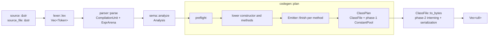
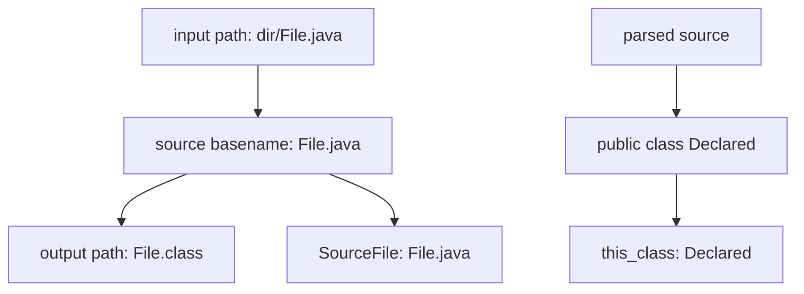
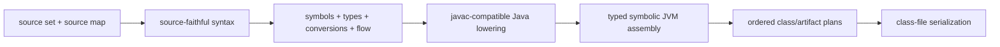

# Architecture Overview

njavac is a single Rust crate that compiles one supported Java source to one
Java 25 class file. Its defining contract is behavioral compatibility, with exact
reference output retained whenever practical. See the
[compatibility contract](../reference/compatibility-contract.md) for the promise
and [language support](../reference/language-support.md) for its input boundary.

This page describes the implementation that exists now. The
[architecture direction](../direction/architecture.md) describes the larger
destination; target responsibilities are not current modules unless this guide
says otherwise.

## Current pipeline

The stable library entry point is `src/lib.rs::compile`:

```rust
pub fn compile(
    source: &str,
    source_file: &str,
) -> diagnostic::CompileResult<Vec<u8>>
```

It runs one fail-fast pipeline through the current module entry points and returns
one class-file byte vector. Public module visibility does not make each root file
an implementation owner or a stable external API.



`codegen::generate` combines planning and serialization. `codegen::plan` exists
so the profiler can measure lowering separately from class-file writing; it is
not a general compilation IR.

## Contracts between stages

| Boundary | Producer guarantees | Consumer responsibility |
| --- | --- | --- |
| Source to lexer | UTF-8 Rust string and no source identity beyond the supplied text | Tokenize bytes, preserve token spans and starting lines, decode supported literals |
| Lexer to parser | Flat `Vec<Token>` ending in one `Eof` | Build source-faithful statement/class structure and stable expression IDs |
| Parser to sema | One `CompilationUnit`, an append-only `ExprArena`, declaration/name spans, statement lines | Validate the supported class shape, resolve locals and calls, assign result types and verifier-local snapshots |
| Sema to lowering | `Analysis` tied to the exact expression arena, one `MethodInfo` per accepted method | Consume local slots, resolved calls, result types, and frame-local snapshots; choose physical lowering matching pinned output |
| Lowering to assembler | Chosen instruction sequence and forms, label operations, source-line marks, and requested frame states | Store symbolic records, allocate stable anchors, account for stack words, consume pending lines, compact supported gotos, assign PCs once, resolve metadata, and encode instructions |
| Assembler to class-file writer | Final code bytes, `max_stack`, lines, and full frame snapshots | Select attribute encodings, complete ordered constant interning, and serialize the class |

The expression-arena identity check in `src/codegen.rs::plan` prevents an
`Analysis` from being paired accidentally with a different parsed unit. Method
counts are checked there as an internal invariant.

## Current ownership

| Area | Current authority | Detail |
| --- | --- | --- |
| Tokens and source syntax | `src/lexer.rs`, `src/parser.rs`, `src/ast.rs` | [Frontend](frontend.md) |
| Modeled subset checks, local identity, slots, and result types | `src/sema.rs` and `src/sema/` | [Semantics](semantics.md) |
| Expression and control-flow choices reconstructed from pinned output | `src/codegen/lowering/` and `src/codegen/condition.rs` | [Lowering](lowering.md) |
| Instruction layout and PC-bearing metadata | `src/codegen/assembler.rs` | [Assembler and metadata](assembler-and-metadata.md) |
| Constant-pool order, attributes, and byte encoding | `src/classfile.rs` and `src/classfile/` | [Class file](classfile.md) |
| Independent structural inspection | `src/classdump.rs` and `src/classdump/` | [Class file](classfile.md#independent-class-reader) |
| Returned failures | `src/diagnostic.rs` | [Diagnostics](../reference/diagnostics.md) |

The complete file-to-responsibility index is the
[repository map](../reference/repository-map.md).

## One class, two names

There are two independent naming paths in the current CLI:



`src/main.rs::compile_one` derives the destination filename from the source
basename, not from the parsed class declaration. `src/codegen.rs::plan` derives
`ClassFile::this_class` from `CompilationUnit.class.name`. The parser and sema do
not enforce that these names match. A mismatch can therefore write bytes whose
class identity is `Declared` into `File.class`; such input is outside the
supported contract.

The `source_file` library argument is metadata only. It supplies the
`SourceFile` attribute and does not choose `this_class` or an output path. See
the [library API](../reference/library-api.md).

## Byte-retention invariants

Reliable exact-byte retention depends on a few cross-layer rules:

- Syntax distinctions that affect javac output, especially parentheses and
  bracing, survive parsing until lowering has consumed them.
- Semantic local IDs and slots are reused downstream; lowering does not resolve
  a source name by text.
- Every emitted instruction passes through `Emitter::emit`, which consumes a
  pending line and updates stack word depth.
- Branches, labels, frame requests, and line events remain symbolic until the
  assembler's final layout.
- Constant-pool insertion order is append-only. Hash maps provide lookup and
  deduplication only; map iteration never determines bytes.
- Ordered attribute vectors drive both phase-2 interning and writing.
- Internal contradictions panic. Modeled source failures and deliberately
  unsupported input return one `Diagnostic`.

Exact local decision tables belong in the doc comments on functions such as
`constant::fold`, `ops::subint_narrow_op`, `CondItem::carry_prefix`,
`Emitter::compact_gotos`, and `writer::classify_frame`. They are intentionally
not copied into this guide.

## Known architectural gaps

The current boundaries are useful but incomplete:

- Public stage modules such as `lexer`, `parser`, `sema`, and `codegen` are
  exposed by the crate for tools and profiling, but their types and signatures
  are not stable API contracts.
- Most expression nodes have an `ExprId` but no expression span. Recursive
  semantic errors often use the enclosing statement span.
- Sema records expression result types, but not complete promoted-operand or
  conversion sequences. Lowering currently recomputes those facts.
- `Emitter` tracks only operand-stack depth in words, not typed stack values or
  full control-flow state.
- General `wide` local loads/stores and long branch selection are absent. These
  are reachable defects, not deliberate Java subset boundaries.
- The class-file model is intentionally closed over the four attributes and
  constant kinds needed today.
- The compilation contract produces one byte vector and cannot represent
  multiple source inputs, generated classes, or several diagnostics.

The relevant pages document the exact impact of each gap. Active repair order
belongs to the project's active-work documentation, not to this current-state
overview.

## Target direction, not current behavior

The target architecture keeps the same one-way flow but strengthens each
boundary:



In that target, semantic attribution is the sole authority for Java meaning,
the assembler owns typed stack and verifier state, and the writer receives a
complete ordered plan without discovering semantic artifacts. A compilation
request returns an artifact set and diagnostics rather than one anonymous byte
vector. These are design goals from
[Architecture Direction](../direction/architecture.md), not promises made by the
current library.
