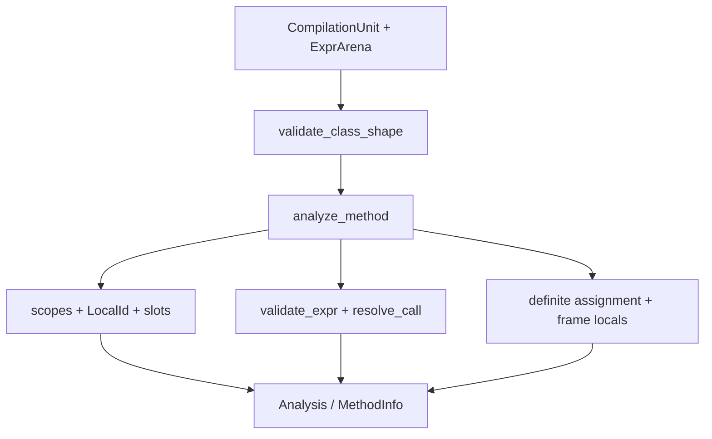

# Semantics

Semantic analysis validates the modeled subset shape, resolves local and library
names, assigns local slots, checks definite assignment, records expression result
types, and produces verifier-local snapshots. Its facade is
`crates/njavac-compiler/src/sema.rs`; the main implementation is in
`crates/njavac-compiler/src/sema/analyzer.rs` and
`crates/njavac-compiler/src/sema/analyzer/attribution.rs`.

## Analysis shape

`sema::analyze` first calls `validate_class_shape`, then analyzes the one accepted
method. `Analysis` records the expression arena's private identity and an ordered
method vector. Current language validation requires exactly one supported
`main`, so only one `MethodInfo` is produced even though the storage is a vector.

`MethodInfo` is the semantic handoff to lowering. It contains:

| Fact | Representation | Consumer |
| --- | --- | --- |
| Declaration order and types | `Vec<LocalInfo>` | Local loads/stores and descriptors |
| Name occurrence resolution | `Span -> LocalId` map | `slot`, `ty`, and `declared_type` queries |
| Maximum physical local usage | `max_locals: u16` | `Code.max_locals` |
| Attributed expression result types | Dense `ExprId`-relative `Vec<Option<Type>>` | Value and condition lowering |
| Resolved calls | Small `(ExprId, ResolvedCall)` table | Call lowering |
| Method-entry verifier locals | Snapshot index | Initial `StackMapTable` comparison state |
| Statement entry/exit verifier locals | `Stmt.span -> snapshot indices` | Branch-target frame requests |

Most internal tables are private. Codegen reads them through methods such as
`MethodInfo::slot`, `MethodInfo::expr_type`, `MethodInfo::call`, and the frame
snapshot accessors.

## Local identity and scopes

Every parameter or local declaration receives a stable `LocalId`. A source name
is not semantic identity. Each declaration and use occurrence is keyed by its
`Name.span`, and downstream code asks sema for the already-resolved local.

`MethodAnalyzer` keeps a lexical scope stack. Each `Scope` owns a spelling-to-ID
map and the local allocator position at scope entry. Declaring a value:

- Rejects a duplicate spelling found in any active scope.
- Assigns the current `next_slot`.
- Advances by `Type::width`, so `long` and `double` use two slots.
- Updates the method's `max_locals` high-water mark.
- Records the declaration name occurrence as resolving to its new `LocalId`.

Exiting a braced scope removes its assignments and restores the allocator to the
scope's base, allowing sibling scopes to reuse slots. Unbraced branch bodies use
the enclosing scope. In current accepted programs this reuse machinery is mostly
latent because every declaration inside a branch is refused with `NJS1001`.

Lowering and the assembler consume semantic `u16` slots without narrowing the
layout. They select and encode a wide local instruction when required.

## Definite assignment and verifier locals

`MethodAnalyzer.assigned` is a set of definitely assigned `LocalId`s, paired with
whether the current path can complete from method entry. Parameters are assigned
at method entry. A declaration with an initializer and every plain or compound
assignment mark their target assigned after validating the right side.

An `if` starts both arms from the same incoming set and uses semantic boolean
outcomes to mark impossible entries. It intersects the resulting sets when both
arms can complete normally, or retains the sole reachable exit. An absent `else`
provides the unchanged incoming state for the false outcome. `&&` and `||`
similarly validate a dead right operand under an impossible path. Reads outside
the assigned set return `NJS0001` only on reachable paths; impossible-path reads
still resolve and type-check.

Verifier-local snapshots are derived from assigned IDs and physical slots:

- Int-family primitives become `FrameLocal::Integer`.
- `float`, `long`, and `double` retain their verifier categories.
- Arrays and classes become `FrameLocal::Object` with a verifier name.
- Unassigned interior physical slots become `Top`.
- Category-2 values occupy one verifier entry while advancing two physical slots.
- Trailing `Top` entries are omitted.

Snapshots are stored in an arena and refreshed only when definite assignment or
scope exit changes the state. Statement maps record snapshot indices, allowing
unchanged states to be reused. Codegen selects entry and exit snapshots; it does
not maintain a second local-flow model.

## Expression attribution

`MethodAnalyzer::validate_expr` recursively checks value expressions and records
their result types by `ExprId`. Structural call-target `Name` and `Select` nodes
used only to recognize `System.out.println` are inspected textually and can retain
`None` in the dense table. Attribution owns:

- Primitive operand category checks.
- Unary and binary numeric result promotion.
- Boolean, equality, and relational operand checks.
- Primitive cast checks.
- Assignment and compound-assignment compatibility.
- Definite-assignment checks for local reads.
- Integral constant-zero rejection for `/` and `%`.
- Supported call spelling, arity, argument checks, and parameter selection.

`sema::unary_promote` and `sema::binary_promote` are the shared current promotion
functions. `sema::constants` contains the narrow constant queries attribution
needs. That module is not the general javac-compatible folding authority. Its
constant-expression test is currently a syntax-only approximation used for
assignment conversion, its numeric evaluator supports integral-zero detection
and constant comparisons, and its conservative boolean-flow query distinguishes
impossible constant and short-circuit outcomes for definite assignment.

Two consequences prevent sema from serving as a complete Java-validity oracle:

- Constant narrowing assignment is not range-checked at attribution time. The
  syntax-only predicate can accept an out-of-range value that Java rejects, after
  which lowering narrows it.
- Integral zero-divisor checking evaluates the right operand in isolation. It
  therefore rejects valid runtime expressions such as `x / 0` and
  `x % (1 - 1)`, even though the complete expression is not constant.

These boundaries are reflected in
[language support](../reference/language-support.md#expressions). The pinned
reference's acceptance, not a successful sema result, is the Java-validity
precondition.

## Library-call resolution

The parser presents every call structurally. `resolve_call` currently accepts only
the exact dotted spelling `System.out.println` with one supported argument. It
does not perform Java symbol lookup or detect a declaration that shadows `System`.
The main-parameter parser similarly maps the exact simple spelling `String`
directly to `java/lang/String`, without checking whether the source class shadows
that name. `resolve_call` records `ResolvedCall::Println { parameter_type }`;
`byte` and `short` select the `int` parameter type.

This removes source-name inspection from lowering, but the resolved fact is not
yet complete. Lowering still hard-codes the owner, member name, invocation kind,
and descriptor table from `parameter_type`. The target semantic fact will carry
all of those selected values so lowering only emits a resolved invocation.
See [lowering](lowering.md#semantic-facts-consumed-and-recomputed).

## Position accuracy

Local declarations and occurrences have precise spans, so duplicate, undeclared,
and uninitialized-local diagnostics can point at the name. Most expression nodes
do not have their own spans. `validate_expr` receives the surrounding statement
span and propagates it through recursive calls; operand and conversion errors can
therefore cover an entire statement. This is a frontend representation limit, not
a renderer limit.

## Semantic boundary

Sema currently owns the subset's modeled checks and result types, but the
approximations above mean it does not decide complete Java validity. It must not
choose physical JVM instruction forms, constant-pool order, branch layout, or
frame encodings. Conversely, lowering must not resolve locals or call targets by
source spelling.

The boundary is not complete yet: lowering recomputes promoted operand types,
conversion steps, assignment coercions, and javac-compatible constant values from
the AST plus sema result types. These are known current mechanics, not the target
ownership model.

## Target direction

The intended semantic layer will become the sole authority for Java symbols,
types, conversions, constants, overload resolution, flow, and local layout. Side
tables keyed by stable syntax IDs will record complete expression facts, including
conversion sequences and resolved invocation descriptors. Source type syntax will
remain distinct from canonical semantic types.

That target does not require introducing a generic type arena or resolver before
a language rung needs one. The immediate structural direction is smaller: finish
the facts already recomputed by current lowering while preserving every emitted
byte.
