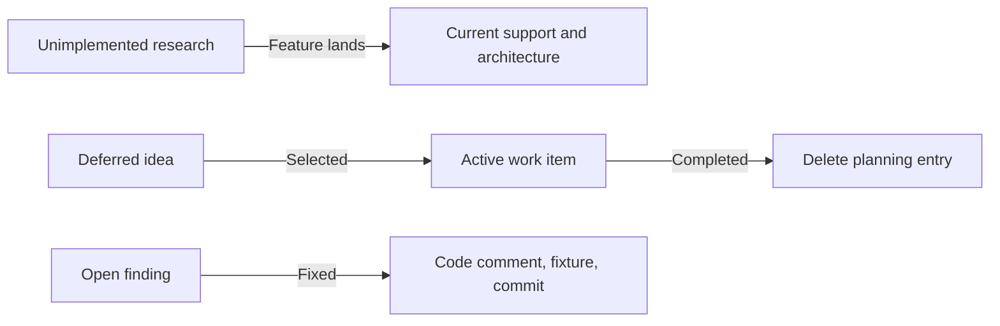

# Documentation Policy

Documentation follows one rule: one durable fact has one authoritative home.
Other pages link to that home instead of maintaining a second explanation.

This prevents a feature, command, architectural boundary, or workflow rule from
being updated in one place while an older copy remains elsewhere.

## Authority hierarchy

Different kinds of facts have different authorities:

| Authority | Owns | Does not own |
| --- | --- | --- |
| Executable code and configuration | Machine behavior, exact constants, configured versions, emitted bytes | Human workflow or planning rationale |
| `make help`, binary `--help`, and executable configuration | Displayed targets and flags; Makefile variables and defaults | Task selection and conceptual guidance |
| Root `README.md` | Repository identity and routes into the guide | Coverage ledger, mechanics, plans, or command catalog |
| This mdBook | Durable human reference, architecture, tooling guidance, contribution policy, research, and direction | Function-local implementation rationale |
| Code doc comments | One decision function's invariant and javac-matching rule | Whole-system architecture or public coverage |
| Probe corpora and fixtures | Observable evidence and regression protection | General prose duplicated from reference pages |
| Root `CLAUDE.md` and skills | Agent bootstrap and agent-specific orchestration | Authoritative human engineering explanation |
| Git history | Historical record of completed work | Current plans or current behavior |

When prose and executable behavior disagree, investigate rather than silently
editing prose to match an accidental bug. Decide whether code or documentation is
wrong, then update the authoritative human contract and its implementation
together.

## Page ownership

Use this map when a fact changes:

| Fact | Authoritative home |
| --- | --- |
| Current accepted Java | [Language support](../reference/language-support.md) |
| Behavioral compatibility, byte retention, and determinism boundary | [Compatibility contract](../reference/compatibility-contract.md) |
| CLI behavior | [CLI reference](../reference/cli.md) |
| Library contract | [Library API](../reference/library-api.md) |
| Current repository structure | [Repository map](../reference/repository-map.md) |
| Current component relationships | Relevant page under `architecture/` |
| Exact local lowering or encoding rule | Doc comment on the decision function |
| Command catalog | `make help` or binary `--help` |
| Command purpose and selection | [Command surface](../tooling/command-surface.md) |
| Fixture and cache lifecycle | [Fixtures and goldens](../tooling/fixtures-and-goldens.md) |
| Black-box observations for unimplemented features | Relevant page under `research/` |
| Probe corpus registry | [Evidence and confidence](../research/evidence.md) |
| Long-term structural boundaries | [Architecture direction](../direction/architecture.md) |
| Ordered language sequence | [Language rungs](../direction/language-rungs.md) |
| Ordered active infrastructure and open findings | [Active work](../direction/active-work.md) |
| Unordered non-active improvements | [Deferred work](../direction/deferred-work.md) |
| Human working convention | Relevant page under `contributing/` |

Entry points may summarize identity and route readers, but they must not become
shadow authorities. If a summary needs enough detail to drift, replace it with a
direct link.

## Update in the same change

Code, tests, evidence, and documentation that describe one behavior change belong
in the same commit. A language rung is not complete while its public support page
still calls it unimplemented. An infrastructure change is not complete while the
current architecture describes the old ownership.

Typical updates are movements, not additions:

When a feature lands, remove or narrow the old research entry. When work completes,
delete it from active planning. When a deferred idea becomes selected, move it to
active work rather than copying it.

## Keep lifecycles separate

Do not mix these categories in one paragraph or checklist:

- Current supported behavior.
- Current implementation mechanics.
- Empirical research for unimplemented behavior.
- Ordered active work.
- Unordered deferred ideas.
- Historical completion records.

The same feature can appear in several places only when each page owns a different
fact. For example, the support page may say that a construct is accepted, an
architecture page may identify which component lowers it, and a code comment may
state the exact opcode decision. None should copy the others' explanation.

## Link stably

Link to page paths and named concepts. Avoid numbered section references, phrases
such as "the section below," or line numbers that break when prose moves. Prefer a page link to
a copied command list, and a named function or corpus to an untraceable phrase such
as "see the boolean tests."

Code comments should use repository-relative paths or stable corpus identifiers.
Book pages should use relative Markdown links that render in mdBook. Validate both
source-tree and rendered-book links with `make docs-check`.

## Diagrams and images

Use Mermaid when a relationship, flow, state transition, or ordering is easier for
a maintainer to verify visually than in prose. Keep diagrams small, directional,
and consistent with adjacent text. The prose must remain sufficient for readers
and agents that do not render Mermaid. Link to a canonical workflow diagram rather
than drawing a second version that can drift.

Human-facing images must help a maintainer perform or understand a task; do not add
decorative screenshots. Store required assets under `docs/src/assets/images/` with
descriptive lowercase filenames, useful alt text, and any necessary source or
license attribution. Prefer SVG for diagrams and optimized PNG for raster content.
Use a reproducible text, table, or Mermaid diagram instead of a screenshot when it
communicates the same fact. Never hotlink an image required to understand the
guide, and verify that labels remain readable in the rendered desktop and narrow
layouts.

## Document evidence honestly

Research pages must distinguish observed, inferred, predicted, and unverified
claims as defined by the [research method](research-method.md). Record the pinned
evidence source without duplicating toolchain versions throughout prose. Exact
versions remain owned by executable configuration.

Do not cite javac or OpenJDK internals as authority. A local abstraction named
after an empirically reconstructed concept does not change the black-box policy.

## Delete stale material

Documentation is a current guide, not a changelog:

- Delete completed active-work entries.
- Delete fixed finding entries after the regression test lands.
- Delete superseded mechanics rather than preserving "formerly" narratives.
- Delete duplicate summaries after replacing them with links.
- Use git history for why and when a completed change landed.

Retain historical explanation only when it remains necessary to understand a
current constraint. Put a one-off decision's rationale at the code that enforces
it, not in planning prose.

## Review checklist

Before landing documentation changes, verify:

- Every changed durable fact has one named owner.
- Other mentions are links or intentionally brief routing text.
- Current and future behavior are not conflated.
- Commands agree with `make help` and binary help.
- Toolchain details agree with executable configuration.
- Code comments and prose do not claim authority from javac internals.
- Completed planning entries were deleted.
- New page links use expected stable paths.
- Inline repository paths and mapped Rust API references pass the documentation
  code-reference check.
- `make docs-check` passes.
