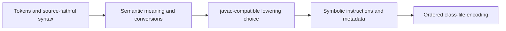

# Implementing a Language Rung

A rung brings one new Java construct under the compatibility contract. It is not
complete when the parser accepts the obvious example; it is complete when every
agreed reachable case preserves the pinned `javac` behavior, reference bytes are
retained wherever practical, deliberate subsystem boundaries are rejected
honestly, and the behavior is regression-backed and documented.

## Place the work

Start from these authorities:

- [Language support](../reference/language-support.md) for the current boundary.
- [Language rungs](../direction/language-rungs.md) for feature order.
- [Active work](../direction/active-work.md) for infrastructure prerequisites.
- Relevant pages under [research](../research/evidence.md) for existing
  pinned-javac observations.
- [Architecture overview](../architecture/overview.md) for current module
  ownership.

Define the rung in terms of source forms and reachable contexts. Do not silently
exclude a case because its class-file consequences are larger than expected. If a
case needs an unbuilt subsystem, identify that boundary before implementation and
record the agreed refusal explicitly.

## Research before code

Follow the [black-box research method](research-method.md). Build the complete
truth table, preserve a durable probe corpus, infer one model, and test its risky
predictions before modifying compiler behavior.

Inspect at least these byte-visible surfaces where relevant:

- Instruction selection and operand order.
- Constant folding and numeric conversion placement.
- Constant-pool kinds, values, deduplication, and encounter order.
- Stack depth, local slots, and verifier states.
- Branch topology, target layout, and wide-form boundaries.
- Attribute presence, order, and encoding.
- Line-number placement and source-shape effects.
- Synthesized classes, members, names, and ordering.

## Separate preparation

If the rung needs a structural change, use the [tidy-first workflow](workflow.md#tidy-first):

1. Make the behavior-preserving preparation needed to establish correct ownership
   and invariants.
2. Run fresh correctness against the existing corpus.
3. Keep the tidy independently committable.
4. Only then add language behavior.

Do not build distant generic infrastructure. Add only the responsibility triggered
by the rung, consistent with [Architecture direction](../direction/architecture.md).

## Implement through the pipeline

Preserve layer ownership:



The frontend preserves source distinctions needed by later phases. Semantic
analysis resolves meaning once. Lowering consumes semantic facts and normally
selects the observed physical form. The assembler owns symbolic layout and
metadata. The class-file backend serializes a complete ordered plan without
discovering Java semantics.

Do not recompute semantic facts in lowering, make the writer synthesize language
artifacts, or let hash iteration determine byte-visible order. Document a specific
javac-matching choice at the function that makes it. A deliberate alternate form
is allowed only under the compatibility contract's optimization exception, belongs
in lowering policy, and requires evidence appropriate to its observable effects;
it must not emerge accidentally from encoding.

## Refuse unsupported edges honestly

When an agreed rung boundary requires unavailable backend capability:

- Reject it before partial class-file emission.
- Return an `Unsupported` diagnostic, not invalid or behaviorally incorrect output.
- Keep internal assertions for states that should be impossible after validation.
- Add a test or fixture for the refusal when it is a significant boundary.
- Describe the boundary in [Language support](../reference/language-support.md).
- Track the enabling infrastructure in [Active work](../direction/active-work.md)
  if it is selected next.

A boundary is a technical contract, not a way to avoid completing the reachable
truth table.

## Add fixtures

Turn byte-visible boundaries from the probe corpus into focused fixtures under the
appropriate topical directory. Follow [Fixtures and goldens](../tooling/fixtures-and-goldens.md):

- Use a globally unique basename matching the public class.
- Keep each fixture focused on a compatibility edge.
- Cover presence and absence cases for new attributes or structures.
- Cover encoding transitions, not only representative middle values.
- Explain non-obvious regression intent at the top of the fixture.

The current fixture harness requires exact reference bytes. Before a rung can use
an equivalent nonidentical representation under the optimization exception, add a
sanctioned durable behavioral regression oracle covering the affected surface.
Byte-drift telemetry alone is insufficient; do not weaken the exact fixture gate.

After fixture changes, refresh cached goldens before relying on the fast gate:

```sh
make record
```

`make record` performs the offline verification after recording.

## Verify the rung

Use focused comparisons while developing, then run the complete gates:

```sh
make src-diff FILE=Probe.java
make test
make fuzz
```

Run `make fuzz-verify` after a JDK or javac-worker change and whenever the rung
reaches class-generation territory not previously exercised by that worker gate.
The aggregate test already includes deterministic worker and observer checks; run
their focused targets while debugging those surfaces. Use `make benchmark` only
when the cycle includes an authoritative performance claim.

The fuzzer must grow with the supported surface. Update generation, rendering,
minimization, and scope capabilities coherently; the exact current extension
points belong in [Fuzzing](../tooling/fuzzing.md) and code comments.

## Update authorities

In the same change:

- Move the public construct into [Language support](../reference/language-support.md).
- Remove or narrow its unimplemented research entry.
- Record system-level mechanics in the relevant architecture page.
- Record local byte-choice rationale at the decision function.
- Remove completed infrastructure from [Active work](../direction/active-work.md).
- Advance [Language rungs](../direction/language-rungs.md) without copying
  implementation detail into it.

Apply [Documentation policy](documentation-policy.md): move facts; do not leave a
completed copy in research and add another in current architecture.

## Definition of done

A rung is done only when:

- Its complete agreed surface is implemented or explicitly refused at a principled
  subsystem boundary.
- The inferred model explains the complete probe corpus.
- Edge fixtures protect reproducible byte-visible transitions, and any accepted
  alternate representation has a sanctioned durable behavioral regression oracle
  scoped to the affected behavior.
- Fresh Docker exact-byte correctness passes for the full fixture suite.
- Differential fuzzing exercises the new surface without the target behavioral
  divergence; accepted physical drift remains documented telemetry.
- Worker-specific gates pass when their contracts changed or expanded.
- Authoritative docs and local decision comments are current.
- Active planning entries completed by the rung are deleted.
- The cycle reflection has been presented before starting another rung.

When commits are authorized, keep preparatory tidies and behavior in separate
commits. Commit and push authorization is governed solely by
[Maintainer Workflow](workflow.md#commit-and-push-authority); completing a rung
does not authorize either action.
