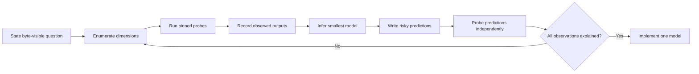

# Black-Box Research Method

The reference `javac` is a black box. njavac derives compatibility rules only
from observable inputs and outputs produced by the repository-pinned compiler.

## Prohibited authorities

Do not inspect, copy, decompile, or base a design on javac or OpenJDK source code
or internal implementation details. Specifications explain valid class files and
Java semantics, but they do not establish which valid encoding the pinned compiler
chooses.

Names in njavac such as `CondItem` may describe an empirically inferred local
abstraction. They are not permission to treat a similarly named javac component
as design documentation. Avoid language such as "port" unless the statement is
explicitly about njavac code derived from its own prior implementation.

## Accepted evidence

Compatibility claims may be based on:

- Minimal source probes compiled by the pinned Docker image.
- Raw class-file bytes and structural classdiff output.
- Pinned `javap` output, recognizing that it can normalize byte differences.
- Fixture comparisons against freshly invoked pinned `javac`.
- Differential-fuzzer outputs and execution observations.
- Predictions from an inferred model that are independently re-probed.

A host compiler, a different JDK build, intuition from the JVMS, or one isolated
example is not sufficient evidence for a javac-specific choice.

## Evidence labels

[Evidence and Confidence](../research/evidence.md#confidence-labels) defines the
four canonical labels and owns the registry, location, format, and replay
convention for probe corpora. Apply those labels; do not redefine them here or
write an inferred or predicted claim as an unconditional fact.

## Complete the table first

One failing case identifies a symptom, not a rule. Before changing code, enumerate
the complete decision table reachable from the construct:

- Operand and result types.
- Constant and non-constant operands.
- Boundary values and encoded-width transitions.
- Both branch polarities and repeated negation.
- Grouped and ungrouped syntax where source shape can survive.
- Top-level and nested contexts.
- Presence or absence of following arms, joins, and statements.
- Empty and non-empty operand-stack contexts when verifier state can differ.
- Attribute presence, absence, ordering, and constant-pool ordering.

The dimensions depend on the feature, but omission must be a reasoned conclusion,
not an accident. Boundary cells become fixtures; broader model evidence remains in
the probe corpus.

## Research loop



Use repository targets rather than invoking `javac`, `javap`, or Docker manually:

```sh
make probe FILE=Probe.java
make src-diff FILE=Probe.java
```

`make probe` inspects the pinned reference. `make src-diff` compares both
compilers and localizes a divergence. See [Differential debugging](../tooling/differential-debugging.md)
for output interpretation and `make help` for current syntax.

## Hidden models

Some choices are a bounded opcode table. Others expose a hidden model across many
contexts, such as condition chains, line-position propagation, switch selection,
string-concatenation recipes, generated member ordering, or verifier-frame
placement.

For a hidden model:

1. Check in a named corpus rather than relying on terminal history.
2. Include sibling contexts that the first failure does not exercise.
3. Infer the smallest state model that explains every observation.
4. Identify cases where competing models predict different bytes.
5. Probe those cases before implementation.
6. Document the final local rule at the decision function and link it to evidence.

If a new observation contradicts the model, stop the implementation cycle. Do not
add an exception until the complete corpus supports a revised model.

## Evidence durability

Probe material follows the corpus convention in
[Evidence and confidence](../research/evidence.md#future-probe-corpora). It should
be minimal, named by the behavior it isolates, and safe to re-run against the
pinned image. Record conclusions and relevant structural fields; avoid committing
huge incidental disassemblies when a small source and precise observation are
sufficient.

Fixtures and probe corpora have different jobs. A fixture guards an exact-output
claim for supported behavior. A corpus preserves enough observations to justify
the model. Important edge cases often belong in both, linked rather than explained
twice.
