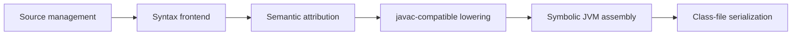
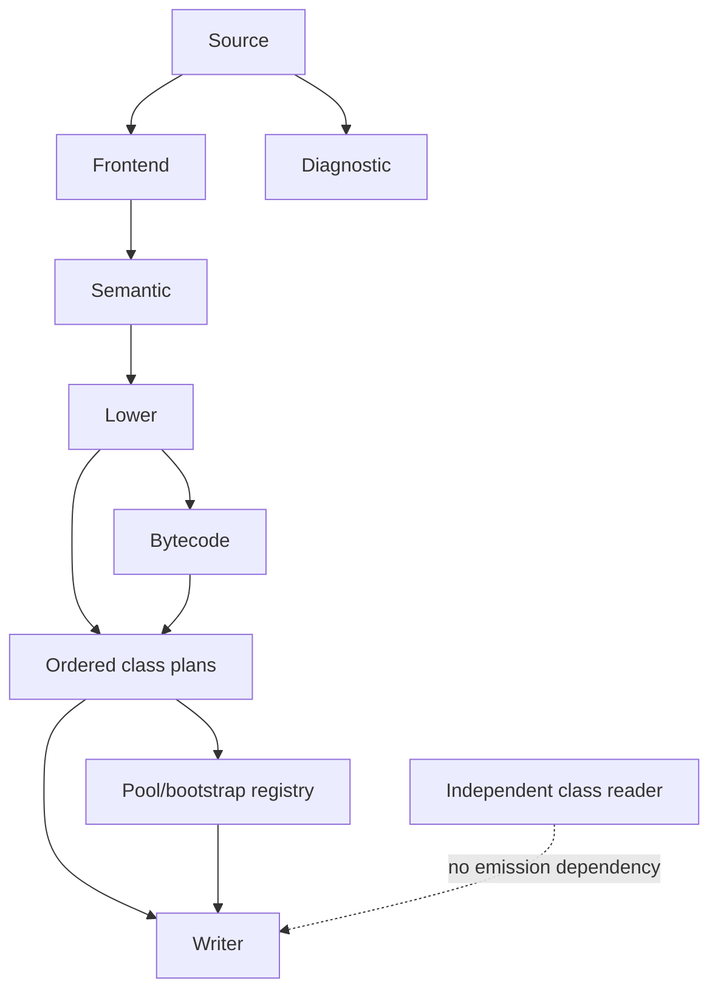

# Architecture Direction

This page defines njavac's intended long-term ownership boundaries, dependency
rules, and evolution triggers. It is a destination map, not a request to create
empty modules. Current accepted Java lives in
[Language Support](../reference/language-support.md), ordered work in
[Active Work](active-work.md), and future feature order in
[Language Rungs](language-rungs.md).

## Objective

The mature compiler has six authorities connected by one-way flow:

The central boundary separates Java meaning from JVM mechanics. Semantic
attribution decides what source means. Lowering normally selects the observed
javac physical shape and owns any deliberate behaviorally equivalent alternative
permitted by the compatibility contract's optimization exception. The assembler
owns code layout and verifier state. The writer serializes an already complete
ordered class plan.

njavac is deliberately not a generic compiler framework. javac-specific choices
are first-class policy, not a compatibility rewrite applied after generic
optimization.

## Design rules

1. Keep one Rust crate until a measured build or dependency problem justifies
   more.
2. Keep ordinary Rust structs and enums for syntax; do not add an object hierarchy
   or visitor framework merely to organize files.
3. Preserve source distinctions until attribution and byte-visible consumers have
   finished. Prefix/postfix form, blocks, parentheses, operator positions, and
   explicit type syntax must not disappear prematurely.
4. Use stable IDs for semantic identity. Strings are spellings, not declarations.
5. Keep source type syntax, semantic Java types, JVM computational stack kinds,
   descriptors, and verifier types distinct, with explicit projections.
6. Do not add SSA or a generic optimization IR. Lower attributed syntax through a
   javac-shaped value/condition model into exact symbolic JVM instructions.
7. Treat every byte-visible sequence as ordered data: constants, instructions,
   targets, frames, attributes, members, bootstrap methods, and generated classes.
8. Use hash maps only as lookup indexes. Map iteration must never determine bytes.
9. Put each javac-specific choice in a named, documented decision function and
   pin it with black-box evidence and fixtures.
10. Introduce a module only when a concrete feature gives it one real
    responsibility.

## Ownership

| Authority | Owns | Must not own |
| --- | --- | --- |
| Source management | Source identity, original and translated text, spans, line maps | Grammar and type rules |
| Diagnostics | Codes, messages, severity, failure classification | Parsing or lowering decisions |
| Syntax frontend | Tokens and source-faithful declarations, statements, expressions, and unresolved type syntax | Resolution, overload selection, bytecode |
| Semantic attribution | Symbols, scopes, Java types, conversions, constants, overloads, definite assignment, local layout | JVM opcode and class encoding choices |
| javac-compatible lowering | Java-to-JVM shape, condition chains, lvalues, synthetic-artifact requests, exact physical instruction forms | Textual name resolution and raw serialization |
| Symbolic JVM assembly | Instructions, labels, operand stack, control flow, PCs, lines, frames, symbolic ranges | Java semantic attribution |
| Ordered pool/bootstrap planning | Encounter-ordered constants and bootstrap registration | Discovering synthetic Java artifacts |
| Class-file writer | Exact serialization of complete ordered plans | Semantic analysis, lowering, or synthesis |
| Independent class reader | Structural parsing and first-divergence reporting | Compiler emission |

Allowed dependencies follow the pipeline. The independent reader may share low-
level neutral utilities, but it must not depend on the writer's interpretation in
a way that could make one bug validate another.

## Compilation contract

Full Java requires multiple source inputs and may emit multiple classes. The
target library API is therefore compilation-shaped: a request contains source
inputs and compiler options; a result contains ordered class artifacts,
diagnostics, and status. Each artifact carries its internal name, output path,
originating source identity, and bytes.

The current `compile(source, source_file)` API remains the single-output contract
while [the supported language](../reference/language-support.md) guarantees one
class. When multi-class compilation lands, the legacy API should be implemented
through the compilation API rather than maintained as a parallel pipeline.

## Source and syntax

Source positions must eventually be compilation-wide and source-relative. Spans
remain half-open and refer to a stable source identity. Source management retains
both original text and Java's Unicode-escape-translated stream, with a mapping
back to original input for diagnostics. Internal positions are not truncated to
class-file line widths before final emission.

Tokens retain raw spans after literal decoding. Syntax retains identifiers,
operators, braces, dimensions, annotations, grouping, and other positions needed
by diagnostics, line tables, local-variable ranges, and type-annotation target
paths.

Blocks are first-class syntax because they define scopes. Calls and selections
remain structural syntax rather than being recognized as library names. Unresolved
type syntax remains separate from semantic types and preserves qualification,
generic arguments, wildcards, annotations, and array dimensions. Desugaring
happens only after attribution and retains an origin link to source syntax.

## Symbols, types, and attribution

Semantic identities use stable IDs for names, declarations, scopes, locals,
methods, and syntax nodes. Java's separate type, value, method, and label
namespaces are explicit. Source/member order lives in vectors separate from
lookup maps. A use resolves once; downstream phases never repeat textual lookup.

The mature semantic type authority must represent:

- Primitive, `void`, null, declared, and array types.
- Type variables, wildcards, intersections, and unions.
- Method and error types.

Erasure, descriptors, generic signatures, local-slot width, JVM stack kind, and
verification type are centralized projections from semantic types. They are not
parallel type systems that independently rediscover conversions.

Attribution records expression type, value category, strict Java constant value,
conversion sequence, and resolved invocation in side tables keyed by stable syntax
IDs. A resolved call carries owner, member, invocation kind, descriptor, parameter
types, and return type. Lowering consumes these facts and does not resolve names,
select overloads, infer descriptors, or recompute expression types.

Strict JLS constants remain distinct from control-flow verdicts and javac-shaped
condition-lowering state. Attribution answers whether and what an expression
means; lowering answers how the pinned javac evaluates and materializes it.

## Local layout

Semantic analysis is the single authority for local identity, lexical scope,
definite assignment, physical slot assignment, and `max_locals`. The target layout
models parameters, `this`, category-2 values, scope exit, sibling-scope reuse,
hidden locals, catches, resources, and pattern variables according to probed javac
behavior.

Lowering and assembly consume that layout. They must not maintain a second
declaration-order or verifier-local model.

## Ordered plans and synthesis

Lowering produces an ordered compilation plan containing ordered class plans.
Each class plan owns version, flags, superclass, interfaces, fields, methods, and
attributes. These vectors are authoritative for byte order.

A compilation-level synthetic registry allocates deterministic names and
positions for generated classes and members. The writer never discovers default
constructors, bridges, lambda bodies, enum helpers, capture fields, switch maps,
or `<clinit>` while writing bytes.

## Java lowering

Lowering remains javac-native. Condition chains, switch density, concatenation
recipes, synthetic ordering, and bridge generation belong in named policies with
complete probe corpora and regression fixtures. They are not generic
optimizations.

Feature-specific files should appear only when their logic becomes substantial.
Current constant, opcode, condition, statement/value, and physical-emission
responsibilities may continue to split incrementally; no speculative complete
source tree is prescribed.

## Symbolic bytecode

Every instruction passes through one typed emission chokepoint. Lowering selects
the physical form, normally retaining the observed javac choice; the assembler
does not replace it with an equivalent opcode. A deliberate alternate form is an
explicit lowering policy only under the compatibility contract's optimization
exception and requires behaviorally appropriate evidence. The emission path
updates typed stack state and returns a stable instruction anchor.

All PC-bearing metadata remains symbolic until finalization:

- Branch and switch targets.
- Line events and stack-map sites.
- Exception handlers and half-open code ranges.
- Local-variable ranges and code type annotations.
- Uninitialized-object verification values.

Finalization owns javac-compatible reachability and goto handling, branch-form
selection, switch alignment, PC assignment, verifier-state snapshots, metadata
resolution, and encoding. The backend must not parse emitted bytes to rediscover
instruction boundaries.

## Stack maps and lines

Frame handling separates three decisions: where javac places a frame, which
verifier state exists there, and which minimal frame encoding represents that
state. One immutable frame plan is shared by pool collection and serialization.

Line handling follows a pending-position model. Marking source does not append a
`(pc, line)` pair; the next surviving instruction consumes the mark, and a later
mark may overwrite it. Final line entries are resolved only after stable layout.

## Constant pool and bootstrap methods

The encounter-ordered pool model remains fundamental:

1. Bytecode operands register phase-one entries when lowering encounters them.
2. Ordered class/member/attribute plans register phase-two structural entries.
3. Deduplication never reorders entries.
4. Pool indices do not change after `ldc` versus `ldc_w` selection.
5. Composite-child insertion order is explicit and probed per entry family.
6. `Long` and `Double` consume two indices.
7. Float/double keys use javac-compatible NaN canonicalization and preserve signed
   zero.
8. Class-file strings use modified UTF-8.

`BootstrapMethods` has its own ordered registry. A bootstrap index addresses that
attribute rather than an ordinary constant-pool child; `InvokeDynamic` and
`Dynamic` registration coordinate the two ordered structures explicitly.

## Attributes and writer

Classes, fields, methods, and `Code` own ordered attribute vectors. One traversal
of each vector is authoritative for phase-two interning and writing. Counts derive
from vector lengths. Attribute body lengths are measured from encoded output and
backpatched rather than duplicated as hand-maintained arithmetic.

An enum representation is preferred while the attribute universe remains closed
and auditable. The writer serializes complete plans and makes no Java semantic or
synthesis decision.

## Independent class reader

The structural reader remains operationally independent from emission so a shared
bug cannot make wrong output appear correct. It grows with bytecode decoding,
modified UTF-8, pool tags, and structured attributes while retaining raw fallback
for unknown attributes and first-differing-byte reporting.

## Evolution triggers

Create a structural responsibility only when its trigger is real:

| Trigger | Structural addition |
| --- | --- |
| Structured diagnostics | Source identities, diagnostics, and spans on tokens/nodes |
| Nested scopes and loops | Semantic scopes and authoritative slot layout |
| Centralized emission | Typed instruction API and method assembler |
| First new attribute family | Ordered attribute-plan abstraction |
| First `invokedynamic` use | Bootstrap registry and required pool entries |
| Fields and general methods | Ordered class/member plans |
| First generated-member family | Compilation-level synthetic registry |
| First multi-class source | Compilation request/result and artifact set |
| Packages or multiple sources | Source set, resolver environment, case-oriented fixtures |
| `switch` | Symbolic switch instructions and focused lowering policy |
| Exceptions | Symbolic code ranges, exception table, verifier handler edges |
| Generics | Erasure, signature, and inference responsibilities |
| Annotations | Owner-specific and code-target attribute plans |

Every transition must preserve all existing bytes. The structural tidy lands
separately from the language behavior that uses it.

## Completion tests

The target boundaries are established when:

- Backend code never resolves locals by string or recomputes semantic expression
  types.
- Semantic layout is the only authority for local slots and scope events.
- Only the method assembler encodes instructions or mutates method code.
- Stack effects are centralized and operand/descriptor aware.
- PC-bearing metadata remains symbolic until finalization.
- Attribute order, interning, counts, lengths, and writing share one plan.
- The writer never synthesizes Java artifacts.
- Constant-pool order remains explicit and encounter-driven.
- The single-source API delegates to the compilation API.
- Every supported program remains behaviorally equivalent to the pinned reference,
  with exact bytes retained whenever practical.

## Non-goals

- Multiple Rust crates without measured need.
- A generic compiler framework or plugin architecture.
- A visitor framework introduced only to move code between files.
- SSA or generic optimization passes.
- A spec-correct backend followed by a javac-quirk rewrite layer.
- Empty modules for distant features.
- Hash-derived output ordering.
- A whole-backend rewrite.
- Checked-in golden `.class` files.
- Control-flow optimization that departs from the observed javac form outside the
  compatibility contract's optimization exception.
