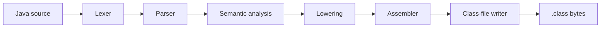

# njavac Maintainer Guide

This book is the authoritative maintainer documentation for njavac. The full
guide is being migrated into this structure; until that migration is complete,
the root documentation remains in force.

