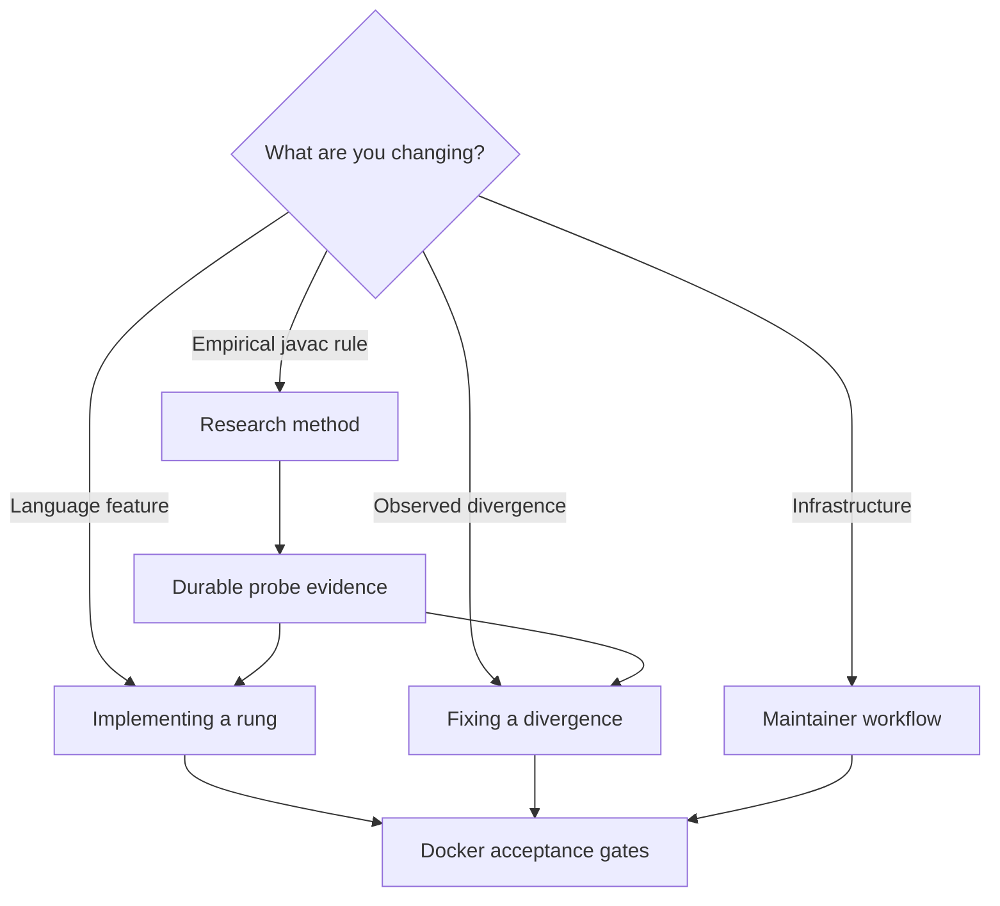
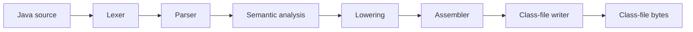

# njavac Maintainer Guide

This book is the authoritative human maintainer guide for njavac. The project
compiles a deliberately limited Java 25 surface to JVM class files under one
compatibility contract: every supported program must produce the same bytes as
the repository-pinned reference `javac`.

The root `README.md` is the repository entrance. This book owns durable human
documentation. Code and executable configuration remain authoritative for
machine-enforced details, such as exact constants and command-line flags.

## Start here

- [Prerequisites](start/prerequisites.md) describes the required Docker-based
  environment and the boundary between local debugging and acceptance.
- [Quickstart](start/quickstart.md) takes a new maintainer through the first
  build, compile, and byte-identity check.
- [Workflow](contributing/workflow.md) defines how changes are researched,
  separated, verified, committed, pushed, and reflected on.

## Find an authority

| Question | Authoritative page |
| --- | --- |
| What Java compiles today? | [Language support](reference/language-support.md) |
| What exactly does byte identity promise? | [Compatibility contract](reference/compatibility-contract.md) |
| How does the compiler work now? | [Architecture overview](architecture/overview.md) |
| Which command should I run? | [Command surface](tooling/command-surface.md), with `make help` as the exact catalog |
| How do fixtures and cached goldens work? | [Fixtures and goldens](tooling/fixtures-and-goldens.md) |
| How do I investigate a mismatch? | [Differential debugging](tooling/differential-debugging.md) |
| How does fuzzing classify results? | [Fuzzing](tooling/fuzzing.md) |
| What is being worked on next? | [Active work](direction/active-work.md) and [language rungs](direction/language-rungs.md) |
| What has been deliberately deferred? | [Deferred work](direction/deferred-work.md) |
| Where does a documentation fact belong? | [Documentation policy](contributing/documentation-policy.md) |

## Maintainer paths

- [Implementing a rung](contributing/implementing-a-rung.md)
- [Fixing a divergence](contributing/fixing-a-divergence.md)
- [Black-box research method](contributing/research-method.md)
- [Documentation policy](contributing/documentation-policy.md)

## Core pipeline

The [repository map](reference/repository-map.md) identifies the current files
and module facades. The [architecture direction](direction/architecture.md)
describes intended boundaries and triggers without pretending that future
modules already exist.
