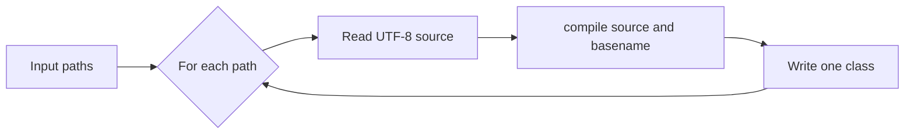

# Command-Line Interface

The `njavac` binary is a thin filesystem wrapper around the single-source
[library API](library-api.md):

```text
njavac [-d <directory>] <file.java> [<file.java> ...]
```

Run `njavac --help` for the executable's exact current syntax. Building and
running the binary directly is useful for compiler-internal debugging; only the
Docker-backed gates establish [byte identity](compatibility-contract.md).

## Inputs and outputs

With `-d`, every emitted class is written directly under the selected directory.
Without `-d`, each class is written beside its source file. The CLI creates the
`-d` directory and missing parents.

Each source is compiled independently. A multi-file invocation is a convenience
loop, not one Java compilation session: sources cannot resolve names from one
another, no shared classpath or symbol environment is built, and each accepted
source emits exactly one class.



## Naming contract

Three names participate in a CLI compilation:

| Name | Source |
| --- | --- |
| Class-file `this_class` | Parsed `public class` declaration |
| `SourceFile` attribute | Bare input filename supplied to the library |
| Output `.class` basename | Input filename with a trailing `.java` removed |

The current compiler does not compare the parsed public class name with the input
basename. A mismatch can therefore write `Wrong.class` whose internal class name
is `Other`. Such input is outside the [supported language contract](language-support.md#compilation-unit-shape); do not rely on this permissive behavior.

The current subset does not emit package directories, nested classes, or auxiliary
classes. Those features require a future artifact-oriented compilation API and a
different output-path model.

## Failure and exit status

The CLI continues to later source paths after a per-source read error, write error,
or returned compiler diagnostic. Creation of the shared `-d` directory happens
once before the source loop; if that setup fails, no source is compiled. It exits:

- `0` when every input compiles and writes successfully.
- `1` when any source has an I/O failure or returned diagnostic.
- `2` for invalid command syntax, an unknown option, no source files, or a missing
  value for `-d`.

Diagnostics are rendered to standard error with source context. Internal Rust
panics are not caught per source and may abort the whole process; they represent
compiler invariant failures rather than user-facing diagnostics. See
[Diagnostics](diagnostics.md).

## Source text

The CLI reads each file with Rust's UTF-8 text API. Valid UTF-8 is required at the
I/O boundary, but the supported Java lexer is intentionally narrower: direct
non-ASCII source and Java's general pre-lex Unicode translation are outside the
current language contract. Consult [Language Support](language-support.md#character-and-string-literals) before treating host-readable text as supported Java.

## Debugging example

After `make check`:

```bash
./target/release/njavac -d target/example-classes Example.java
```

This proves only that the host-built compiler ran. To compare against the pinned
reference compiler, use `make src-diff FILE=Example.java` for diagnostics or add a
fixture and run `make correctness` for an acceptance result. The distinction is
explained in [Command Surface](../tooling/command-surface.md).
