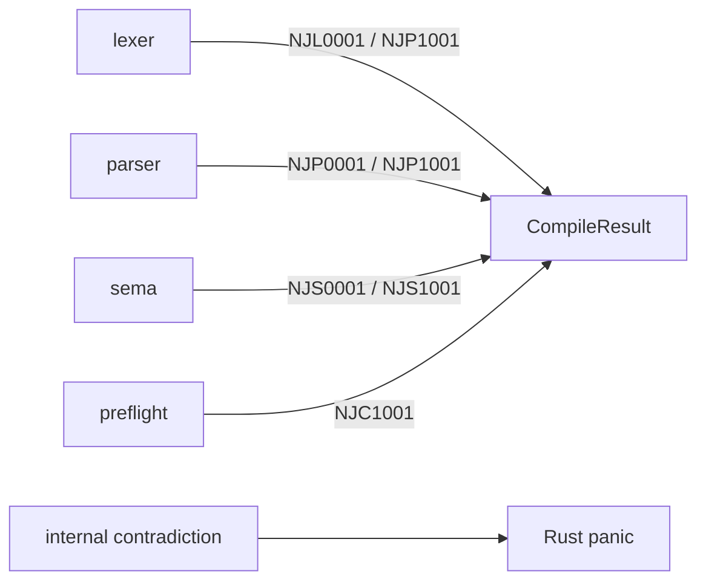

# Diagnostics

`src/diagnostic.rs` defines the compiler's returned failure model. A diagnostic
is structured data with a source byte span, severity, stable family code, and
human-readable message.

```rust
pub struct Diagnostic {
    pub span: Span,
    pub severity: Severity,
    pub code: DiagnosticCode,
    pub message: String,
}
```

`CompileResult<T>` is `Result<T, Diagnostic>`. The current compiler stops at the
first returned failure.

## Codes and classification

| Code | `DiagnosticCode` | Kind | Typical producer |
| --- | --- | --- | --- |
| `NJL0001` | `LexicalError` | `SyntaxError` | Lexer traversal, comments, escapes, and literals |
| `NJP0001` | `ParseError` | `SyntaxError` | Token expectation and grammar errors |
| `NJS0001` | `SemanticError` | `SyntaxError` | Invalid class use, types, assignments, names, or definite assignment |
| `NJP1001` | `UnsupportedSyntax` | `Unsupported` | Recognized punctuation or statement families outside the subset |
| `NJS1001` | `UnsupportedSemantic` | `Unsupported` | Parsed Java shape or meaning not modeled by sema |
| `NJC1001` | `UnsupportedCodegen` | `Unsupported` | Attributed shape the current backend cannot represent safely |

`DiagnosticCode::kind` deliberately groups ordinary lexical, parse, and semantic
errors as `ErrorKind::SyntaxError`; the name means invalid candidate input for
the current compiler oracle, not only parser syntax. The three `1001` families
are deliberate subset boundaries.

All compiler constructors currently create `Severity::Error`. `Severity::Warning`
exists in the model but no pipeline stage emits warnings and the compile result
cannot carry a warning alongside successful bytes.

## Stage boundary



Unsupported is used only for a known, intentional capability boundary. It is not
a catch-all for every Java feature that the parser does not recognize. Therefore
arbitrary out-of-subset source may produce a lexical or parse error instead of an
unsupported code.

Codegen preflight runs before constant-pool interning or byte emission. Its
returned diagnostic does not expose a partial class plan.

## Rendering

`Diagnostic::render(file, source)` returns a compact one-line-source report:

```text
path/File.java:line:column: error[NJS0001]: message
source line
    ^^^^^
```

The renderer:

- Treats `Span` offsets as byte offsets into the original UTF-8 source.
- Clamps the span start to the available source bytes.
- Computes line by counting preceding newline bytes.
- Computes column as byte distance from the line start plus one.
- Displays only the source line containing the span start.
- Extends an empty span to at least one caret.
- Derives the underline from the original span end, then clips it at the current
  LF-delimited line end while still showing one caret for an empty span or EOF.
- Uses `String::from_utf8_lossy` for the displayed source slice.

Columns and caret widths are therefore byte-based, not Unicode display columns.
Tabs, combining characters, wide glyphs, and non-ASCII UTF-8 can make visual
alignment differ from a terminal's rendered columns. Supported source is
ASCII-oriented, but this remains part of the renderer contract.

The `file` argument is display text supplied by the caller. It is independent of
the `source_file` metadata passed to `njavac::compile`.

## Position accuracy

`Span` is a half-open byte range with no source ID. Tokens, declarations,
statements, branch bodies, and `Name` occurrences retain spans. Most expression
nodes retain only `ExprId` and have no own span.

As a result, diagnostic precision depends on the error:

- Lexical failures generally identify the scanned bytes precisely.
- Parser failures generally identify the current or just-consumed token.
- Duplicate, undeclared, and uninitialized local failures point at a precise
  name occurrence.
- Many operand, cast, assignment, call-argument, and expression-type failures use
  the enclosing statement span supplied to recursive attribution.
- Some class-shape refusals use a method, parameter, or class-name span selected
  by sema.

The target source model will add source identity and complete expression spans;
the current renderer cannot recover positions the AST did not retain.

## Returned errors versus panics

Returned diagnostics represent expected source failures and deliberate
unsupported boundaries. Panics represent compiler invariant violations or
currently unreported hard limits, such as an analysis paired with the wrong
expression arena, stack accounting underflow, an unresolved label, a missing pool
entry, an unrepresentable branch offset, oversized method code, or an oversized
modified-UTF-8 payload. The unchecked `u16` source-line counter panics in debug
builds and wraps in release builds rather than returning a diagnostic.

Known long-branch overflow currently panics because branch-form selection is
missing. Wide ordinary local slots currently truncate rather than return a
diagnostic. Both are documented reachable defects, not additions to the
diagnostic surface.

The library does not catch panics. The CLI catches no panics either; it only
continues to the next source after a returned `Diagnostic` or filesystem error.
The fuzzer's panic capture is test infrastructure used to distinguish compiler
findings from supported refusals.

## CLI behavior

For each input file, `src/main.rs::compile_one` renders a returned diagnostic with
the original input path and source. The outer loop prints it with an `njavac:`
prefix, marks the invocation failed, and continues compiling later input paths.
Per-source read and write failures follow the same continuation rule. Failure to
create a shared `-d` directory occurs before that loop and terminates the
invocation without compiling any input.
The process exits nonzero if any input had an I/O or returned compile failure.

CLI usage and unknown-option errors are separate unstructured messages and exit
with status 2. Filesystem read/write failures are also strings, not `Diagnostic`
values.

## Target direction

The target compilation result can carry several diagnostics associated with
source IDs, preserve original-to-translated Unicode positions, and separate
status from emitted artifacts. Parser recovery, warning collection, and a
diagnostic sink belong to that future model.

Until then, callers should rely on the six code strings and `ErrorKind`
classification rather than parsing human-readable messages or rendered carets.
