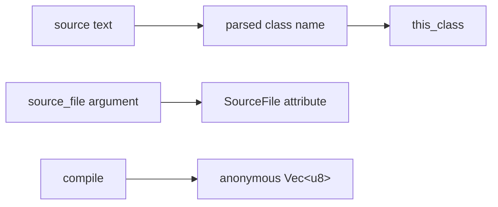

# Library API

The crate's fixed library entry point compiles one source string to one class-file
byte vector:

```rust
pub fn compile(
    source: &str,
    source_file: &str,
) -> njavac::diagnostic::CompileResult<Vec<u8>>
```

For accepted input inside [language support](language-support.md), the returned
bytes satisfy the [compatibility contract](compatibility-contract.md).

## Inputs

`source` is the complete Java source text. The current compiler has no source-map
or compilation-session object and does not read additional sources or a
classpath through this API.

`source_file` is the exact text stored in the class's `SourceFile` attribute. It
is conventionally the bare filename, such as `Example.java`, but the function
does not strip directories or validate a suffix. It does not select the class
name or an output location.

The emitted `this_class` comes from the parsed `public class` declaration:



The caller is responsible for associating the returned bytes with a path. To stay
inside the current compatibility boundary, the public class name, source
basename, and `source_file` value must agree as described by
[language support](language-support.md#compilation-unit-shape).

## Result and failure model

`CompileResult<T>` is an alias for `Result<T, Diagnostic>`. The current pipeline
is fail-fast and returns at most one diagnostic. It does not return partial class
bytes, warnings alongside success, or several source errors.

Expected lexical, parse, semantic, and deliberate backend refusals are returned
as `Err(Diagnostic)`. Internal invariant failures are ordinary Rust panics. A
caller that executes untrusted or out-of-subset input and needs isolation must
provide its own panic/process boundary; the differential fuzzer uses
`catch_unwind` only as test-oracle infrastructure.

See [diagnostics](diagnostics.md) for codes, classification, and rendering.

## Example

```rust
fn compile_example() -> Result<Vec<u8>, njavac::diagnostic::Diagnostic> {
    let source = r#"
public class Example {
    public static void main(String[] args) {
        int value = 40 + 2;
        System.out.println(value);
    }
}
"#;

    njavac::compile(source, "Example.java")
}
```

The function performs no filesystem I/O.

## Pipeline behavior

`src/lib.rs::compile` is a direct composition:

```text
lexer::lex
    -> parser::parse
    -> sema::analyze
    -> codegen::generate
```

The compiler validates only the documented subset. It is not a general Java
front end that guarantees graceful `Unsupported` results for arbitrary Java 25
source. Out-of-grammar input may receive an ordinary lexical or parse error, and
known reachable assembler defects remain outside the supported-program contract.

## Stage APIs are unstable

`src/lib.rs` currently declares `classfile`, `classdump`, `span`, `diagnostic`,
`lexer`, `ast`, `parser`, `sema`, and `codegen` as public modules. This visibility
supports repository binaries such as the profiler and structural differ. It does
not make every stage type a stable external API.

The source comment on `compile` identifies that function and its byte behavior as
the fixed frontend contract. The crate is version `0.1.0`, has no published
semver policy, and the architecture explicitly permits internal stage boundaries
and types to change. In particular:

- `lexer::lex`, `parser::parse`, `sema::analyze`, `codegen::plan`, and
  `codegen::generate` are maintainer-facing pipeline seams.
- AST layouts, `Analysis`, `MethodInfo`, `ClassPlan`, and class-file model types
  may evolve without compatibility wrappers.
- `Analysis` is tied to one exact `ExprArena`; `codegen::plan` asserts arena and
  method identity rather than accepting independently reconstructed values.
- Public `classfile` constructors expose the current closed model, not a general
  class-file authoring library.
- Public `classdump` functions are repository tooling and have partial decoding
  limits documented in [class file](../architecture/classfile.md#independent-class-reader).

External callers should depend on `njavac::compile` and diagnostic data only
unless they intentionally accept source-level coupling to this repository.

## CLI relationship

The `njavac` binary in `src/main.rs` is a thin filesystem wrapper over
`compile`. It accepts several input paths and compiles each independently,
continuing after a returned diagnostic. It supplies each path's bare filename as
`source_file`.

The CLI's destination basename is derived from the input source basename with a
trailing `.java` removed. It is not derived from the parsed class name. This is a
known distinction from the library's class identity and is shown in the
[architecture overview](../architecture/overview.md#one-class-two-names).

One invocation still does not represent one multi-source semantic compilation:
sources cannot resolve each other, and each call returns exactly one class.

## Target API, not implemented

The target architecture uses a compilation-shaped request and result containing
multiple source inputs, options, emitted class artifacts with internal names and
paths, diagnostics, and overall status. That contract is needed for packages,
multiple top-level classes, generated classes, and cross-source resolution.

No such types exist today. The current `compile(&str, &str)` function returns one
anonymous class byte vector and remains the only fixed library contract until a
concrete multi-artifact feature justifies the transition.
