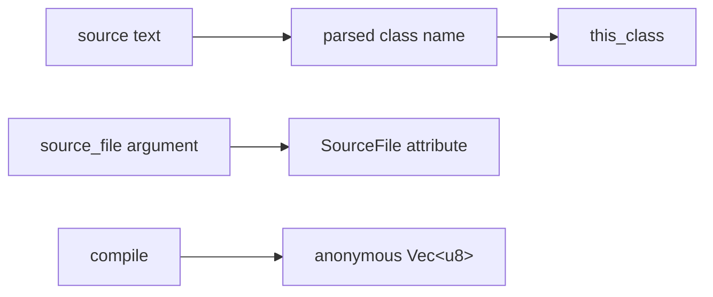

# Library API

The `njavac` facade's fixed library entry point compiles one source string to one
class-file byte vector:

```rust
pub fn compile(
    source: &str,
    source_file: &str,
) -> njavac::diagnostic::CompileResult<Vec<u8>>
```

For accepted input inside [language support](language-support.md), the returned
bytes satisfy the [compatibility contract](compatibility-contract.md).

## Inputs

`source` is the complete Java source text. The current compiler has no source-map
or compilation-session object and does not read additional sources or a
classpath through this API.

`source_file` is the exact text stored in the class's `SourceFile` attribute. The
function does not strip directories or validate a suffix, but the compatibility
contract requires an exact bare filename such as `Example.java`, matching both the
public class and the basename supplied to the pinned reference. A qualified path
such as `src/Example.java` is accepted as metadata but is outside that contract.
The argument does not select the class name or an output location.

The emitted `this_class` comes from the parsed `public class` declaration:



The caller is responsible for associating the returned bytes with a path. To stay
inside the current compatibility boundary, the public class name and bare
`source_file` value must agree, and that same basename must be supplied to the
reference compiler, as described by
[language support](language-support.md#compilation-unit-shape).

## Result and failure model

`CompileResult<T>` is an alias for `Result<T, Diagnostic>`. The current pipeline
is fail-fast and returns at most one diagnostic. It does not return partial class
bytes, warnings alongside success, or several source errors.

Expected lexical, parse, semantic, and deliberate backend refusals are returned
as `Err(Diagnostic)`. Internal invariant failures are ordinary Rust panics. A
caller that executes untrusted or out-of-subset input and needs isolation must
provide its own panic/process boundary; the differential fuzzer uses
`catch_unwind` only as test-oracle infrastructure.

See [diagnostics](diagnostics.md) for codes, classification, and rendering.

## Example

```rust
fn compile_example() -> Result<Vec<u8>, njavac::diagnostic::Diagnostic> {
    let source = r#"
public class Example {
    public static void main(String[] args) {
        int value = 40 + 2;
        System.out.println(value);
    }
}
"#;

    njavac::compile(source, "Example.java")
}
```

The function performs no filesystem I/O.

## Pipeline behavior

`crates/njavac/src/lib.rs::compile` delegates to the implementation pipeline in
`crates/njavac-compiler/src/lib.rs`:

```text
lexer::lex
    -> parser::parse
    -> sema::analyze
    -> codegen::plan
    -> ClassPlan::to_bytes
```

The compiler validates only the documented subset. It is not a general Java
front end that guarantees graceful `Unsupported` results for arbitrary Java 25
source. Out-of-grammar input may receive an ordinary lexical or parse error, and
known reachable assembler defects remain outside the supported-program contract.

## Facade boundary

Within this repository, the currently unpublished `njavac` package is the fixed
source-level facade. It exposes `compile`, `diagnostic`, and `span`. It does not
re-export lexer, parser, AST, semantic, codegen, class-file, class-reader, or
observer APIs. Diagnostic and span types are direct re-exports from the compiler
implementation, preserving type identity without exposing its stage modules.

Every workspace package currently sets `publish = false`. There is no supported
crates.io publication, root `cargo install --path .` route, or semver compatibility
commitment. Publishing or packaging the facade requires a deliberate distribution
policy for its compiler dependency and re-exported types.

`njavac-compiler` is an unpublished workspace member. Its public stage APIs and
`CompileObserver`, `CompilePhase`, and `compile_observed` are repository-internal
interfaces used by benchmark tooling. They may evolve without compatibility
wrappers. `CompilePhase` contains only compiler-owned stages; caller-owned
destruction of returned bytes belongs to the benchmark model.

The independent class reader belongs to the unpublished `njavac-classdump`
member rather than the fixed facade. Its partial decoding limits are documented
in [class file](../architecture/classfile.md#independent-class-reader).

Code using the facade should depend only on `njavac::compile` and its diagnostic
data.

## CLI relationship

The `njavac` binary in `crates/njavac/src/main.rs` is a thin filesystem wrapper over
`compile`. It accepts several input paths and compiles each independently,
continuing after a returned diagnostic. It supplies each path's bare filename as
`source_file`.

The CLI's destination basename is derived from the input source basename with a
trailing `.java` removed. It is not derived from the parsed class name. This is a
known distinction from the library's class identity and is shown in the
[architecture overview](../architecture/overview.md#one-class-two-names).

One invocation still does not represent one multi-source semantic compilation:
sources cannot resolve each other, and each call returns exactly one class.

## Target API, not implemented

The target architecture uses a compilation-shaped request and result containing
multiple source inputs, options, emitted class artifacts with internal names and
paths, diagnostics, and overall status. That contract is needed for packages,
multiple top-level classes, generated classes, and cross-source resolution.

No such types exist today. The current `compile(&str, &str)` function returns one
anonymous class byte vector and remains the only fixed library contract until a
concrete multi-artifact feature justifies the transition.
