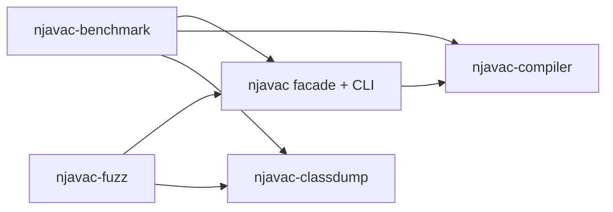
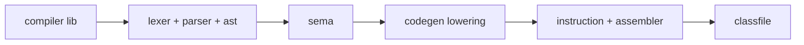

# Repository Map

njavac is a Cargo workspace with one stable compiler facade and four unpublished
implementation or tooling members. This page maps current paths to current
responsibilities. Future compiler-stage boundaries live in
[Architecture Direction](../direction/architecture.md).

## Workspace dependency graph



`njavac` is the fixed library boundary. Every current member sets
`publish = false`; the [Library API](library-api.md#facade-boundary) owns the
current consumption and distribution contract. Public Rust items inside
implementation and tooling members are workspace interfaces and do not become
part of the `njavac` facade unless it explicitly re-exports them. Compiler and
class-reader members do not depend on benchmark or fuzzer tooling.

## Workspace tree

```text
Cargo.toml
Cargo.lock
crates/
|-- njavac/
|   |-- Cargo.toml
|   |-- src/
|   |   |-- lib.rs
|   |   `-- main.rs
|   `-- tests/cli.rs
|-- njavac-compiler/
|   |-- Cargo.toml
|   `-- src/
|       |-- lib.rs
|       |-- span.rs
|       |-- diagnostic.rs
|       |-- fxhash.rs
|       |-- ast.rs
|       |-- lexer.rs
|       |-- lexer/
|       |-- parser.rs
|       |-- parser/
|       |-- sema.rs
|       |-- sema/
|       |-- codegen.rs
|       |-- codegen/
|       |-- classfile.rs
|       `-- classfile/
|-- njavac-classdump/
|   |-- Cargo.toml
|   `-- src/
|       |-- lib.rs
|       |-- reader.rs
|       |-- diff.rs
|       `-- bin/classdiff.rs
|-- njavac-benchmark/
|   |-- Cargo.toml
|   |-- src/bin/
|   |   |-- benchmark/main.rs
|   |   |-- benchmark/correctness.rs
|   |   |-- benchmark/measurement.rs
|   |   |-- benchmark/model.rs
|   |   |-- benchmark/phase.rs
|   |   |-- benchmark/report.rs
|   |   |-- benchmark/resource.rs
|   |   `-- benchmark_alloc.rs
|   `-- tests/benchmark_cli.rs
`-- njavac-fuzz/
    |-- Cargo.toml
    `-- src/bin/fuzz/
        |-- main.rs
        |-- model.rs
        |-- generate.rs
        |-- generate/
        |-- render.rs
        |-- javac.rs
        |-- observe.rs
        |-- oracle.rs
        |-- run.rs
        |-- finding.rs
        |-- minimize.rs
        |-- verify.rs
        `-- verify/
```

The root manifest is virtual and owns workspace membership, shared package
metadata, path dependencies, and shared external dependency versions. Each member
manifest owns its publication policy, direct dependencies, and binary targets.
The root lockfile covers the complete workspace.

## Stable facade and CLI

| Path | Responsibility |
| --- | --- |
| `crates/njavac/src/lib.rs` | Stable `compile` entry point and selected diagnostic/span re-exports |
| `crates/njavac/src/main.rs` | `njavac` CLI argument parsing, per-file I/O, and output naming |
| `crates/njavac/tests/cli.rs` | CLI-to-library output equivalence |

The [Library API](library-api.md) owns the currently unpublished facade's exact
export contract. Compiler stages, class-file construction, structural reading,
and instrumentation remain outside that boundary.

## Compiler implementation

`crates/njavac-compiler` owns the production pipeline and its benchmark observer
seam. Its source topology preserves the one-way compiler flow:



### Root compiler files

| Path | Named entry points or ownership |
| --- | --- |
| `crates/njavac-compiler/src/lib.rs` | Pipeline composition, `compile`, and workspace-internal phase observer seam |
| `crates/njavac-compiler/src/span.rs` | Half-open byte `Span` |
| `crates/njavac-compiler/src/diagnostic.rs` | `CompileResult`, diagnostic codes, classification, and rendering |
| `crates/njavac-compiler/src/fxhash.rs` | Deterministic-use custom hash implementation for lookup indexes |
| `crates/njavac-compiler/src/ast.rs` | Class/method/statement model, shared types, expression IDs, and expression arena |

### Frontend and semantics

| Path | Ownership |
| --- | --- |
| `crates/njavac-compiler/src/lexer.rs` | Byte traversal, trivia, lines, identifier/keyword dispatch, and `lex` |
| `crates/njavac-compiler/src/lexer/token.rs` | `Token` and `TokenKind` |
| `crates/njavac-compiler/src/lexer/literal.rs` | Supported numeric and text literal decoding |
| `crates/njavac-compiler/src/lexer/punctuator.rs` | Longest-match operators and punctuation |
| `crates/njavac-compiler/src/parser.rs` | Parser cursor, compilation unit, declarations, and `parse` |
| `crates/njavac-compiler/src/parser/expression.rs` | Prefix, primary, and precedence-climbing expression parsing |
| `crates/njavac-compiler/src/parser/statement.rs` | Statements, branches, assignments, and inc/dec desugaring |
| `crates/njavac-compiler/src/sema.rs` | Semantic model, class-shape validation, promotion helpers, and `analyze` |
| `crates/njavac-compiler/src/sema/analyzer.rs` | Method scopes, local IDs, slots, definite assignment, and frame-local snapshots |
| `crates/njavac-compiler/src/sema/analyzer/attribution.rs` | Expression validation, types, assignment checks, and call resolution |
| `crates/njavac-compiler/src/sema/constants.rs` | Attribution-time constant predicates, boolean outcome flow, and zero-divisor evaluation |

See [Frontend](../architecture/frontend.md) and
[Semantics](../architecture/semantics.md).

### Lowering and class files

| Path | Ownership |
| --- | --- |
| `crates/njavac-compiler/src/codegen.rs` | `ClassPlan`, preflight orchestration, method order, `plan`, and `generate` |
| `crates/njavac-compiler/src/codegen/preflight.rs` | Backend capability validation before emission |
| `crates/njavac-compiler/src/codegen/constant.rs` | Lowering constants, folding, conversions, and compound deltas |
| `crates/njavac-compiler/src/codegen/condition.rs` | `CondItem` and boolean provenance state |
| `crates/njavac-compiler/src/codegen/ops.rs` | Opcode-family and conversion decisions |
| `crates/njavac-compiler/src/codegen/stack.rs` | Primitive Java type to JVM computational type projection |
| `crates/njavac-compiler/src/codegen/lowering.rs` | Method context, constructor, descriptors, and frame-local projection |
| `crates/njavac-compiler/src/codegen/lowering/body.rs` | Statement, value, call, assignment, and compound lowering |
| `crates/njavac-compiler/src/codegen/lowering/condition.rs` | Conditions, chains, `if`, and boolean materialization |
| `crates/njavac-compiler/src/codegen/lowering/emit.rs` | Physical constant/load/store/conversion emission |
| `crates/njavac-compiler/src/codegen/instruction.rs` | Current opcodes, exact instruction forms, and stack-word effects |
| `crates/njavac-compiler/src/codegen/assembler.rs` | Symbolic instructions, anchors, stack accounting, lines, labels, layout, metadata, and encoding |
| `crates/njavac-compiler/src/classfile.rs` | Class-file module declarations and re-exports |
| `crates/njavac-compiler/src/classfile/model.rs` | Ordered class, method, code, attribute, and verifier models |
| `crates/njavac-compiler/src/classfile/pool.rs` | Encounter-ordered constant pool and serialization |
| `crates/njavac-compiler/src/classfile/writer.rs` | Phase-2 interning and complete class/attribute writing |
| `crates/njavac-compiler/src/classfile/modified_utf8.rs` | Modified UTF-8 payload encoding |
| `crates/njavac-compiler/src/classfile/buffer.rs` | Big-endian byte sink and length backpatching |

See [Lowering](../architecture/lowering.md),
[Assembler and Metadata](../architecture/assembler-and-metadata.md), and
[Class File](../architecture/classfile.md).

## Repository tooling

| Package | Binary | Purpose |
| --- | --- | --- |
| `njavac-classdump` | `classdiff` | Independently dump or compare class-file structure |
| `njavac-benchmark` | `benchmark` | Correctness harness modes plus controlled performance/resource reports |
| `njavac-benchmark` | `benchmark_alloc` | Allocation-instrumented helper invoked by benchmark tooling |
| `njavac-fuzz` | `fuzz` | Generate in-scope programs and run exact plus behavioral differential oracles |

`njavac-classdump` owns `reader.rs` and `diff.rs` and has no dependency on compiler
emission. The benchmark package owns strict fixture discovery, correctness modes,
the serde report contract, phase sequencing, resource accounting, measurement,
rendering, and publication. Its CLI integration tests use controlled compiler
executables rather than reaching across package binary targets.

The fuzzer keeps its typed source model, generation, rendering, reference worker,
execution observer, oracle, finding, minimization, and verification modules under
`crates/njavac-fuzz/src/bin/fuzz/`. It compiles candidates through the stable
facade and inspects divergences through the independent class reader.

## Java-side tools and fixtures

| Path | Purpose |
| --- | --- |
| `tools/FuzzJavac.java` | Persistent JavaCompiler worker using in-memory source and class bytes |
| `tools/FuzzObserve.java` | Class loader/execution observer with bounded protocol output |
| `fixtures/` | Recursively discovered exact-byte regression sources grouped by topic |

The Java helpers are fuzzer protocol peers, not compiler inputs. `fuzz-out/`,
`benchmark-results/`, `docs/book/`, and `target/` are ignored generated output.

## Build and documentation files

| Path | Responsibility |
| --- | --- |
| `Cargo.toml`, `Cargo.lock` | Virtual workspace definition and complete dependency lock |
| `crates/*/Cargo.toml` | Member ownership, direct dependencies, publication policy, and binary targets |
| `Makefile` | Sanctioned command surface; `make help` is the exact catalog |
| `Dockerfile` | Pinned workspace build/test stage plus reference, acceptance, and fuzz targets |
| `docs/book.toml`, `docs/Dockerfile` | Pinned mdBook and Mermaid configuration |
| `.github/` | Repository automation |
| `docs/src/` | Maintainer guide and current reference authorities |

All compiler builds, executions, exact-byte checks, behavioral checks, and
performance measurements run through Docker-backed Make targets.
