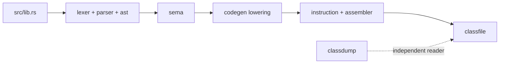

# Repository Map

njavac is one dependency-free Rust crate with several binaries, a Docker-pinned
reference environment, Java fixtures, and an mdBook maintainer guide. This page
maps current paths to current responsibilities. Future boundaries live separately
in [Architecture Direction](../direction/architecture.md).

## Compiler crate

```text
src/
|-- lib.rs
|-- main.rs
|-- span.rs
|-- diagnostic.rs
|-- fxhash.rs
|-- ast.rs
|-- lexer.rs
|-- lexer/
|   |-- token.rs
|   |-- literal.rs
|   `-- punctuator.rs
|-- parser.rs
|-- parser/
|   |-- expression.rs
|   `-- statement.rs
|-- sema.rs
|-- sema/
|   |-- analyzer.rs
|   |-- analyzer/attribution.rs
|   `-- constants.rs
|-- codegen.rs
|-- codegen/
|   |-- preflight.rs
|   |-- constant.rs
|   |-- condition.rs
|   |-- ops.rs
|   |-- stack.rs
|   |-- instruction.rs
|   |-- assembler.rs
|   |-- lowering.rs
|   `-- lowering/
|       |-- body.rs
|       |-- condition.rs
|       `-- emit.rs
|-- classfile.rs
|-- classfile/
|   |-- model.rs
|   |-- pool.rs
|   |-- writer.rs
|   |-- modified_utf8.rs
|   `-- buffer.rs
|-- classdump.rs
|-- classdump/
|   |-- reader.rs
|   `-- diff.rs
`-- bin/
    |-- bench/
    |-- classdiff.rs
    |-- fuzz/
    `-- profile.rs
```

Rust module-root files declare children and expose stage entry points. Some also
own implementation, cross-child types, or orchestration; others, notably
`src/classfile.rs`, primarily re-export child-owned types. Facade status alone
does not imply additional ownership or API stability.

## Pipeline ownership



### Root compiler files

| Path | Named entry points or ownership |
| --- | --- |
| `src/lib.rs` | Public modules and fixed `compile` pipeline |
| `src/main.rs` | `njavac` CLI, argument parsing, per-file I/O, output naming |
| `src/span.rs` | Half-open byte `Span` |
| `src/diagnostic.rs` | `CompileResult`, diagnostic codes, classification, rendering |
| `src/fxhash.rs` | Deterministic-use custom hash implementation for lookup indexes |
| `src/ast.rs` | Class/method/statement model, shared `Type`, `ExprId`, `ExprArena`, `ExprKind` |

### Frontend

| Path | Ownership |
| --- | --- |
| `src/lexer.rs` | Byte traversal, trivia, lines, identifier/keyword dispatch, `lex` |
| `src/lexer/token.rs` | `Token` and `TokenKind` |
| `src/lexer/literal.rs` | Supported numeric and text literal decoding |
| `src/lexer/punctuator.rs` | Longest-match operators and punctuation |
| `src/parser.rs` | Parser cursor, compilation unit, class/method/parameter declarations, `parse` |
| `src/parser/expression.rs` | Precedence climbing, unary/primary expressions, structural calls |
| `src/parser/statement.rs` | Statements, branch bodies, assignments, inc/dec desugaring |

See [frontend](../architecture/frontend.md).

### Semantic analysis

| Path | Ownership |
| --- | --- |
| `src/sema.rs` | Public semantic model, class-shape validation, promotion helpers, `analyze` |
| `src/sema/analyzer.rs` | Method scopes, `LocalId`, slots, definite assignment, frame-local snapshots |
| `src/sema/analyzer/attribution.rs` | Expression validation/types, assignment checks, call resolution |
| `src/sema/constants.rs` | Narrow attribution-time constant predicates and zero-divisor evaluation |

See [semantics](../architecture/semantics.md).

### Lowering and assembly

| Path | Ownership |
| --- | --- |
| `src/codegen.rs` | `ClassPlan`, preflight orchestration, class method order, `plan`, `generate` |
| `src/codegen/preflight.rs` | Backend capability validation before emission |
| `src/codegen/constant.rs` | Lowering constants, folding, constant conversion, compound deltas |
| `src/codegen/condition.rs` | `CondItem` and boolean provenance state |
| `src/codegen/ops.rs` | Opcode and conversion decision helpers |
| `src/codegen/stack.rs` | `PrimitiveType` to `StackTy` projection |
| `src/codegen/lowering.rs` | `Gen`, constructor/method setup, descriptor and verifier-local projection |
| `src/codegen/lowering/body.rs` | Statement, value, assignment, compound, and call lowering |
| `src/codegen/lowering/condition.rs` | Conditions, chains, `if`, boolean materialization |
| `src/codegen/lowering/emit.rs` | Physical constant/load/store/conversion emission |
| `src/codegen/instruction.rs` | Current opcodes, exact `Instruction` forms, stack-word effects |
| `src/codegen/assembler.rs` | Symbolic instruction storage, anchors, stack-word accounting, pending-line consumption, labels, goto compaction, layout, metadata resolution, encoding |

See [lowering](../architecture/lowering.md) and
[assembler and metadata](../architecture/assembler-and-metadata.md).

### Class files and inspection

| Path | Ownership |
| --- | --- |
| `src/classfile.rs` | Class-file module declarations and public re-exports |
| `src/classfile/model.rs` | Ordered class, method, code, attribute, and verifier models |
| `src/classfile/pool.rs` | Ordered constant pool and pool serialization |
| `src/classfile/writer.rs` | Phase-2 interning and complete class/attribute writing |
| `src/classfile/modified_utf8.rs` | Modified UTF-8 payload encoding |
| `src/classfile/buffer.rs` | Big-endian byte sink and length backpatching |
| `src/classdump.rs` | Independent reader/differ facade |
| `src/classdump/reader.rs` | Partial structural class reader with raw fallback regions |
| `src/classdump/diff.rs` | First-byte and first-substantive-field localization |

See [class file](../architecture/classfile.md).

## Binaries

Cargo auto-discovers the crate's binaries from `src/main.rs`, `src/bin/*.rs`, and
`src/bin/<name>/main.rs`.

| Binary | Source | Purpose |
| --- | --- | --- |
| `njavac` | `src/main.rs` | Compile one or more independent `.java` files through the library |
| `bench` | `src/bin/bench/main.rs` | Fixture correctness and controlled whole-suite timing harness |
| `classdiff` | `src/bin/classdiff.rs` | Dump or structurally compare class files |
| `fuzz` | `src/bin/fuzz/main.rs` | Generate in-scope programs and run exact plus behavioral differential oracles |
| `profile` | `src/bin/profile.rs` | Local in-process cumulative pipeline profiler |

`src/bin/bench/correctness.rs` owns fixture discovery outcomes, live/cached
reference comparison, and mismatch reports. `src/bin/bench/timing.rs` owns the
container-gated process timing pass.

The fuzzer is split by responsibility:

| Path area | Responsibility |
| --- | --- |
| `src/bin/fuzz/model.rs` | Fuzzer-only typed source IR and naming chokepoint |
| `generate.rs`, `generate/` | Deterministic random program generation |
| `render.rs` | Precedence-aware Java source rendering |
| `javac.rs` | Persistent in-memory reference compiler client and CLI verification helpers |
| `observe.rs` | Persistent execution observer client and normalized observations |
| `oracle.rs` | njavac outcome capture and javac-first classification |
| `run.rs` | Batch orchestration, tallies, signatures, lazy observation |
| `finding.rs`, `minimize.rs` | Finding persistence, signatures, and minimization |
| `verify.rs`, `verify/` | Worker, observer, and self-test gates |

## Java-side tools

| Path | Purpose |
| --- | --- |
| `tools/FuzzJavac.java` | Source-launched persistent JavaCompiler worker using in-memory source and class bytes |
| `tools/FuzzObserve.java` | Source-launched class loader/execution observer with bounded protocol output |

These are fuzzer protocol peers, not compiler inputs. Their bytes and behavior
must be verified against the pinned CLI/observer gates after changes.

## Fixtures and generated output

`fixtures/` contains recursively discovered Java acceptance cases grouped by
topic. Basenames must be globally unique because current harness output
directories are flat. Fixtures are compiled in one compiler invocation but remain
independent one-class sources.

`fuzz-out/` is git-ignored raw finding/telemetry output. `target/` contains Rust
build artifacts, benchmark outputs, and optional local caches. Neither is source
authority.

## Build and environment files

| Path | Responsibility |
| --- | --- |
| `Cargo.toml`, `Cargo.lock` | One dependency-free Rust 2024 crate and locked package metadata |
| `Makefile` | Sanctioned command surface; `make help` is the exact catalog |
| `Dockerfile` | Pinned Java reference and Rust build image used by correctness tooling |
| `docs/book.toml`, `docs/Dockerfile` | Pinned mdBook/Mermaid build configuration |
| `.github/` | Repository automation |

All byte-identity acceptance runs through Docker. Local `make check` and
`profile` are compiler-debugging/performance tools, not compatibility gates.

## Documentation authorities

| Path | Current role |
| --- | --- |
| `docs/src/` | Human maintainer guide and current reference pages |
| `README.md` | Concise repository entry that routes readers into this guide |
| `CLAUDE.md` | Agent bootstrap and documentation style guide |
| `docs/src/direction/architecture.md` | Target boundaries and module-creation triggers |
| `docs/src/direction/active-work.md` | Ordered active infrastructure and open findings |
| `docs/src/direction/deferred-work.md` | Unordered deferred improvements |
| `.claude/skills/byte-identity-rung/` | Thin agent adapter to the human feature and bug workflows |

The [documentation policy](../contributing/documentation-policy.md) defines how
facts migrate into this book and how duplicate prose is removed.

## API visibility warning

The crate currently exports most stage facades publicly. This is useful to the
profiler and repository tools, but it does not establish stable external module
contracts. `njavac::compile` is the fixed library entry point; details are in the
[library API](library-api.md). The target boundaries in
[Architecture Direction](../direction/architecture.md) are not permission to
import paths that do not exist or to create empty modules.
