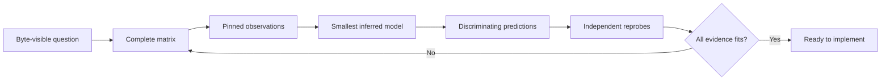

# Evidence and Confidence

The research pages preserve the project's broad Java 25 survey and byte-identity
hazards for language that njavac does not yet support. They are a research queue,
not a promise of syntax acceptance and not an exhaustive account of Java 25.

Current accepted behavior is authoritative only in
[Language Support](../reference/language-support.md). The reference compiler and
byte-identity boundary are defined by the
[Compatibility Contract](../reference/compatibility-contract.md).

## Confidence labels

Every research claim uses one of these labels:

| Label | Meaning |
| --- | --- |
| **[O] Observed** | A checked-in, rerunnable probe or fixture shows the pinned compiler producing the stated output. |
| **[I] Inferred** | One explicit rule explains a complete documented observation matrix. |
| **[P] Predicted** | An inferred rule predicts the result, but that result has not been independently probed. |
| **[U] Unverified** | A useful report, hypothesis, or concern lacks durable pinned evidence and must be reprobed before implementation. |

An isolated manual experiment is not promoted to **[O]** unless its input and
relevant output facts are retained. Specifications can explain semantics and
legal class-file forms, but not which legal byte sequence the pinned javac emits.

## Status of the migrated survey

The previous root coverage survey said its future-feature details were manually
checked with throwaway programs against the pinned compiler. Those probe sources
and output records were not retained. The details remain valuable and have been
migrated to these pages, but are marked **[U]** until a named corpus makes them
rerunnable. This is a confidence correction, not a claim that the old observations
were false.

Research pages may contain many **[U]** rows and no **[O]** row for a distant
feature. That accurately distinguishes a survey lead from evidence ready to drive
byte-compatible implementation.

## Research map

| Topic | Page | Scope |
| --- | --- | --- |
| Structural consequences | [Class-file impact](classfile-impact.md) | Frames, pool kinds, attributes, bootstrap methods, and cross-cutting byte hazards |
| Values and operations | [Values and expressions](values-and-expressions.md) | Literals, references, arrays, calls, operators, lambdas, and concatenation |
| Statements | [Control flow](control-flow.md) | Loops, switch families, abrupt completion, exceptions, synchronization, and scopes |
| Program declarations | [Declarations and types](declarations-and-types.md) | Members, inheritance, nested types, interfaces, enums, records, annotations, and generics |
| Source-set structure | [Compilation units](compilation-units.md) | Packages, imports, multiple outputs, local types, package info, and modules |
| Recent language | [Modern Java](modern-java.md) | Java 8 through Java 25 headline features and preview stamping |

The map is intentionally broad but not exhaustive. Missing Java grammar or
class-file behavior must not be interpreted as cheap, byte-invisible, or covered.

## Durable evidence currently present

The checked-in `fixtures/` tree is durable **[O]** evidence for current supported
behavior because the Docker correctness gate recompiles each fixture with the
pinned reference and byte-compares it. Its topical areas are:

- `basics/`
- `branches/`
- `compound-assign/`
- `conversions/`
- `folding/`
- `literals/`
- `operators/`
- `println/`
- `scopes/`
- `types/`

Fixtures guard support; a complete probe corpus justifies a hidden model. A
boundary case can belong in both, but the prose conclusion should have one home
and link to the evidence rather than duplicating a disassembly.

## Evidence record

A future corpus should record:

- The question and competing hypotheses.
- Pinned compiler identity through repository configuration.
- Minimal source inputs and exact command surface used.
- Relevant raw bytes or structural fields, not only normalized `javap` text.
- Dimensions covered and intentionally omitted.
- Observations, inferred rule, risky predictions, and independent prediction
  checks.
- Fixture links for supported boundary cases.

Useful dimensions include operand/result types, constants versus locals, encoding
boundaries, branch polarity, grouping, nesting, empty versus non-empty stack,
attribute presence/order, constant-pool order, and generated-artifact order.

## Research loop

If a probe contradicts the current model, stop and rebuild the model from the
complete corpus. Do not stack local exceptions onto a disproven explanation.

## Black-box boundary

Allowed evidence includes pinned repository probes, raw bytes, structural
classdiff output, pinned `javap`, fresh fixture comparisons, and differential
fuzzer observations. javac/OpenJDK source, decompilation, implementation internals,
a host JDK, intuition, or one unretained example are not authorities.

Names in njavac that resemble compiler concepts describe local models inferred
from outputs. They do not grant permission to use reference-compiler internals as
design documentation.
