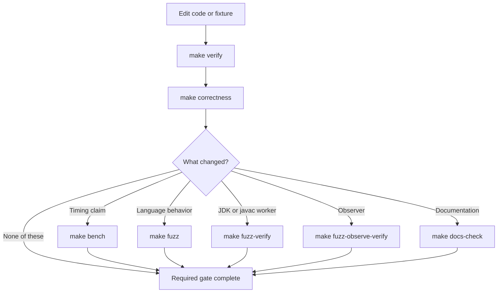

# Command Surface

Run repository operations through `make` from the repository root. The
`Makefile` is the sanctioned command surface because it selects the pinned
containers, mounts, volumes, entrypoints, and resource controls that make each
operation meaningful.

Use this page to choose a command. Use `make help` and the relevant binary's
`--help` output for the exact current syntax and flags.

## Gate hierarchy

`make verify` is fast but cache-backed and can be stale. `make correctness` is
the fresh, authoritative pre-commit byte-identity gate. `make bench` adds
controlled whole-suite timing to the same fresh correctness check. Local builds
and profiles are never acceptance evidence.

## Target catalog

### Discovery and images

| Target | Purpose | Gate semantics |
| --- | --- | --- |
| `help` | Print the current Make target catalog. | Informational. It is the authority for target invocation syntax. |
| `image` | Build the main compiler, reference-JDK, benchmark, differ, and fuzzer image. | Build prerequisite only. A successful image build does not compare compiler output. |
| `docs-image` | Build the separate pinned mdBook and Mermaid image. | Documentation-tool prerequisite only. |

### Correctness and timing

| Target | Purpose | Gate semantics |
| --- | --- | --- |
| `verify` | Compile with njavac in Docker and compare against the persisted golden volume. It auto-records only when that volume has no class files. | Fast cached inner-loop gate. A nonempty cache is not freshness-checked and can be stale. |
| `correctness` | Compile with both njavac and the pinned `javac`, then byte-compare fresh outputs. | Authoritative online correctness gate with no timing pass. This is the normal pre-commit gate. |
| `record` | Rebuild the golden cache from the pinned `javac`, then run an offline verification. | Cache-maintenance operation followed by a cached check. With `FILE`, recording still covers the whole suite; only the second verification is filtered. |
| `bench` | Run fresh correctness, then time one whole-suite invocation of each compiler under Docker CPU and memory controls. | Authoritative correctness plus controlled process-level timing. With `FILE`, the harness checks only that fixture and skips timing. |
| `check` | Build all Rust binaries in release mode on the host. | Local compiler-internal debugging only. It is not a test and not acceptance. |
| `profile` | Build and run the in-process pipeline profiler on the host. | Local performance investigation only. It neither invokes the reference compiler nor proves byte identity. |

See [Fixtures and Goldens](fixtures-and-goldens.md) for cache lifecycle and
[Profiling](profiling.md) for the distinction between benchmark and pipeline
measurements.

### Differential debugging

| Target | Purpose | Gate semantics |
| --- | --- | --- |
| `probe` | Compile one source with the pinned `javac` and print `javap -v -p` output. | Black-box reference inspection, not a comparison or gate. |
| `src-diff` | Compile one source with both compilers, byte-compare it, and print `classdiff` plus a `javap -c` diff on divergence. | Diagnostic command, not a gate. It intentionally returns success when both compilers accept but their bytes differ. |
| `diff` | Run the structural `classdiff` tool on two existing class files inside Docker. | Focused comparison. The underlying tool exits nonzero when the files differ, but this does not exercise the corpus or compilers. |

The success status of `src-diff` means the diagnostic completed, not that the
classes matched. Read its `IDENTICAL` or `bytes differ` output. Use
`correctness` for a status-bearing byte-identity gate. See
[Differential Debugging](differential-debugging.md).

### Fuzzing

| Target | Purpose | Gate semantics |
| --- | --- | --- |
| `fuzz` | Generate random in-scope Java, compare exact bytes, and execute byte-divergent pairs through the observer. | Fails for behavioral differences and invalid njavac syntax rejections or panics. Byte-only drift is operational telemetry and does not fail this target, although it still violates the product's byte-compatibility contract. |
| `fuzz-verify` | Compare the persistent in-memory javac worker with the real pinned `javac` CLI over generated programs. | Worker-oracle gate. Run after a JDK bump or worker change. Any acceptance or byte disagreement fails. |
| `fuzz-selftest` | Inject a synthetic difference and exercise outcome capture, minimization, reporting, and artifact writing. | Harness plumbing gate. It does not need or discover a real compiler bug. |
| `fuzz-observe-verify` | Exercise observer return, output difference, load failure, throw, timeout, and restart behavior. | Observer lifecycle gate. Run after observer or execution-isolation changes. |

The fuzzer is not CPU-pinned because it is a differential search tool, not a
timing benchmark. Its worker source files are not baked into the main image;
the Make targets bind-mount the repository so `tools/FuzzJavac.java` and
`tools/FuzzObserve.java` are available. See [Fuzzing](fuzzing.md).

### Documentation

| Target | Purpose | Gate semantics |
| --- | --- | --- |
| `docs` | Serve the mdBook through the documentation container on a loopback port. | Interactive preview, not a complete documentation gate. |
| `docs-build` | Build the mdBook through the pinned documentation image. | Validates mdBook parsing, preprocessing, and rendering for pages included by `SUMMARY.md`. |
| `docs-check` | Build the book, then run the pinned link checker against rendered output in offline mode. | Documentation build and internal-link gate. |

See [Documentation Tooling](documentation.md) for generated artifacts, Mermaid,
and link-check behavior.

## Key Make variables

| Variable | Used by | Meaning |
| --- | --- | --- |
| `FILE` | `probe`, `src-diff`, `verify`, `correctness`, `record`, `bench` | Select one source or fixture where supported. `probe` and `src-diff` require it. `record FILE=...` records the whole suite before filtering verification. |
| `A`, `B` | `diff` | Paths to the two class files, visible through the repository bind mount. |
| `BENCH_CPU`, `BENCH_MEM` | `bench` | Select the host CPU index and container memory limit used for deterministic timing controls. |
| `SEED`, `COUNT`, `BATCH` | `fuzz`, `fuzz-verify` | Select a reproducible generator seed, case count, and javac-worker batch size. Omitting `SEED` from a normal fuzz run chooses and prints a fresh seed. |
| `FUZZFLAGS` | `fuzz` | Pass additional fuzzer options. Consult `fuzz --help` for the exact supported flags. |
| `ROUNDS`, `TRIALS`, `PHASE` | `profile` | Control repeated corpus passes, minimum-reduced trials, and the cumulative pipeline phase to measure. |
| `DOCS_PORT` | `docs` | Change the host loopback port used by the documentation server. |
| `DOCS_IMAGE` | documentation targets | Override the local tag used for the pinned documentation image. |
| `IMAGE` | main Docker targets | Override the local tag of the main njavac image. |
| `VOLUME`, `GOLDENS` | `verify`, `record` | Override the Docker golden-volume name and its in-container path. These are normally implementation details. |

The Makefile computes `DOCS_UID` and `DOCS_GID` from the host so documentation
build output is not owned by root. Do not treat those computed values as a public
configuration surface.

## Artifact map

| Operation | Durable artifact |
| --- | --- |
| `make check` or `make profile` | Host `target/release/` binaries; `target/` is ignored. |
| `make record` or first empty-cache `make verify` | Class files in the Docker golden volume; never committed. |
| `make fuzz` and fuzzer verification modes | Findings under host `fuzz-out/` because the repository is bind-mounted; the directory is ignored. |
| `make docs-build`, `make docs-check`, or `make docs` | Rendered host `docs/book/`; the directory is ignored. |
| `make probe` or `make src-diff` | Terminal output only; temporary classes disappear with the container. |
| `make correctness` or `make bench` | Terminal result only under the Make wrapper; benchmark output directories are inside the disposable container. |

For environment failures and misleading success states, see
[Troubleshooting](../start/troubleshooting.md).
