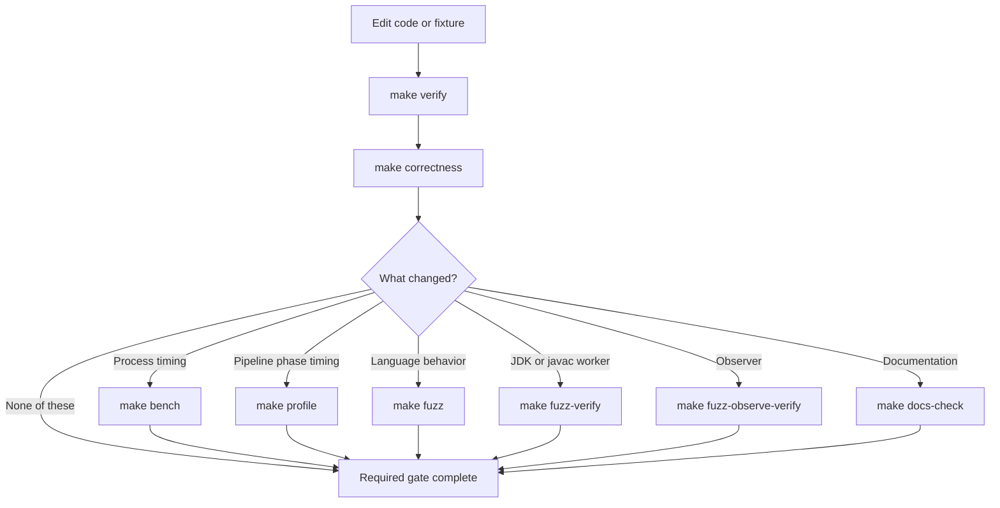

# Command Surface

Run repository operations through `make` from the repository root. The
`Makefile` is the sanctioned command surface because it selects the configured
containers, mounts, volumes, entrypoints, and resource controls that make each
operation meaningful.

Use this page to choose a command. Use `make help` and the relevant binary's
`--help` output for the exact current syntax and flags.

## Gate hierarchy

`make verify` is fast but cache-backed and can be stale. `make correctness` is
the fresh, authoritative pre-commit exact-byte fixture gate. `make bench` adds repeated
whole-suite timing samples under controls that support same-host comparisons; it
does not make wall-clock results deterministic or portable across hosts. An image
build or profile run is never compatibility evidence.

## Target catalog

### Discovery and images

| Target | Purpose | Gate semantics |
| --- | --- | --- |
| `help` | Print the current Make target catalog. | Informational. It is the authority for target invocation syntax. |
| `image` | Build the main compiler, reference JDK, benchmark, profiler, differ, and fuzzer image. | Sole compiler build path and prerequisite for main-image targets. A successful image build does not compare compiler output. |
| `docs-image` | Build the separate pinned mdBook and Mermaid image. | Documentation-tool prerequisite only. |

### Correctness and timing

| Target | Purpose | Gate semantics |
| --- | --- | --- |
| `verify` | Compile with njavac in Docker and compare against the persisted golden volume. It auto-records only when that volume has no class files. | Fast cached inner-loop gate. A nonempty cache is not freshness-checked and can be stale. |
| `correctness` | Compile with both njavac and the configured in-image `javac`, then byte-compare fresh outputs. | Authoritative online exact-byte fixture gate with no timing pass. This is the normal pre-commit gate. |
| `record` | Rebuild the golden cache from the configured in-image `javac`, then run an offline verification. | Cache-maintenance operation followed by a cached check. With `FILE`, recording still covers the whole suite; only the second verification is filtered. |
| `bench` | Run fresh correctness, then collect repeated whole-suite process samples for each compiler under Docker CPU and memory controls. Each sample is one compiler invocation. | Exact-byte fixture evidence plus controlled same-host timing. With `FILE`, the harness checks only that fixture and skips timing. Timed invocations do not check their later process statuses. |
| `profile` | Run the main image's in-process pipeline profiler under the benchmark CPU and memory controls. | Controlled phase-performance evidence only. It neither invokes the reference compiler nor establishes compatibility. |

See [Fixtures and Goldens](fixtures-and-goldens.md) for cache lifecycle and
[Profiling](profiling.md) for the distinction between benchmark and pipeline
measurements.

### Differential debugging

| Target | Purpose | Gate semantics |
| --- | --- | --- |
| `probe` | Compile one source with the configured in-image `javac` and print `javap -v -p` output. | Black-box reference inspection, not a comparison or gate. |
| `src-diff` | Compile one source with both compilers, byte-compare it, and print `classdiff` plus a `javap -c` diff on divergence. | Diagnostic command, not a gate. It intentionally returns success when both compilers accept but their bytes differ, and it suppresses `classdiff` and text-diff failures while printing diagnostics. |
| `diff` | Run the structural `classdiff` tool on two existing class files inside Docker. | Focused comparison. Zero means identical. Nonzero can mean either different bytes or a read/parse/usage failure, so read stderr and stdout; this does not exercise the corpus or compilers. |

The success status of `src-diff` means the shell recipe reached its end, not that
the classes matched or every diagnostic tool succeeded. Read `IDENTICAL`, `bytes
differ`, and every diagnostic error. GNU Make also reports a recipe failure with
its own status, so the inner reference-rejected and candidate-rejected exit codes
are not a stable public status API. Use `correctness` for a status-bearing
exact-byte fixture gate. See [Differential Debugging](differential-debugging.md).

### Fuzzing

| Target | Purpose | Gate semantics |
| --- | --- | --- |
| `fuzz` | Generate random in-scope Java, compare exact bytes, and execute byte-divergent pairs through the observer. | Fails for behavioral differences and invalid njavac syntax rejections or panics. Observation-equivalent byte drift passes this scoped behavioral oracle and remains byte-retention telemetry. |
| `fuzz-verify` | Compare the persistent in-memory javac worker with the configured `javac` CLI over a generated sample. | Sampled worker-oracle gate. Run after a JDK bump or worker change. Any observed acceptance or byte disagreement fails; a pass is not exhaustive proof. |
| `fuzz-selftest` | Capture synthetic candidate outcomes, find a compilable generated case, minimize under its synthetic predicate, and write source and structural-diff artifacts. | Narrow harness plumbing check. It does not exercise the normal observer, behavioral-finding report, worker protocol, keep-going census, or a real compiler bug. |
| `fuzz-observe-verify` | Exercise observer return, output difference, load failure, throw, timeout, and restart behavior. | Observer lifecycle gate. Run after observer or execution-isolation changes. |

The fuzzer is not CPU-pinned because it is a differential search tool, not a
timing benchmark. Its worker source files are not baked into the main image;
the Make targets bind-mount the repository so `tools/FuzzJavac.java` and
`tools/FuzzObserve.java` are available. See [Fuzzing](fuzzing.md).

### Documentation

| Target | Purpose | Gate semantics |
| --- | --- | --- |
| `docs` | Serve the mdBook through the documentation container on a loopback port. | Interactive preview, not a complete documentation gate. |
| `docs-build` | Build the mdBook through the pinned documentation image. | Validates mdBook parsing, preprocessing, and rendering for pages included by `SUMMARY.md`. |
| `docs-check` | Build the book, inventory recursive Markdown sources against `SUMMARY.md`, then run the pinned link checker against rendered output in offline mode. | Documentation source-inclusion, build, and internal-link gate. |

See [Documentation Tooling](documentation.md) for generated artifacts, Mermaid,
and link-check behavior.

## Make controls

`make help` owns target names and the short invocation hints attached to targets;
it is not a generated variable catalog. The assignments in `Makefile` are the
executable authority for defaults and forwarding. The table here explains the
maintainer-facing controls but must not be used to infer controls that a recipe
does not pass.

| Variable | Used by | Meaning |
| --- | --- | --- |
| `FILE` | `probe`, `src-diff`, `verify`, `correctness`, `record`, `bench` | Select one source or fixture where supported. `probe` and `src-diff` require it. `record FILE=...` records the whole suite before filtering verification. |
| `A`, `B` | `diff` | Paths to the two class files, visible through the repository bind mount. |
| `BENCH_CPU`, `BENCH_MEM` | `bench`, `profile` | Select the Docker-visible CPU index and container memory limit shared by both performance measurements. |
| `SEED`, `COUNT`, `BATCH` | `fuzz`, `fuzz-verify` | Select the generator seed, case count, and javac-worker batch size. `COUNT` and `BATCH` must be positive decimal integers. Omitting `SEED` chooses and prints a fresh seed in these two modes. |
| `FUZZFLAGS` | `fuzz` only | Append raw fuzzer command-line tokens. Consult `fuzz --help`; this value is not shell-safe quoting and is not forwarded by the other fuzzer targets. |
| `ROUNDS`, `TRIALS`, `PHASE` | `profile` | Control repeated corpus passes, minimum-reduced trials, and the cumulative pipeline phase to measure. |
| `DOCS_PORT` | `docs` | Change the host loopback port used by the documentation server. |
| `DOCS_IMAGE` | documentation targets | Override the local tag used for the pinned documentation image. |
| `IMAGE` | main Docker targets | Override the local tag of the main njavac image. |
| `VOLUME`, `GOLDENS` | `verify`, `record` | Override the Docker golden-volume name and its in-container path. These are normally implementation details. |

The Makefile computes `DOCS_UID` and `DOCS_GID` from the host so documentation
build output is not owned by root. Do not treat those computed values as a public
configuration surface.

The fuzzer parser currently accepts some malformed named numeric values by
silently retaining a default. `COUNT=0` can produce a vacuous run, while
`BATCH=0` with a positive count prevents progress. A malformed value can also
consume the next token as its value. Treat only explicit positive decimal values
as valid and verify the printed `seed`, `count`, and `batch` header before relying
on a run.

## Environment and paths

Direct `bench` execution reads `JAVAC`, `JAVAP`,
`NJAVAC_BENCH_ALLOW_HOST`, and the container marker
`NJAVAC_IN_CONTAINER`. Direct `fuzz` execution reads `JAVAC`, `JAVA`,
`FUZZ_WORKER`, and `FUZZ_OBSERVER`. These are binary-level debugging controls,
not all Make controls. The Docker recipes do not pass arbitrary host environment
variables with `docker run -e`; use the Make variables and flags that each recipe
explicitly forwards. In particular, `FUZZFLAGS` reaches only `make fuzz`.

Use repository-relative paths for `FILE`, `A`, `B`, worker paths, and fuzzer
output paths. The relevant recipes interpolate some values into shell commands or
expand them as unquoted argument lists, so whitespace, quotes, shell
metacharacters, and leading option-like path components are unsupported. Keep ad
hoc inputs under a simple ignored repository path such as `scratch-fuzz/`.

## Artifact map

| Operation | Durable artifact |
| --- | --- |
| `make image` | Local Docker image under `IMAGE`; BuildKit may retain Cargo registry and Rust target caches outside Git. |
| `make docs-image` | Local Docker image under `DOCS_IMAGE`; downloaded mdBook and Mermaid archives are verified during the build. |
| `make profile` | Terminal timing report only; the profiler binary and fixture snapshot come from `IMAGE`. |
| `make record` or first empty-cache `make verify` | Class files in the named Docker golden volume; never committed. BuildKit cache removal does not remove this volume. |
| `make fuzz` and fuzzer verification modes | Findings under host `fuzz-out/` because the repository is bind-mounted. Containers run as root, so created files may be root-owned. Only the default top-level directory is ignored. |
| `make docs-build`, `make docs-check`, or `make docs` | Rendered host `docs/book/`; the directory is ignored. |
| `make probe` or `make src-diff` | Terminal output only; temporary classes disappear with the container. |
| `make correctness` or `make bench` | Terminal result only under the Make wrapper; benchmark output directories are inside the disposable container. |

A custom fuzzer `--out-dir` is not automatically ignored. Place it below
`fuzz-out/` or add an intentional ignore rule before generating artifacts; do not
leave findings in an unignored source directory.

For environment failures and misleading success states, see
[Troubleshooting](../start/troubleshooting.md).
