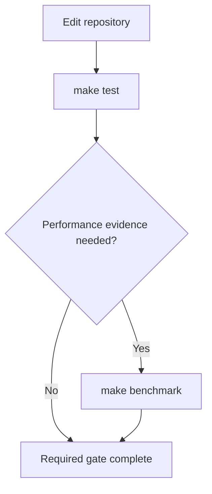

# Command Surface

Run repository operations through `make` from the repository root. The
`Makefile` is the sanctioned command surface because it selects the configured
containers, mounts, volumes, entrypoints, and resource controls that make each
operation meaningful.

Use this page to choose a command. Use `make help` and the relevant binary's
`--help` output for the exact current syntax and flags.

## Gate hierarchy

`make test` is the complete deterministic pass/fail repository gate. Focused
targets remain useful while developing, but they do not replace the aggregate.
`make benchmark` is deliberately outside that gate: it collects only performance
and resource evidence and never establishes correctness. Timing must not decide a
test result, and deterministic correctness assertions must not be added to the
benchmark path. Wall-clock results remain non-deterministic and non-portable.

## Target catalog

### Discovery and images

| Target | Purpose | Gate semantics |
| --- | --- | --- |
| `help` | Print the current Make target catalog. | Informational. It is the authority for target invocation syntax. |
| `image` | Build the explicit `acceptance` target containing the reference JDK, compiler, fixture harness, and differ. | Acceptance-image prerequisite only. A successful image build does not compare compiler output. |
| `docs-image` | Build the separate pinned mdBook and Mermaid image. | Documentation-tool prerequisite only. |
| `benchmark-help` | Build the acceptance image, print effective Make controls and fixed Docker controls, then print the in-image benchmark binary help. | Informational sanctioned discovery route. |

### Testing and timing

| Target | Purpose | Gate semantics |
| --- | --- | --- |
| `verify` | Compile with njavac in Docker and compare against the persisted golden volume. It auto-records only when that volume has no class files. | Fast cached inner-loop gate. A nonempty cache is not freshness-checked and can be stale. |
| `correctness` | Compile with both njavac and the configured in-image `javac`, then byte-compare fresh outputs. | Authoritative focused exact-byte fixture gate with no timing pass. The complete pre-commit gate is `make test`. |
| `record` | Rebuild the golden cache from the configured in-image `javac`, then run an offline verification. | Cache-maintenance operation followed by a cached check. With `FILE`, recording still covers the whole suite; only the second verification is filtered. |
| `test` | Run all deterministic pass/fail checks: Rust tests, fresh exact-byte fixtures, instrumentation equivalence, fuzzer self-test, observer lifecycle, fixed-seed worker verification and fuzz smoke, and documentation checks. | Complete repository test gate. It makes no performance assertion and does not invoke `make benchmark`. |
| `benchmark` | Run uninstrumented process and compiler-core measurements, phase attribution, allocation attribution, and one unified report under Docker controls. | Performance/resource evidence only. It rejects `FILE`, performs no reference byte comparison, and fails only when measurement or publication cannot complete. |

See [Fixtures and Goldens](fixtures-and-goldens.md) for cache lifecycle and
[Benchmarking and Profiling](profiling.md) for pass isolation, metrics, artifacts,
and the distinction between uninstrumented and profiled measurements.

### Differential debugging

| Target | Purpose | Gate semantics |
| --- | --- | --- |
| `probe` | Compile one source with the configured in-image `javac` and print `javap -v -p` output. | Black-box reference inspection, not a comparison or gate. |
| `src-diff` | Compile one source with both compilers, byte-compare it, and print `classdiff` plus a `javap -c` diff on divergence. | Diagnostic command, not a gate. It intentionally returns success when both compilers accept but their bytes differ, and it suppresses `classdiff` and text-diff failures while printing diagnostics. |
| `diff` | Run the structural `classdiff` tool on two existing class files inside Docker. | Focused comparison. Zero means identical. Nonzero can mean either different bytes or a read/parse/usage failure, so read stderr and stdout; this does not exercise the corpus or compilers. |

The success status of `src-diff` means the shell recipe reached its end, not that
the classes matched or every diagnostic tool succeeded. Read `IDENTICAL`,
`bytes differ`, and every diagnostic error. GNU Make also reports a recipe failure
with its own status, so the inner reference-rejected and candidate-rejected exit
codes are not a stable public status API. Use `correctness` for a status-bearing
exact-byte fixture gate. See [Differential Debugging](differential-debugging.md).

### Fuzzing

| Target | Purpose | Gate semantics |
| --- | --- | --- |
| `fuzz` | Generate random in-scope Java, compare exact bytes, and execute byte-divergent pairs through the observer. | Fails for behavioral differences and invalid njavac syntax rejections or panics. Observation-equivalent byte drift passes this scoped behavioral oracle and remains byte-retention telemetry. |
| `fuzz-verify` | Compare the persistent in-memory javac worker with the configured `javac` CLI over a generated sample. | Sampled worker-oracle gate. Run after a JDK bump or worker change. Any observed acceptance or byte disagreement fails; a pass is not exhaustive proof. |
| `fuzz-selftest` | Capture synthetic candidate outcomes, find a compilable generated case, minimize under its synthetic predicate, and write source and structural-diff artifacts. | Narrow harness plumbing check. It does not exercise the normal observer, behavioral-finding report, worker protocol, keep-going census, or a real compiler bug. |
| `fuzz-observe-verify` | Exercise observer return, output difference, load failure, throw, timeout, and restart behavior. | Observer lifecycle gate. Run after observer or execution-isolation changes. |

The fuzzer is not CPU-pinned because it is a differential search tool, not a
timing benchmark. Its dedicated image contains the worker source files and pins
their absolute paths. Make mounts only repository-root `fuzz-out/` for durable
artifacts. See [Fuzzing](fuzzing.md).

### Documentation

| Target | Purpose | Gate semantics |
| --- | --- | --- |
| `docs` | Serve the mdBook through the documentation container on a loopback port. | Interactive preview, not a complete documentation gate. |
| `docs-build` | Build the mdBook through the pinned documentation image. | Validates mdBook parsing, preprocessing, and rendering for pages included by `SUMMARY.md`. |
| `docs-check` | Build the book, inventory recursive Markdown sources, validate inline repository and mapped Rust API references, then run the pinned link checker against rendered output in offline mode. | Documentation source-inclusion, code-reference, build, and internal-link gate. |

See [Documentation Tooling](documentation.md) for generated artifacts, Mermaid,
and link-check behavior.

## Make controls

`make help` owns target names and the short invocation hints attached to targets;
it is not a generated variable catalog. The assignments in `Makefile` are the
executable authority for defaults and forwarding. The table here explains the
maintainer-facing controls but must not be used to infer controls that a recipe
does not pass.

| Variable | Used by | Meaning |
| --- | --- | --- |
| `FILE` | `probe`, `src-diff`, `verify`, `correctness`, `record` | Select one source or fixture where supported. `probe` and `src-diff` require it. `record FILE=...` records the whole suite before filtering verification. `benchmark` rejects `FILE`; use `correctness FILE=...`. |
| `A`, `B` | `diff` | Paths to the two class files, visible through the repository bind mount. |
| `BENCH_CPU`, `BENCH_MEM` | `benchmark` | Select the Docker-visible CPU index and container memory limit for every benchmark pass. |
| `SAMPLES`, `WARMUP`, `ROUNDS`, `ALLOCATION_ROUNDS` | `benchmark` | Control measured samples, untimed warm-ups, hot/phase corpus repetitions per sample, and allocation corpus repetitions. Positive-value validation belongs to the benchmark binary; `WARMUP` may be zero. |
| `BENCH_POWER_MODE` | `benchmark` | Record the maintainer-supplied host power-mode label in the report. It does not change host power settings. |
| `RESULTS`, `RESULT_FILE` | `benchmark` | Select the repository-relative host directory and generated JSON filename. The default directory is ignored, and the default filename includes revision, UTC run time, and a run-process identifier so reports accumulate rather than overwrite one another. A custom directory is not automatically ignored. |
| `SEED`, `COUNT`, `BATCH` | `fuzz`, `fuzz-verify` | Select the generator seed, case count, and javac-worker batch size. `COUNT` and `BATCH` must be positive decimal integers. Omitting `SEED` chooses and prints a fresh seed in these two modes. |
| `FUZZFLAGS` | `fuzz` only | Append raw fuzzer command-line tokens. Consult `fuzz --help`; this value is not shell-safe quoting and is not forwarded by the other fuzzer targets. |
| `DOCS_PORT` | `docs` | Change the host loopback port used by the documentation server. |
| `DOCS_IMAGE` | documentation targets | Override the local tag used for the pinned documentation image. |
| `IMAGE` | acceptance targets | Override the local acceptance-image tag. |
| `REFERENCE_IMAGE` | `probe` | Override the local reference-image tag. |
| `FUZZ_IMAGE` | fuzzer targets | Override the local self-contained fuzzer-image tag. |
| `VOLUME`, `GOLDENS` | `verify`, `record` | Override the Docker golden-volume name and its in-container path. These are normally implementation details. |

The Makefile computes documentation and benchmark UID/GID values from the host so
their mounted output is not owned by root. It also captures the current revision
and host CPU label for benchmark metadata. Do not treat those computed values as a
public configuration surface.

The fuzzer parser currently accepts some malformed named numeric values by
silently retaining a default. `COUNT=0` can produce a vacuous run, while
`BATCH=0` with a positive count prevents progress. A malformed value can also
consume the next token as its value. Treat only explicit positive decimal values
as valid and verify the printed `seed`, `count`, and `batch` header before relying
on a run.

## Environment and paths

Direct `benchmark` execution reads `JAVAC`, `JAVAP`,
`NJAVAC_BENCHMARK_ALLOW_HOST`, and the container marker
`NJAVAC_IN_CONTAINER`. The Make target also supplies revision, host CPU, power,
and container-control metadata. Direct `fuzz` execution reads `JAVAC`, `JAVA`,
`FUZZ_WORKER`, and `FUZZ_OBSERVER`. These are binary-level debugging controls,
not all Make controls. The fuzz target sets worker paths inside its image. Docker
recipes do not pass arbitrary host environment variables with `docker run -e`;
use the Make variables and flags that each recipe explicitly forwards. In
particular, `FUZZFLAGS` reaches only `make fuzz`.

Use repository-relative paths for `FILE`, `A`, and `B`. The relevant recipes
interpolate some values into shell commands or expand them as unquoted argument
lists, so whitespace, quotes, shell metacharacters, and leading option-like path
components are unsupported. Keep ad hoc inputs under a simple ignored repository
path such as `scratch-fuzz/`. Fuzzer worker paths are fixed inside `FUZZ_IMAGE`,
and only output below container path `fuzz-out/` persists through Make's narrow
host mount.

## Artifact map

| Operation | Durable artifact |
| --- | --- |
| `make image` | Local acceptance image under `IMAGE`; BuildKit may retain shared JDK, Cargo registry, and Rust target caches outside Git. |
| `make docs-image` | Local Docker image under `DOCS_IMAGE`; downloaded mdBook and Mermaid archives are verified during the build. |
| `make probe` | Local reference image under `REFERENCE_IMAGE`; probe classes remain inside the disposable container. |
| `make record` or first empty-cache `make verify` | Class files in the named Docker golden volume; never committed. BuildKit cache removal does not remove this volume. |
| `make fuzz` and fuzzer verification modes | Local fuzz image under `FUZZ_IMAGE` plus findings under the bind-mounted host `fuzz-out/`. Containers run as root, so created files may be root-owned. |
| `make docs-build`, `make docs-check`, or `make docs` | Rendered host `docs/book/`; the directory is ignored. |
| `make src-diff` | Terminal output only; temporary classes disappear with the container. |
| `make correctness` | Terminal result only; class outputs remain inside the disposable container. |
| `make benchmark` | Terminal performance/resource report plus one full-revision- and time-named JSON file under host `RESULTS`. Temporary class outputs remain inside the disposable container. |
| `make test` | Terminal pass/fail output, Docker build caches, and generated ignored `docs/book/`; fuzzer test artifacts stay in disposable containers. |

A custom fuzzer `--out-dir` must remain below `fuzz-out/` to use Make's host mount.
Output elsewhere in the container disappears with `--rm`.

For environment failures and misleading success states, see
[Troubleshooting](../start/troubleshooting.md).
