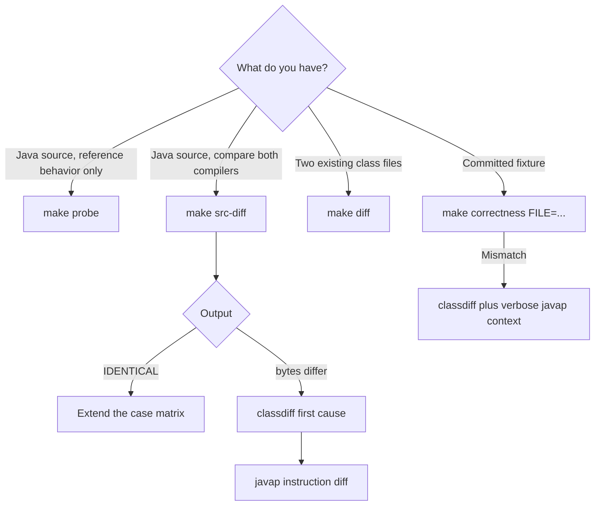

# Differential Debugging

Differential debugging treats the configured in-image `javac` as a black box. Build probes,
observe emitted class files, and infer the smallest rule that explains a complete
case matrix. Do not inspect or derive a design from javac or OpenJDK source.

## Tool selection

Use ad hoc probes to understand behavior. Use fixtures to preserve exact-output
rules after they are understood. Use a fresh fixture gate, not an ad hoc
diagnostic's exit status, to establish byte retention for a fixture.

## `make probe`

`make probe FILE=...` bind-mounts the repository, compiles the source only with
the configured `javac` into a temporary directory, then prints private and verbose
`javap` output. It is useful for constant-pool order, attributes, stack maps, line
tables, descriptors, flags, and exact bytecode layout.

The source must be visible below the repository mount and should follow the normal
public-class/filename rule. Pass a repository-relative path with no whitespace,
quotes, shell metacharacters, or leading option-like component because the Make
recipe interpolates `FILE` into an in-container shell command. Put throwaway
matrices under an ignored repository path such as `scratch-fuzz/`, not outside the
mount. The temporary class files are deleted with the container; preserve durable
evidence as a probe corpus or fixture when required by the development workflow.

`probe` answers "what did the reference emit?" It does not run njavac and is not a
gate.

## `make src-diff`

`make src-diff FILE=...` is the fastest end-to-end diagnostic for one ad hoc
source:

1. Compile with the configured `javac`.
2. Compile with the image's njavac binary.
3. Compare `<basename>.class` byte-for-byte.
4. If bytes differ, print the structural `classdiff` report.
5. Print a `javap -c -p` diff with javac on the left and njavac on the right.

The command uses disposable output directories and persists only terminal output.
It assumes the source basename is the emitted class basename.

Important: byte divergence is an expected diagnostic outcome, so the internal
`classdiff` and text `diff` failures are deliberately ignored. If both compilers
accepted, `make src-diff` returns success even when it printed `bytes differ`.
This also means a `classdiff` read or parse failure and a textual-diff tool failure
can be hidden while the outer command succeeds. The shell emits distinct internal
statuses for reference and njavac rejection, but GNU Make normally collapses a
failed recipe to its own nonzero status. Treat the printed rejection label as the
diagnostic distinction, not the top-level Make status. Never use this command in a
script as a boolean byte-identity or diagnostic-health gate; parse-free gate
semantics for exact fixtures belong to `make correctness`.

## `make diff` and `classdiff`

`make diff A=... B=...` bind-mounts the repository and invokes `classdiff` in the
acceptance image. The first path is conventionally the reference class and the
second the candidate.

The structural differ parses class files into ordered fields and reports the first
substantive divergent path with its byte offset and readable values. Count and
length fields that merely reflect later content are demoted so the report points
at the likely cause rather than a derived symptom. It remains useful when `javap`
renders both files identically.

The `classdiff` binary also supports a one-file structural dump when run directly.
For two files it exits zero only on identity. Exit 1 is ambiguous: it represents
both byte divergence and read or parse failure; usage errors use another nonzero
status. `make diff` therefore supports a zero-is-identical check, but a nonzero
result must be interpreted with its output. It compares only the supplied files
and does not prove how they were produced. `A` and `B` have the same
repository-relative, shell-safe path constraint as other diagnostic paths.

## Fixture mismatch diagnostics

The benchmark correctness pass reports every failing basename, then expands the
first failure. It prints:

- A byte-offset-precise structural divergence.
- The first differing line of `javap -v -p` output with nearby context.
- A missing-output message if one compiler did not emit the expected class.

The harness strips file path, modification time, and checksum header lines from
the verbose disassembly before comparing it. If class bytes differ but normalized
`javap` agrees, trust the byte comparison and structural report to establish and
localize physical divergence; neither result alone establishes a behavioral
defect.

## Investigation workflow

1. Reproduce with `make correctness FILE=...` for a fixture or `make src-diff`
   for an ad hoc source.
2. Read the structural path before studying the larger disassembly.
3. Reduce the source while preserving the structural signature for byte-retention
   work and the observation signature for behavioral work.
4. Build a matrix around all relevant operand types, constants, source positions,
   control-flow shapes, and boundary values.
5. Use `make probe` to collect configured-reference observations for cases njavac does
   not yet compile.
6. State a falsifiable rule and test predictions outside the examples that
   suggested it.
7. Implement one model change.
8. Add or reduce the durable exact fixture. For an alternate permitted by the
   optimization exception, first add the sanctioned durable behavioral regression
   oracle required for acceptance, then run the applicable full-suite gates.

Stop if a supposedly byte-preserving change creates broad new divergence or a
probe contradicts the model. Return to the last verified boundary rather than
stacking exceptions. See [Research Method](../contributing/research-method.md) and
[Fixtures and Goldens](fixtures-and-goldens.md).
