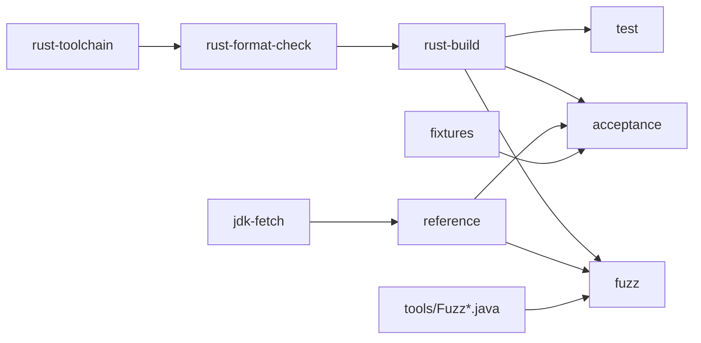

# Docker and CI

Docker defines njavac's controlled build and execution environments. Exact bytes
and behavioral comparisons are specific to the content-pinned reference `javac`
shared by the reference-derived images, so host Java output is never a substitute.

## Root image graph

The root `Dockerfile` has shared reference and Rust workspace build stages, one
deterministic test target, and three runtime capability targets:

The fetch stage selects the GraalVM 25.0.2 archive by Docker target architecture
and verifies its repository-recorded SHA-256 before extraction. The runtime and
Rust base images are digest-pinned; the Rust build copies all workspace members
and uses `Cargo.lock` through `cargo build --release --locked --workspace`.
BuildKit caches the Cargo registry and shared workspace target data across local
rebuilds. The digest-pinned Rust base installs the rustfmt component for the exact
toolchain in `rust-toolchain.toml`. `rust-format-check` copies the complete Rust
workspace and runs the policy in `rustfmt.toml` before `rust-build`; every compiler,
test, acceptance, and fuzz image therefore rejects unformatted Rust. `make fmt`
uses the earlier toolchain stage with a writable host-identity bind mount, while
`make fmt-check` exposes the read-only build stage directly.

| Target | Image variable | Contents and purpose |
| --- | --- | --- |
| `rust-toolchain` | `RUST_TOOLCHAIN_IMAGE` | Exact Rust release plus its matching rustfmt component; used only by the mutating `make fmt` command. |
| `rust-format-check` | No runtime tag required | Complete Rust source snapshot checked against the committed rustfmt policy before any workspace build. |
| `reference` | `REFERENCE_IMAGE` | Complete verified JDK and reference tools; used by `probe` and as the base for reference-dependent targets. |
| `acceptance` | `IMAGE` | Reference JDK, `njavac`, the unified `benchmark` runner, its internal allocation helper, `classdiff`, and the fixture snapshot. It sets `NJAVAC_IN_CONTAINER` and defaults to the benchmark harness. |
| `fuzz` | `FUZZ_IMAGE` | Reference JDK, `fuzz`, and the two source-launched Java workers copied from `tools/`. Absolute worker paths bind the image to one repository revision. |
| `test` | No runtime tag required | Every workspace member's deterministic unit and CLI integration tests. It has no reference JDK and makes no timing assertions. The aggregate `make test` also runs reference, fuzzer, and documentation checks through their capability images. |

Every image recipe using the root compiler Dockerfile names its target explicitly.
Adding another stage cannot silently change a public compiler image tag merely by
becoming the last stage. The reference archive is accepted only after checksum
verification, so cache state cannot silently select different javac bytes.

## Runtime isolation by target

| Target family | Image | Host mount or volume | Resource controls |
| --- | --- | --- | --- |
| `verify`, `record` | Acceptance | Golden volume | No timing controls |
| `correctness` | Acceptance | None | No timing controls |
| `benchmark` | Acceptance | Host `RESULTS` directory for JSON; the default is ignored | One selected CPU, fixed CPU quota, memory and swap cap, PID limit |
| Workspace Rust tests | Rust `test` build target | None | No timing controls; test results are deterministic assertions |
| Rust formatting | Rust toolchain or format-check target | Writable repository mount only for `make fmt`; copied read-only build context for checks | No timing controls |
| `probe` | Reference | Repository source mount | Diagnostic only |
| `src-diff`, `diff` | Acceptance | Repository source/class mount | Diagnostic only |
| Fuzzer targets | Fuzz | Only repository-root `fuzz-out/` | Not CPU-pinned; fuzzing is not a timing benchmark |

Every Docker-backed execution command depends on the capability image it requires,
so Docker evaluates the relevant current build context before execution. Outputs
under the benchmark's in-container `/tmp/njavac-benchmark` disappear with the
`--rm` container. The golden volume, bind-mounted `fuzz-out/`, and benchmark JSON
under the bind-mounted results directory are the intentional durable exceptions.

`make benchmark` uses `BENCH_CPU` and `BENCH_MEM` to account for host topology and
available resources. The selected CPU index must exist in Docker's visible CPU
set. After building `IMAGE`, the recipe resolves its immutable image ID once, runs
that ID, and records the same value in the report. The container runs as the host
UID/GID so its JSON artifact remains writable.
These controls reduce variance for nearby runs on the same host; host load,
virtualization, power, thermal state, and scheduler behavior remain uncontrolled.
The result is neither deterministic nor comparable across arbitrary hosts.

## Documentation image

Documentation uses `docs/Dockerfile`, not the compiler image. It pins all base
images by digest, verifies the mdBook archive and mdbook-mermaid crate checksums,
and builds mdbook-mermaid against the committed lockfile's matching 0.5.4
preprocessor protocol before copying only the documentation tools into runtime.

Documentation commands bind-mount the repository and run as the host UID/GID so
`docs/book/` remains host-writable. The preview server publishes only on
`127.0.0.1`. `make docs-check` uses a separately pinned Lychee image and mounts the
rendered book read-only for offline internal-link and anchor checking. Before
Lychee, it runs the source inventory script in the documentation image against a
read-only repository mount. See [Documentation Tooling](documentation.md).

## Acceptance boundary

| Activity | Docker-backed? | Acceptance evidence? |
| --- | ---: | ---: |
| `make image` | Yes | Acceptance-image build evidence only |
| Direct host `javac` comparison | No | No; disallowed as reference evidence |
| `make verify` | Yes | Cached inner-loop evidence; cache may be stale |
| `make correctness` | Yes | Fresh exact-byte fixture evidence |
| `make test` | Yes | Complete deterministic pass/fail repository evidence across Rust formatting/tests, fixtures, instrumentation, fuzzer infrastructure, fixed-seed smoke, and documentation |
| `make benchmark` | Yes | Controlled same-host performance and resource evidence only; no compatibility claim |
| Fuzzer worker and observer gates | Yes | Evidence for their specific oracle contracts |
| `make docs-check` | Yes | Documentation rendering and internal-link evidence |

Direct host `cargo test` and `cargo fmt` are not sanctioned. `make test` is the
Docker-backed aggregate test route, `make fmt` and `make fmt-check` own formatting,
and focused debugging uses the narrower targets from the command surface.

## Current CI state

`.github/workflows/ci.yml` runs `make test` on GitHub Actions for every push and
pull request. The job checks out the repository on `ubuntu-latest`, enables
BuildKit, and executes every deterministic pass/fail surface through the aggregate
Make target. The runner and checkout action use mutable GitHub labels, but the
reference JDK and compiler build images remain content-pinned by the repository
Dockerfile.

The workflow does not run the mutable golden cache, random-seed fuzz campaign, or
`make benchmark`. It has no declared Docker layer cache. A green GitHub status
establishes the deterministic contracts aggregated by `make test`; it does not
establish performance, random-fuzz coverage, or accepted alternate
representations beyond those deterministic checks.

Changes to the workflow should continue to invoke existing Make targets rather
than recreate their Docker commands. Add the relevant explicit jobs when their
contract is required; do not infer them from the correctness job. Do not call a
golden-volume `make verify` job authoritative unless the job refreshes the cache
from the same image first.

For Docker daemon, CPU-set, mount, and cache failures, see
[Troubleshooting](../start/troubleshooting.md).
