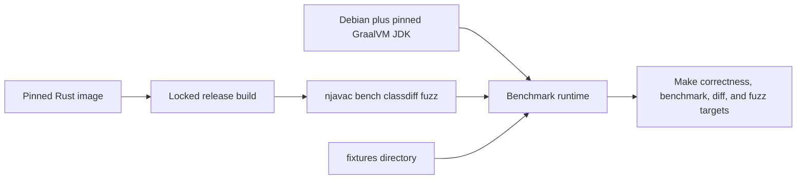

# Docker and CI

Docker defines njavac's reproducible acceptance environment. Byte identity is
specific to the exact reference `javac` build, so host Java output is never a
substitute for the repository image.

## Main image

The root `Dockerfile` has three stages:

The JDK stage installs the exact GraalVM Java 25 distribution selected by the
Dockerfile through SDKMAN. The Rust stage uses its pinned Rust image and
`cargo build --release --locked`. The runtime inherits the JDK, copies the fixture
corpus and release binaries, sets `NJAVAC_IN_CONTAINER`, and uses `bench` as its
default entrypoint.

The runtime image includes `njavac`, `bench`, `classdiff`, and `fuzz`. It does not
include the Java sources under `tools/`. Fuzzer Make targets therefore mount the
repository at `/w` and run there so the source-launched workers resolve. Probe and
class-file-diff targets also mount the repository because they consume ad hoc host
files. Fixture gates use the fixture snapshot copied into the newly built image.

BuildKit caches SDKMAN archives, the Cargo registry, and Cargo target data across
image rebuilds. These caches improve rebuild speed but do not become checked-in
artifacts or reference goldens.

## Runtime isolation by target

| Target family | Repository mount | Golden volume | Resource controls |
| --- | ---: | ---: | --- |
| `verify`, `record` | No | Yes | No timing controls |
| `correctness` | No | No | No timing controls |
| `bench` | No | No | One selected CPU, fixed CPU quota, memory and swap cap, PID limit |
| `probe`, `src-diff`, `diff` | Yes | No | Diagnostic only |
| Fuzzer targets | Yes | No | Not CPU-pinned; fuzzing is not a timing benchmark |

Every main Docker target depends on `image`, so Docker evaluates the current build
context before running it. Outputs under the benchmark's default in-container
`target/bench-out` disappear with the `--rm` container. The golden volume and
bind-mounted `fuzz-out/` are the intentional durable exceptions.

`make bench` uses `BENCH_CPU` and `BENCH_MEM` to account for host topology and
available resources. The selected CPU index must exist in Docker's visible CPU
set. Correctness does not require pinning; repeatable timing does.

## Documentation image

Documentation uses `docs/Dockerfile`, not the compiler image. It pins the Alpine
base by digest, downloads fixed mdBook and mdbook-mermaid releases for `amd64` or
`arm64`, verifies their archives by architecture-specific SHA-256, and copies only
those tools into the runtime stage.

Documentation commands bind-mount the repository and run as the host UID/GID so
`docs/book/` remains host-writable. The preview server publishes only on
`127.0.0.1`. `make docs-check` uses a separately pinned Lychee image and mounts the
rendered book read-only for offline internal-link and anchor checking. See
[Documentation Tooling](documentation.md).

## Acceptance boundary

| Activity | Docker-backed? | Acceptance evidence? |
| --- | ---: | ---: |
| `make check` | No | No; local build only |
| `make profile` | No | No; local pipeline measurement only |
| Direct host `javac` comparison | No | No; disallowed as reference evidence |
| `make verify` | Yes | Cached inner-loop evidence; cache may be stale |
| `make correctness` | Yes | Fresh byte-identity acceptance |
| `make bench` | Yes | Fresh acceptance plus controlled timing |
| Fuzzer worker and observer gates | Yes | Evidence for their specific oracle contracts |
| `make docs-check` | Yes | Documentation rendering and internal-link evidence |

There is no `cargo test` acceptance substitute. A local compiler run can help
debug internals but cannot establish compatibility against the pinned reference.

## Current CI state

The repository currently contains no hosted CI workflow configuration under
`.github/workflows`. No GitHub Actions job automatically runs correctness,
fuzzing, or documentation gates on push or pull request. Maintainers must run the
appropriate Make targets explicitly and report their results; a green remote
status must not be assumed.

If hosted CI is introduced, it should invoke the existing Make targets rather
than recreate their Docker commands. In particular, CI must preserve:

- The pinned main and documentation images.
- Docker-only reference comparisons.
- Fresh `make correctness` semantics for compiler acceptance.
- Golden-volume cache semantics only for an explicitly non-authoritative fast
  job.
- Worker verification after a JDK or `FuzzJavac.java` change.
- Observer verification after execution-observer changes.
- A CPU topology compatible with `BENCH_CPU` before publishing benchmark numbers.
- Repository mounts for worker-backed fuzzer commands.

Do not call `make verify` an authoritative CI gate unless the job first refreshes
the cache from the same pinned image. Prefer `make correctness` for a simple fresh
CI correctness job.

For Docker daemon, CPU-set, mount, and cache failures, see
[Troubleshooting](../start/troubleshooting.md).
