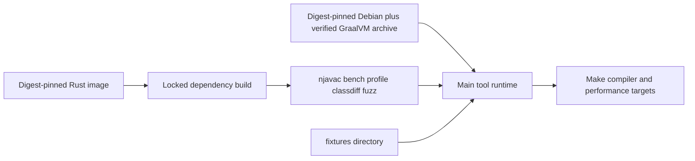

# Docker and CI

Docker defines njavac's controlled acceptance environment. Exact bytes and
behavioral comparisons are specific to the content-pinned reference `javac` in the
image, so host Java output is never a substitute for that image.

## Main image

The root `Dockerfile` has four stages: JDK fetch/verification, JDK runtime,
compiler build, and final main-tool runtime.

The fetch stage selects the GraalVM 25.0.2 archive by Docker target architecture
and verifies its repository-recorded SHA-256 before extraction. The runtime and
Rust base images are digest-pinned; the Rust build also uses `Cargo.lock` through
`cargo build --release --locked`. The runtime copies the verified JDK, fixture
corpus, and release binaries, sets `NJAVAC_IN_CONTAINER`, and uses `bench` as its
default entrypoint.

The runtime image includes `njavac`, `bench`, `profile`, `classdiff`, and `fuzz`.
It does not include the Java sources under `tools/`. Fuzzer Make targets therefore
mount the repository at `/w` and run there so the source-launched workers resolve.
Probe and class-file-diff targets also mount the repository because they consume ad
hoc host files. Fixture and profile runs use the fixture snapshot copied into the
newly built image.

BuildKit caches the Cargo registry and Cargo target data across image rebuilds.
The reference archive is accepted only after checksum verification, so cache
state cannot silently select different javac bytes.

## Runtime isolation by target

| Target family | Repository mount | Golden volume | Resource controls |
| --- | ---: | ---: | --- |
| `verify`, `record` | No | Yes | No timing controls |
| `correctness` | No | No | No timing controls |
| `bench` | No | No | One selected CPU, fixed CPU quota, memory and swap cap, PID limit |
| `profile` | No | No | Same controls as `bench` |
| `probe`, `src-diff`, `diff` | Yes | No | Diagnostic only |
| Fuzzer targets | Yes | No | Not CPU-pinned; fuzzing is not a timing benchmark |

Every main Docker target depends on `image`, so Docker evaluates the current build
context before running it. Outputs under the benchmark's default in-container
`target/bench-out` disappear with the `--rm` container. The golden volume and
bind-mounted `fuzz-out/` are the intentional durable exceptions.

`make bench` and `make profile` use `BENCH_CPU` and `BENCH_MEM` to account for host
topology and available resources. The selected CPU index must exist in Docker's
visible CPU set. These controls reduce variance for nearby runs on the same host;
host load, virtualization, power, thermal state, and scheduler behavior remain
uncontrolled. The result is neither deterministic nor comparable across arbitrary
hosts.

## Documentation image

Documentation uses `docs/Dockerfile`, not the compiler image. It pins all base
images by digest, verifies the mdBook archive and mdbook-mermaid crate checksums,
and builds mdbook-mermaid against the committed lockfile's matching 0.5.4
preprocessor protocol before copying only the documentation tools into runtime.

Documentation commands bind-mount the repository and run as the host UID/GID so
`docs/book/` remains host-writable. The preview server publishes only on
`127.0.0.1`. `make docs-check` uses a separately pinned Lychee image and mounts the
rendered book read-only for offline internal-link and anchor checking. Before
Lychee, it runs the source inventory script in the documentation image against a
read-only repository mount. See [Documentation Tooling](documentation.md).

## Acceptance boundary

| Activity | Docker-backed? | Acceptance evidence? |
| --- | ---: | ---: |
| `make image` | Yes | Build evidence only |
| `make profile` | Yes | Controlled pipeline-performance evidence only |
| Direct host `javac` comparison | No | No; disallowed as reference evidence |
| `make verify` | Yes | Cached inner-loop evidence; cache may be stale |
| `make correctness` | Yes | Fresh exact-byte fixture evidence |
| `make bench` | Yes | Fresh exact-byte fixture evidence plus controlled same-host timing |
| Fuzzer worker and observer gates | Yes | Evidence for their specific oracle contracts |
| `make docs-check` | Yes | Documentation rendering and internal-link evidence |

There is no `cargo test` or direct host compiler substitute. Compiler debugging
uses the Docker-backed diagnostic targets from the command surface.

## Current CI state

`.github/workflows/ci.yml` runs `make correctness` on GitHub Actions for every
push and pull request. The job checks out the repository on `ubuntu-latest`,
enables BuildKit, builds the main image, and performs the fresh byte comparison.
It is an exact-byte fixture backstop. The runner and checkout action use mutable
GitHub labels, but the reference JDK and compiler build images remain
content-pinned by the repository Dockerfile.

The workflow does not run `make verify`, `make bench`, `make profile`, any fuzzer
mode, worker or observer verification, or `make docs-check`. It has no
declared Docker layer cache. A green GitHub status therefore establishes only the
fresh exact-byte fixture contract of `make correctness` against the main image
built for that job. It does not establish documentation, fuzz, worker, observer,
accepted alternate representations, or performance claims.

Changes to the workflow should continue to invoke existing Make targets rather
than recreate their Docker commands. Add the relevant explicit jobs when their
contract is required; do not infer them from the correctness job. Do not call a
golden-volume `make verify` job authoritative unless the job refreshes the cache
from the same image first.

For Docker daemon, CPU-set, mount, and cache failures, see
[Troubleshooting](../start/troubleshooting.md).
