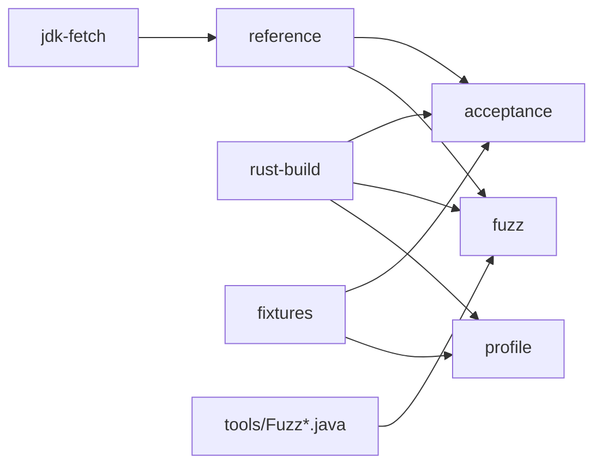

# Docker and CI

Docker defines njavac's controlled build and execution environments. Exact bytes
and behavioral comparisons are specific to the content-pinned reference `javac`
shared by the reference-derived images, so host Java output is never a substitute.

## Root image graph

The root `Dockerfile` has two shared build stages and four capability targets:

The fetch stage selects the GraalVM 25.0.2 archive by Docker target architecture
and verifies its repository-recorded SHA-256 before extraction. The runtime and
Rust base images are digest-pinned; the Rust build also uses `Cargo.lock` through
`cargo build --release --locked`. BuildKit caches the Cargo registry and target
data across local rebuilds.

| Target | Image variable | Contents and purpose |
| --- | --- | --- |
| `reference` | `REFERENCE_IMAGE` | Complete verified JDK and reference tools; used by `probe` and as the base for reference-dependent targets. |
| `acceptance` | `IMAGE` | Reference JDK, `njavac`, `bench`, `classdiff`, and the fixture snapshot. It sets `NJAVAC_IN_CONTAINER` and defaults to the benchmark harness. |
| `fuzz` | `FUZZ_IMAGE` | Reference JDK, `fuzz`, and the two source-launched Java workers copied from `tools/`. Absolute worker paths bind the image to one repository revision. |
| `profile` | `PROFILE_IMAGE` | Pinned Debian, `profile`, and the fixture snapshot. It deliberately contains no JDK. |

Every image recipe using the root compiler Dockerfile names its target explicitly.
Adding another stage cannot silently change a public compiler image tag merely by
becoming the last stage. The reference archive is accepted only after checksum
verification, so cache state cannot silently select different javac bytes.

## Runtime isolation by target

| Target family | Image | Host mount or volume | Resource controls |
| --- | --- | --- | --- |
| `verify`, `record` | Acceptance | Golden volume | No timing controls |
| `correctness` | Acceptance | None | No timing controls |
| `bench` | Acceptance | None | One selected CPU, fixed CPU quota, memory and swap cap, PID limit |
| `profile` | Profile | None | Same controls as `bench` |
| `probe` | Reference | Repository source mount | Diagnostic only |
| `src-diff`, `diff` | Acceptance | Repository source/class mount | Diagnostic only |
| Fuzzer targets | Fuzz | Only repository-root `fuzz-out/` | Not CPU-pinned; fuzzing is not a timing benchmark |

Every Docker-backed execution command depends on the capability image it requires,
so Docker evaluates the relevant current build context before execution. Outputs
under the benchmark's default in-container `target/bench-out` disappear with the
`--rm` container. The golden volume and bind-mounted `fuzz-out/` are the
intentional durable exceptions.

`make bench` and `make profile` use `BENCH_CPU` and `BENCH_MEM` to account for host
topology and available resources. The selected CPU index must exist in Docker's
visible CPU set. These controls reduce variance for nearby runs on the same host;
host load, virtualization, power, thermal state, and scheduler behavior remain
uncontrolled. The result is neither deterministic nor comparable across arbitrary
hosts.

## Documentation image

Documentation uses `docs/Dockerfile`, not the compiler image. It pins all base
images by digest, verifies the mdBook archive and mdbook-mermaid crate checksums,
and builds mdbook-mermaid against the committed lockfile's matching 0.5.4
preprocessor protocol before copying only the documentation tools into runtime.

Documentation commands bind-mount the repository and run as the host UID/GID so
`docs/book/` remains host-writable. The preview server publishes only on
`127.0.0.1`. `make docs-check` uses a separately pinned Lychee image and mounts the
rendered book read-only for offline internal-link and anchor checking. Before
Lychee, it runs the source inventory script in the documentation image against a
read-only repository mount. See [Documentation Tooling](documentation.md).

## Acceptance boundary

| Activity | Docker-backed? | Acceptance evidence? |
| --- | ---: | ---: |
| `make image` | Yes | Acceptance-image build evidence only |
| `make profile` | Yes | Controlled pipeline-performance evidence only |
| Direct host `javac` comparison | No | No; disallowed as reference evidence |
| `make verify` | Yes | Cached inner-loop evidence; cache may be stale |
| `make correctness` | Yes | Fresh exact-byte fixture evidence |
| `make bench` | Yes | Fresh exact-byte fixture evidence plus controlled same-host timing |
| Fuzzer worker and observer gates | Yes | Evidence for their specific oracle contracts |
| `make docs-check` | Yes | Documentation rendering and internal-link evidence |

There is no `cargo test` or direct host compiler substitute. Compiler debugging
uses the Docker-backed diagnostic targets from the command surface.

## Current CI state

`.github/workflows/ci.yml` runs `make correctness` on GitHub Actions for every
push and pull request. The job checks out the repository on `ubuntu-latest`,
enables BuildKit, builds the explicit `acceptance` target, and performs the fresh
byte comparison. It is an exact-byte fixture backstop. The runner and checkout
action use mutable GitHub labels, but the reference JDK and compiler build images
remain content-pinned by the repository Dockerfile.

The workflow does not run `make verify`, `make bench`, `make profile`, any fuzzer
mode, worker or observer verification, or `make docs-check`. It has no
declared Docker layer cache. A green GitHub status therefore establishes only the
fresh exact-byte fixture contract of `make correctness` against the acceptance
image built for that job. It does not establish documentation, fuzz, worker,
observer, accepted alternate representations, or performance claims.

Changes to the workflow should continue to invoke existing Make targets rather
than recreate their Docker commands. Add the relevant explicit jobs when their
contract is required; do not infer them from the correctness job. Do not call a
golden-volume `make verify` job authoritative unless the job refreshes the cache
from the same image first.

For Docker daemon, CPU-set, mount, and cache failures, see
[Troubleshooting](../start/troubleshooting.md).
