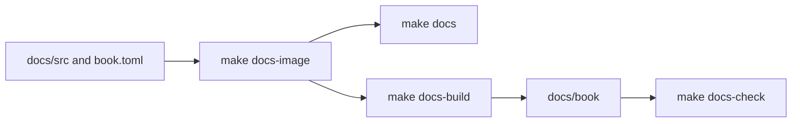
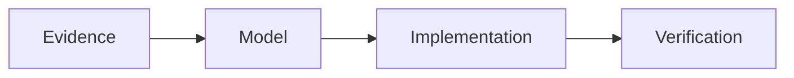

# Documentation Tooling

The maintainer guide is an mdBook built entirely through pinned Docker tooling.
The human content policy lives in [Documentation Policy](../contributing/documentation-policy.md);
this page owns build, preview, Mermaid, and link-check mechanics.

## Source and output

Book sources live under `docs/src/`. `docs/src/SUMMARY.md` controls navigation and
which pages mdBook renders. A Markdown file that exists but is not listed in the
summary is not part of the rendered book or the rendered-link check.

Rendered output goes to `docs/book/`. It is generated, ignored by Git, and should
never be edited directly. The documentation container runs as the host UID/GID so
the output remains removable and writable without elevated permissions.

## Commands

| Target | Purpose | Result |
| --- | --- | --- |
| `make docs-image` | Build the pinned mdBook and Mermaid tool image. | Local Docker image only. |
| `make docs` | Serve the book for interactive review on the configured loopback port. | Live preview plus generated `docs/book/`; stop with the foreground process. |
| `make docs-build` | Render the book once through Docker. | Replaces or updates `docs/book/`; fails on mdBook or preprocessor errors. |
| `make docs-check` | Build first, then inspect rendered links and fragments with pinned Lychee. | Documentation gate for rendered internal links. |

`DOCS_PORT` changes the host preview port and `DOCS_IMAGE` changes the local image
tag. Consult `make help` for current invocation syntax rather than copying a flag
catalog into prose.

## Pinned toolchain

`docs/Dockerfile` supports Docker `amd64` and `arm64`. It pins the Alpine base by
digest and verifies the downloaded mdBook and mdbook-mermaid archives against
architecture-specific checksums. Unsupported architectures fail during the image
build rather than silently downloading an unverified binary.

`docs/book.toml` enables the Mermaid preprocessor and loads the vendored Mermaid
browser assets. The link gate runs a pinned Lychee image in offline mode against a
read-only mount of the rendered book. It checks internal links and anchor-only
fragments without turning external network availability into a documentation
failure.

## Mermaid

Use fenced `mermaid` blocks for flows and relationships that are clearer as a
diagram than as prose:

Keep node labels concise, use stable conceptual names, and retain nearby prose or
tables for details that readers need to search. Mermaid diagrams are rendered by
the pinned preprocessor; do not add external scripts or CDN dependencies.

## Links

Use relative Markdown links between book pages. From a page under `tooling/`, for
example, link to a sibling as `fuzzing.md` and to contribution guidance as
`../contributing/workflow.md`. Prefer named pages and headings over source line
numbers or copied explanations.

The link checker sees rendered pages, not every Markdown file in the source tree.
Before considering a new page integrated, ensure the navigation owner adds it to
`SUMMARY.md`, then run `make docs-check`. A build success alone does not prove that
an unlisted source page rendered.

## Documentation workflow

1. Identify the one authoritative home for each fact.
2. Update code/configuration and its human documentation in the same change when
   behavior changes.
3. Link from other pages instead of duplicating an explanation.
4. Use Mermaid only where it clarifies structure or flow.
5. Preview with `make docs` when visual layout matters.
6. Run `make docs-check` after the page is included in `SUMMARY.md`.
7. Run `git diff --check` to catch whitespace errors in all changed sources.

Documentation commands validate only the guide. If a documentation change also
changes Docker build context, Make behavior, fixtures, worker tools, or compiler
code, run the corresponding gate from [Command Surface](command-surface.md).
