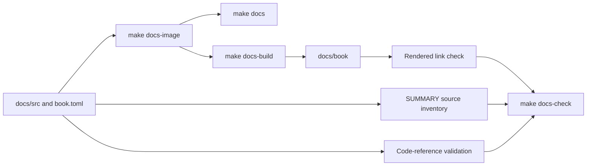
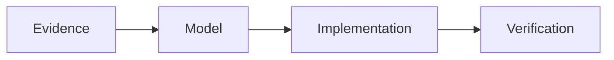

# Documentation Tooling

The maintainer guide is an mdBook built entirely through pinned Docker tooling.
The human content policy lives in [Documentation Policy](../contributing/documentation-policy.md);
this page owns build, preview, Mermaid, and link-check mechanics.

## Source and output

Book sources live under `docs/src/`. `docs/src/SUMMARY.md` controls navigation and
which pages mdBook renders. A Markdown file that exists but is not listed in the
summary is not part of the rendered book or the rendered-link check. The
`docs-check` source inventory closes that gap by rejecting any recursive Markdown
source, except `SUMMARY.md` itself, that has no summary entry.

Rendered output goes to `docs/book/`. It is generated, ignored by Git, and should
never be edited directly. The documentation container runs as the host UID/GID so
the output remains removable and writable without elevated permissions.

`docs/mermaid.min.js` and `docs/mermaid-init.js` are checked-in build inputs, not
generated book output. Keep durable explanatory images under
`docs/src/assets/images/` and reference them from an included page; do not place
source assets under `docs/book/`.

## Commands

| Target | Purpose | Result |
| --- | --- | --- |
| `make docs-image` | Build the pinned mdBook and Mermaid tool image. | Local Docker image only. |
| `make docs` | Serve the book for interactive review on the configured loopback port. | Live preview plus generated `docs/book/`; stop with the foreground process. |
| `make docs-build` | Render the book once through Docker. | Replaces or updates `docs/book/`; fails on mdBook or preprocessor errors. |
| `make docs-check` | Build first, inventory Markdown sources, validate inline repository and Rust API references, then inspect rendered links and fragments with pinned Lychee. | Documentation source-inclusion, code-reference, rendering, and internal-link gate. |

`DOCS_PORT` changes the host preview port and `DOCS_IMAGE` changes the local image
tag. `make help` owns target names and short target hints; `Makefile` owns variable
defaults and forwarding.

## Pinned toolchain

`docs/Dockerfile` supports Docker `amd64` and `arm64`. It pins its Alpine, Debian,
and Rust bases by digest. The mdBook release archive and mdbook-mermaid crate
source are checksum-verified. mdbook-mermaid is built from the committed
`docs/mdbook-mermaid.Cargo.lock`, which selects `mdbook-preprocessor` 0.5.4 to
match mdBook 0.5.4. Unsupported architectures fail during the image build rather
than downloading an unverified mdBook binary.

`docs/book.toml` enables the Mermaid preprocessor and loads the vendored Mermaid
browser assets. The link gate runs a pinned Lychee image in offline mode against a
read-only mount of the rendered book. It checks internal links and anchor-only
fragments without turning external network availability into a documentation
failure.

When either mdBook component changes, update the lockfile deliberately and reject
any preprocessor version warning rather than suppressing it.

## Mermaid

Use fenced `mermaid` blocks for flows and relationships that are clearer as a
diagram than as prose:

Keep node labels concise, use stable conceptual names, and retain nearby prose or
tables for details that readers need to search. Mermaid diagrams are rendered by
the pinned preprocessor; do not add external scripts or CDN dependencies.

## Links

Use relative Markdown links between book pages. From a page under `tooling/`, for
example, link to a sibling as `fuzzing.md` and to contribution guidance as
`../contributing/workflow.md`. Prefer named pages and headings over source line
numbers or copied explanations.

The link checker sees rendered pages, not every Markdown file in the source tree.
`docs/check-summary.sh` separately checks that each `docs/src/**/*.md` source has
a literal page link in `SUMMARY.md`. Before considering a new page integrated,
ensure the navigation owner adds it, then run `make docs-check`. A build success
alone does not prove that an unlisted source page rendered; the full gate does.

## Code references

`docs/check-code-references.sh` scans paired single-backtick inline code outside
fenced examples, including blockquotes. It rejects unsupported multiline or
double-backtick spans and backticks in ambiguous indented content; use a fenced
block for indented examples. It requires concrete repository paths to exist,
requires repository globs to match, checks file-qualified symbol boundaries
textually, and resolves selected crate-qualified APIs through
`docs/code-references.tsv`. A path segment written as `...` is an explicit
placeholder rather than a concrete path.
Intentional non-repository examples require a reason in
`docs/code-reference-exceptions.tsv`. Known obsolete terminology belongs in
`docs/forbidden-terms.tsv`; the check covers guide Markdown and line-form Rust doc
comments.

This is a deterministic stale-reference check, not a Rust name resolver. Prefer a
repository-relative file path plus a named symbol when documenting implementation
authority. Keep public API mappings narrow and delete exceptions when their
referenced example disappears.

## Documentation workflow

1. Identify the one authoritative home for each fact.
2. Update code/configuration and its human documentation in the same change when
   behavior changes.
3. Link from other pages instead of duplicating an explanation.
4. Use Mermaid only where it clarifies structure or flow.
5. Preview with `make docs` when visual layout matters.
6. Run `make docs-check` after the page is included in `SUMMARY.md`.
7. Run `git diff --check` to catch whitespace errors in all changed sources.

Documentation commands validate only the guide. If a documentation change also
changes Docker build context, Make behavior, fixtures, worker tools, or compiler
code, run the corresponding gate from [Command Surface](command-surface.md).
