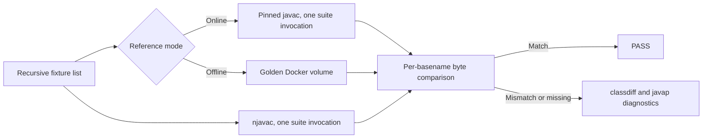

# Fixtures and Goldens

The fixture corpus is the acceptance suite. Each fixture is compiled by njavac
and compared byte-for-byte with either a fresh configured `javac` output or a cached
copy of that output.

## Fixture contract

The harness recursively discovers every `*.java` file under `fixtures/` and sorts
the paths for stable reporting. Current topical directories include `basics/`,
`branches/`, `compound-assign/`, `conversions/`, `folding/`, `literals/`,
`operators/`, `println/`, `scopes/`, and `types/`.

Each fixture must satisfy these assumptions:

- The filename matches its one public class name.
- The source emits one expected `<basename>.class` file.
- Basenames are globally unique across all topical directories because benchmark
  output and the golden cache are flat.
- Fixtures are independent and can be compiled together in one compiler
  invocation.
- The directory is organizational only. njavac uses the bare filename for the
  `SourceFile` attribute, so moving a fixture without renaming it is byte-neutral.
- Packages, multiple source units per case, and auxiliary emitted classes are not
  represented by the current harness shape.

Choose the topical directory by the byte-identity edge being protected, not by
which compiler module was edited. Prefer a small fixture that makes one boundary
obvious, such as an opcode threshold, pool-order interaction, verifier frame, or
line-number decision.

## Regression fixtures

Every bug fix needs a committed regression fixture. Hand-reduce a fuzzer finding
rather than copying a large generated program into the corpus. The fixture should
start with a short comment naming the exact compatibility edge and how njavac used
to diverge.

Raw files under `fuzz-out/` are evidence for triage, not durable tests. Once the
case is understood, create the minimal topical fixture, run the focused fresh
check, then run the full fresh gate. The full bug-fix workflow is in
[Fixing a Divergence](../contributing/fixing-a-divergence.md).

## How the harness compiles



Both compilers receive the complete selected fixture list in one invocation. This
avoids paying a JVM startup per source and matches normal multi-source compiler
use. Before compiling, the harness removes outputs expected for the selected
fixtures so an old class cannot turn a missing compiler output into a false pass.
It does not inventory unrelated output basenames.

An online mismatch is localized with a structural `classdiff` followed by a
noise-stripped `javap -v -p` comparison. Offline mode uses the cached class as the
reference and cannot tell whether that reference is current.

## Golden cache

Goldens are convenience copies of class files emitted by the configured `javac`.
They live in the Docker volume selected by `VOLUME`, mounted at `GOLDENS`; they
are not source files, are not checked into Git, and must never be hand-edited.

`make verify` follows this lifecycle:

1. Build the current main image.
2. Check whether the golden volume contains any top-level class file.
3. If none exists, record the whole fixture suite with the configured `javac`.
4. Run njavac and compare the whole suite, or `FILE`, against the volume.

The emptiness check is not a freshness check. A nonempty volume can contain
goldens from an older fixture corpus or JDK image and `make verify` will use them
without warning. A cached mismatch can therefore mean either a compiler
regression or a stale reference, while a cached pass can miss a changed reference
compiler behavior.

Recording removes and rewrites the expected class for every current fixture, but
it does not clear the volume first. A golden whose fixture was renamed or removed
remains as an orphan. Comparisons ignore that unrelated basename, but its presence
can make the volume look nonempty and prevent `make verify` from auto-recording
when no current golden is usable. Remove the Docker volume explicitly when a
strictly clean cache is required, then use `make record`; never delete or edit
individual class bytes as a repair.

Run `make record` after changing the fixture corpus or configured JDK. The Make
target invokes `javac` over the whole current suite and then already runs offline
verification against the refreshed current entries. A second `make verify` is
redundant unless another change occurred. In particular:

```sh
make record FILE=fixtures/branches/IfElse.java
```

does not record only `IfElse.java`. The recording command intentionally refreshes
the whole suite; `FILE` applies only to the subsequent offline verification.

## Selecting a gate

| Need | Command | Reference |
| --- | --- | --- |
| Fast whole-suite edit loop | `make verify` | Cached and possibly stale |
| Fast focused fixture loop | `make verify FILE=fixtures/.../Case.java` | Cached and possibly stale |
| Fresh focused diagnosis | `make correctness FILE=fixtures/.../Case.java` | Live configured `javac` |
| Fresh pre-commit acceptance | `make correctness` | Live configured `javac` |
| Fresh acceptance plus controlled timing | `make bench` | Live configured `javac` |
| Refresh cache after fixture or JDK change | `make record` | Rewrites expected goldens from configured `javac` |

Passing one focused fixture is not evidence that the complete corpus still
matches. Finish compiler behavior changes with the whole-suite fresh gate.

## Adding a fixture

1. Pick the topical directory and a globally unique class basename.
2. Make the filename and public class name identical.
3. Keep the program inside the currently supported language and current
   one-class harness shape.
4. Add a concise edge comment, especially for a regression.
5. Refresh the cache and run its built-in offline verification with `make record`.
6. Run a focused fresh check if diagnosis is useful.
7. Run `make correctness` over the complete suite.

Use [Differential Debugging](differential-debugging.md) before adding a fixture
when the javac behavior still needs to be inferred.
