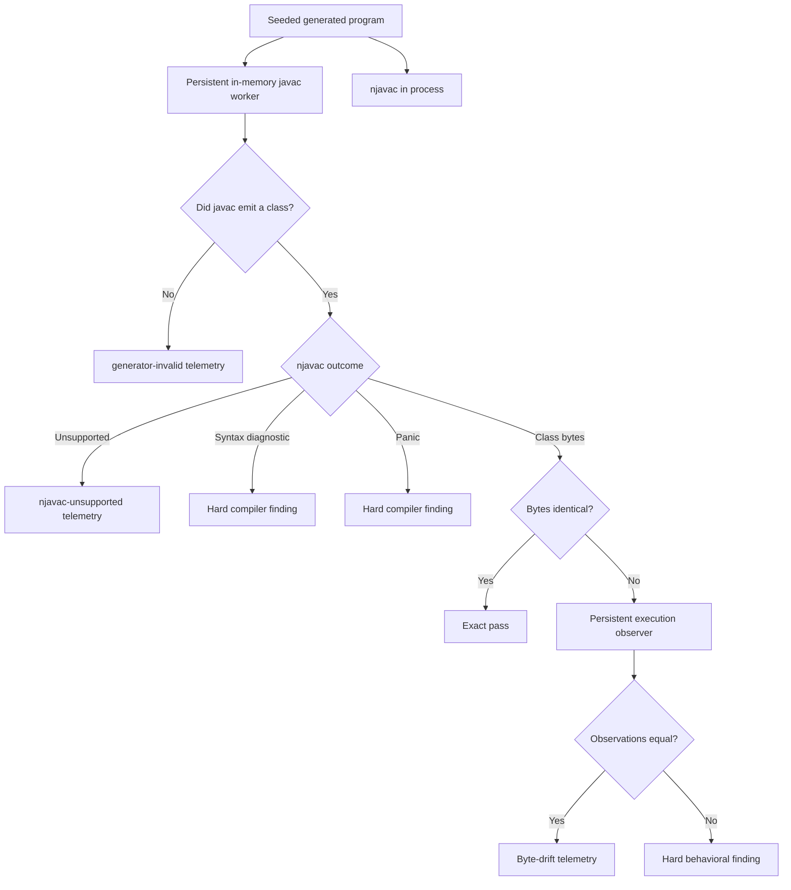

# Fuzzing

The differential fuzzer generates random programs inside its modeled subset,
compiles each program with both compilers, compares exact class bytes, and invokes
an execution observer only when those bytes differ. It complements fixtures by
searching combinations maintainers did not anticipate.

## Oracle

Javac rejection takes precedence regardless of what njavac did because the oracle
has no usable reference class for that case. This normally means the generator
produced invalid reference input, but an unexpected count can indicate a worker
failure as described under [Reference worker](#reference-worker). When javac
accepts, the outcomes are classified as follows:

| Outcome | Operational treatment | Product meaning |
| --- | --- | --- |
| Both emit identical bytes | Exact pass | Exact fuzzer pass against the worker; worker verification separately checks sampled CLI equivalence. |
| Bytes differ, observations match | Telemetry; normal `make fuzz` can exit zero | The current generated behavior check passes; the physical difference remains byte-retention telemetry. |
| Bytes and observations differ | Hard finding and nonzero exit | Behavioral compiler bug. |
| Javac rejects | `generator-invalid` telemetry | Generator escaped valid Java or the intended reference surface. |
| Javac accepts, njavac returns `Unsupported` | `njavac-unsupported` telemetry | Valid Java reached a deliberate compiler boundary. Review whether the generator exceeded current scope. |
| Javac accepts, njavac returns a syntax diagnostic | Hard compiler finding | Invalid rejection of reference-accepted input. |
| Javac accepts, njavac panics | Hard compiler finding | Internal invariant failure. |

The observer supplies empirical semantic evidence, not universal proof. Equal
stdout, stderr, and termination cannot reveal unobserved state, but they are the
sanctioned behavioral oracle for the current generated subset, which prints its
modeled mutations and branch choices. Exact bytes remain the preferred fast path
and the strict oracle for fixtures that claim reference-byte retention. A
persistent nonidentical representation under the optimization exception needs a
sanctioned durable regression oracle covering any behavior the changed physical
surface can affect before it becomes a support claim; terminal byte-drift telemetry
is not that oracle.

## Reproduction and control

A bare `make fuzz` chooses a fresh seed and prints it before compiling. The seed
recreates the generator stream only when the generator code and relevant mode are
unchanged. Reproducing the full run also requires the same commit and
self-contained fuzz image, `COUNT`, `BATCH`, forwarded flags, and output/stop mode.
That image binds the fuzzer binary, reference JDK, worker, and observer sources to
one build context.
`COUNT` determines how much of the stream is visited; `BATCH` changes which source
units share one javac task and can therefore affect the oracle even though it does
not change generation order. Record the image identity, complete printed header,
and invocation, not only `SEED`.

`COUNT` and `BATCH` must be positive decimal integers. The current parser does not
validate that contract reliably: malformed named values can silently retain a
default or consume the next option, `COUNT=0` can pass without testing a case, and
`BATCH=0` with positive `COUNT` cannot advance. Confirm the printed values before
trusting a run.

The generator creates every program in a batch before either compiler runs, so a
compiler failure cannot perturb the seed-determined generation order.

Use `FUZZFLAGS` for additional options such as continuing after findings, changing
the output directory, or dumping generated sources without compiling. The binary
help is authoritative for exact flags. Make appends `FUZZFLAGS` as raw tokens only
for `make fuzz`; shell quoting and arbitrary host environment forwarding are not
provided. Parallel jobs beyond one are not implemented; requesting them is
rejected.

With keep-going enabled, the summary groups byte divergences by normalized
structural path and behavioral findings by which observation fields differ. This
is useful for a census, but a broad unexpected census is evidence that the model
or change boundary is wrong, not an invitation to patch signatures individually.

## Reference worker

`tools/FuzzJavac.java` is source-launched once by the configured Java runtime. It keeps
one JVM hot, receives framed source strings over a pipe, and returns class bytes
from an in-memory file manager. It writes neither source nor class files to disk.
Each batch uses one javac task so compiler context setup is amortized similarly to
a CLI batch.

The class name, virtual `<Class>.java` filename, and njavac `source_file` argument
come from one generator naming chokepoint. That invariant matters because the
filename is visible in `SourceFile` and line metadata. The harness also rejects
unexpected emitted classes so a future generator cannot silently compare only one
part of a multi-class program; a missing expected class is treated as javac
rejection for that program.

The worker is an optimization, not an independent authority. `make fuzz-verify`
generates `COUNT` programs from one seed, compiles that sample through both the
worker and the configured `javac` CLI batch, and compares acceptance and bytes.
A pass supports equivalence only over that generated sample; it is not exhaustive
proof for all inputs or batch shapes. Run it after any JDK bump or edit to the
worker, its naming, options, file manager, protocol, or batching, and record the
sample controls.

`FuzzJavac.java` suppresses compiler diagnostics and converts a caught
`RuntimeException` into whatever partial class set had already been emitted. The
parent can therefore classify a worker infrastructure failure as rejection for
missing classes. Unexpected rejection counts require investigation even when the
protocol stays alive; use worker verification and direct CLI probes to separate
generator rejection from worker failure.

The root Dockerfile copies both Java worker sources into the dedicated `fuzz`
target and sets `FUZZ_WORKER` and `FUZZ_OBSERVER` to absolute in-image paths. A
worker edit therefore invalidates that image target and cannot be paired silently
with an older fuzzer binary or reference JDK. Fuzzer commands do not require a
repository source mount.

## Execution observer

`tools/FuzzObserve.java` is started lazily at the first byte divergence and then
kept alive. For each reference/candidate pair it:

- Runs with JVM class verification enabled.
- Defines each class through a fresh class loader.
- Invokes static `main` with an empty argument array.
- Captures bounded stdout and stderr separately.
- Normalizes return, thrown exception, class-load failure, and timeout state plus
  exception detail.
- Supplies an empty `System.in` stream.
- Times out one class after two seconds and restarts the worker after a timeout.

Each captured output stream is capped at one MiB, and the Rust protocol reader
rejects response frames over 16 MiB. A reference timeout prevents the candidate
from running in that process; the Rust driver restarts and reverses the request so
both sides can still be observed.

This in-process isolation is valid only for the current generator, which cannot
read input, call `System.exit`, create threads, or deliberately mutate persistent
JVM-global state. A language rung that enables any of those capabilities must
strengthen or replace the execution boundary before enabling generation.

`make fuzz-observe-verify` compiles controlled probes with the reference worker and
checks return, stdout difference, invalid class loading, throws, reference and
candidate timeouts, and successful post-timeout restart.

The Rust fuzzer installs a process-wide no-op panic hook so candidate compiler
panics captured by `catch_unwind` do not print twice. The same hook also suppresses
the normal panic message for uncaught harness and infrastructure panics. An exit
status such as 101 with little or no diagnostic output can therefore be a harness,
worker, path, or filesystem failure rather than a classified compiler finding.

## Generator boundary

The current model covers the eight primitive types, numeric and bitwise
expressions, casts, comparisons, boolean operations, assignments, compound
assignments, increment/decrement statements, printing, and `if`/`else` shapes.
Declarations remain at method-body top level; branch-local declarations are
disabled. Ternary expressions and loops are disabled.

Boolean generation distinguishes branch booleans from value booleans so it does
not manufacture unsupported nonempty-stack materialization. Deliberate grouping
is represented explicitly because grouping can change javac's bytecode. Generated
mutations and branch choices are printed to maximize the observer's visible trace.
The generator also creates bounded uninitialized-local scenarios: assignment on
the sole reachable constant-condition arm, reads in impossible arms, and boolean
reads confined to dead `&&`/`||` operands. These scenarios are appended after
ordinary random statements and leave every new local assigned after its final
observed read.

This is a generator coverage boundary, not the authoritative language-support
ledger. A feature is not proven merely because the fuzzer can generate it, and a
feature absent from the generator is not necessarily unsupported by the compiler.

## Artifacts

The Make targets mount only repository-root `fuzz-out/` at `/work/fuzz-out`, so
default artifacts persist on the host without exposing the rest of the checkout
to the container. Fuzzer containers run as root rather than the host UID/GID, so
created directories and files can be root-owned. This differs from documentation
targets, which explicitly select the host identity.

| Outcome | Artifact |
| --- | --- |
| Behavioral finding | Raw `<Class>.java`, structural `<Class>.diff` when available, and `<Class>.observe` at the output root. |
| Syntax rejection or panic | Source and details under `compiler-findings/syntax-error/` or `compiler-findings/internal-panic/`. |
| Unsupported case | Up to the first 20 sources and diagnostics under `unsupported/`. |
| Worker/CLI mismatch | Up to the first 20 sources and available `.cli.class` and `.worker.class` files under `worker-mismatch/`. |
| Self-test | A synthetic minimized Java source and structural diff at the output root. |
| Byte-only drift | Signature and example in terminal telemetry; no normal finding bundle is written. |

Only `/work/fuzz-out` is bind-mounted by the Make targets. A custom `--out-dir`
supplied through `FUZZFLAGS` must remain below `fuzz-out/` to persist on the host;
another container path disappears with `--rm`. Repository-root `fuzz-out/` is
ignored by Git. The self-test Make target does not forward `FUZZFLAGS`, `SEED`, or
a custom output directory.

Behavioral findings intentionally remain raw because the current minimizer does
not have an observation-aware predicate. Byte-only reduction could preserve a
different harmless byte drift while erasing the behavior bug. Hand-reduce the
case while repeatedly checking the same observations, then create the minimal
documented fixture described in [Fixtures and Goldens](fixtures-and-goldens.md).

## Which fuzzer gate to run

| Change | Gate |
| --- | --- |
| Compiler behavior or language rung | `make fuzz` with a recorded seed on failure |
| JDK, javac worker, worker protocol, or virtual source naming | `make fuzz-verify` |
| Finding capture, minimization, or report writing | `make fuzz-selftest` |
| Observer, timeout, output capture, or execution isolation | `make fuzz-observe-verify` |

`make fuzz-selftest` has deliberately narrow coverage. It checks synthetic
candidate outcome classification, selects a compilable generated program,
minimizes with an acceptance-only synthetic predicate, and writes a Java source
plus structural diff. It does not exercise a normal behavioral finding, observer
capture, worker protocol equivalence, keep-going aggregation, or every artifact
kind.

Fuzzer compile-time statistics are useful operational feedback but are not a
benchmark. Use [Benchmarking and Profiling](profiling.md) or `make benchmark` for
performance claims.
